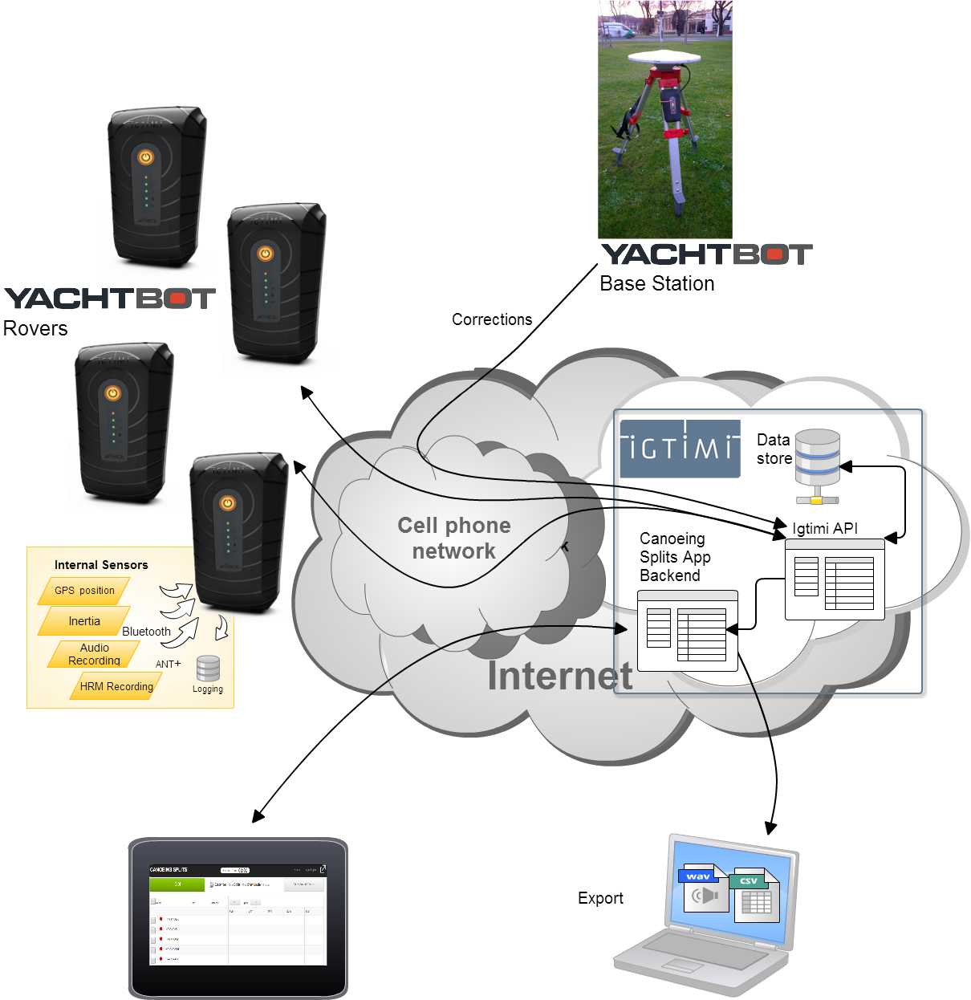

# Introduction to Canoeing Splits System

The Canoeing Splits System is a GPS-based tool that provides accurately measurement elapsed time and distances over typical kayak and canoeing race course distances. The system allows athletes, coaches and performance analysts to view the output data in real-time via the Canoeing Splits App. The Igtimi servers make the data available for detailed post analysis.

  

  

The System consists of

  

• One or multiple YachtBot rovers  
• One YachtBot base station

   • All with appropriate number of SIM cards with sufficient network coverage and data allowances 

• One tablet or laptop running the Canoeing Splits App (typically administered on training or race day by an analyst, coach, or assistant coach)   
 

  

_The information contained on these support pages has been carefully checked and is believed to be accurate at the time of publication. However, Igtimi makes no representations or warranties as to the accuracy or completeness and specifically disclaims and implied warranties of fitness for any particular purpose. Igtimi does not accept any liability from your use of or inability to use this document or products described herein. If in doubt, just ask support@igtimi.com._