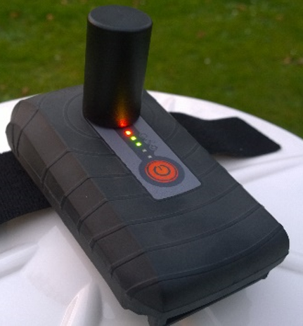

# Rovers indicators

The YachtBot rover is mounted on the canoe, either on or under the aft deck behind the athlete. It is easily distinguished from a standard YachtBot or YachtBot Bio by its different front label. The YachtBot rover has the orange button below the five indicator lights and features a front facing GPS antenna mount.

## Indicators

### Top (red) – power indicator

Solid On – unit is on

Slow Flashing - unit is in Synchronisation Mode

Solid Off - unit has been turned off

### Circle (green) – data connection indicator

Solid Off - Cell module has been turned off in the Config.ini

Fast Flashing - Missing the SIM card

Slow Flashing - Trying to connect to the YachtBot server using the cell settings in the Config.ini

Solid On - Connected to the YachtBot servers established

### GPS symbol (green) – satellite connection indicator

Slow Flashing - Trying to connect to satellites. Ensure the unit has a clear view of the sky. Outside in an open area and away from tall buildings and trees is best.

Solid On - Connected to the GPS Satellites.

Solid On with blip off - Connected to the GPS Satellites and receiving GPS corrections from a Base station (configured to work with a Base Station and receiving correction data successfully)

### Audio symbol (green) – Bluetooth connection indicator

Solid Off - Bluetooth has been turned off in the Config.ini

Solid Off with a Blip on - In Pairing mode (see Help document "Using Audio with YachtBot Bio" on our Support pages)

Slow Flashing - Waiting for a connect from the Bluetooth device

Solid On - Connected to the Bluetooth device

### Heart rate symbol (green) - ANT+ connection indicator

Solid Off - ANT has been turned off in the Config.ini

Slow Flashing - Waiting for a connect from the ANT device

Solid On - Connected and receiving data from an ANT+ device.
