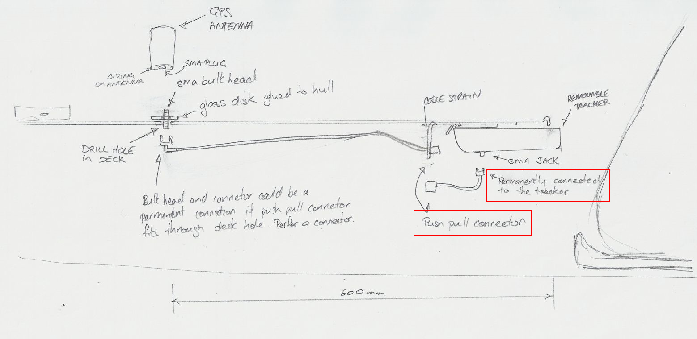

# Rovers mounting

YachtBot rover is either mounted on the deck, or under the deck using a cable loom to feed a connection to the GPS antenna out.

## What’s the advantage of either method?

When YachtBot rover is mounted under the deck, it is as close as practical to the athlete. This avoids the weight of the unit affecting the boat motion. The sensitive GPS antenna has to be mounted on the deck to provide a good signal and a cable loom feeds through the deck and attaches to a two-part bracket. The bracket is glued into the boat and hence only appropriate for boats regularly used with the Canoeing Splits System.

Full deck mount is appropriate for ad-hoc measurements and during training or events when visibility of the technology to competing teams is a lesser concern.

How do I take it off?

YachtBot rover requires turning off and charging after most training sessions. Steps to remove from the under-deck mount:

- Use the push/pull connector to remove the antenna cable from the YachtBot rover. The short cable on the rover end should remain connected

- Pull the metal clasp towards the YachtBot rover and gently slide the unit toward you
