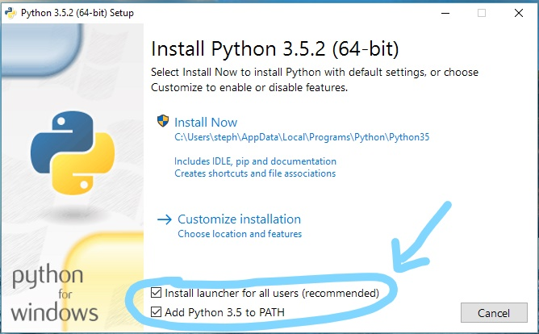

# Turn Analyser Installation 

The following are instructions for installing Turn Analyser which can be found attached to this document.

  

**Windows:**

  

If you haven't already downloaded and install python from [https://www.python.org/downloads/](https://www.python.org/downloads/). This program was developed and tested using [python version 3.5.2](https://www.python.org/downloads/release/python-352/) and therefore this is the recommended version to download and install. When installing python remember to check the option to install python into the PATH.

  

Once python is installed, open command prompt and type the following:

  

```pip install matplotlib PyQt5```

  

The command prompt can either be opened via the start menu or by holding shift and using right-click > "Open command window here".

<table style="width: 100%;"><tbody><tr><td style="width: 50.0000%;"></td><td style="width: 50.0000%;"></td></tr></tbody></table>

  

  

**Optional Steps:**

  

You can enable python to run this file without the command prompt by following these additional steps.

  

Open up command prompt in Administrator mode and type the following associate the python files with the correct group.

```
assoc .py=Python.File
assoc .pyw=Python.File
```

Next, we want to assign that group to the correct python executable.

```ftype Python.File=\[PATH TO pythonw.exe\] "%1" %\*```

where \[PATH TO pythonw.exe\] is the path to that executable, which could be at one of the following by default

```C:\\Users\\\[USER\]\\AppData\\Local\\Programs\\Python\\Python35-32\\pythonw.exe```

or

```C:\\Python\\pythonw.exe```

but this will depend on your installation.

  

Once this is done you can now just double click on "TurnAnalyser.pyw" to run the program.

  

**Mac OSX:**

  

If you haven't already downloaded and install python from [https://www.python.org/downloads/](https://www.python.org/downloads/). This program was developed and tested using [python version 3.5.2](https://www.python.org/downloads/release/python-352/) and therefore this is the recommended version to download and install.

  

Once python is installed, open the terminal (can found in Applications/Utilities) and type the following:

```pip install matplotlib PyQt5```

  

note: Python 2.7 may come pre-installed on OSX. See the section below about using both python 2 and 3.

  

**Additional Info:**

  

**Python 2 vs 3**

  

Python 3 is required for this program due to some of the libraries used. If you are already using python 2 you can still install python 3. To check which version of python you are running type

```python --version```

into command prompt (terminal on a mac). If you are on a mac you can specify the version in the command

```
pip3  install matplotlib PyQt5
python3 TurnAnalyser.pyw
```

  

On a windows computer please refer to this python help document [https://docs.python.org/3.3/using/windows.html](https://docs.python.org/3.3/using/windows.html).

  

**For any general questions about python, consult the python documentation at** [**https://wiki.python.org/moin/FrontPage**](https://wiki.python.org/moin/FrontPage)