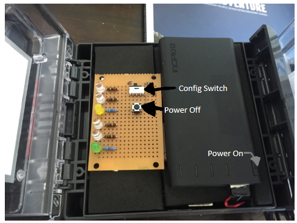

# First steps

Mechanics: opening the lid
--------------------------

The only tool required to use the system is a flat head screw driver which is used to open the lid. To open the lid, place the flat end of the screwdriver into the slot and twist.

  

What to do inside the box
-------------------------

On the inside there is a config switch, a power button and a battery. The battery can be charged through the micro USB port on the end of the battery. The config switch allows the user to change between coach (C) and athlete (A) mode. When the switch is towards the LEDs the box is in Athlete mode, and when the switch is towards the battery it is in Coach mode. Turning on the unit is done by pressing and holding the power button on the battery for a couple of seconds. Turning off the unit is done by pressing and holding the off button until the LEDs turn off (normally 2 seconds) which indicates that shutdown has been initiated. Turing on and off the unit can take around 30 seconds and sometimes up to a minute.  

  

Charging
--------

Charging is done via the micro USB port on the end of the battery. The unit may power on after a few minutes of charge being applied. If this happens, for full charging efficiency power off the unit using the power off button. 

