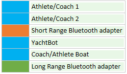

# Understanding connections

The link between the boats can be controlled using the coaches headset. The link will only be active if the coach headset is turned on and connected. The link to YachtBot will only be active if one or more of the athletes is connected. This is to ensure there is no long periods of blank recording.

  

When the coach turns his/her headset off, the connection between boats is terminated.

When both athletes turn their headsets off, the YachtBot recording is stopped.

  

### Lights

On the top of each unit sits 6 LEDs. There are 4x blue LEDs, 1x orange LED and 1x Green LED. They indicate an active connection when lit:

  

