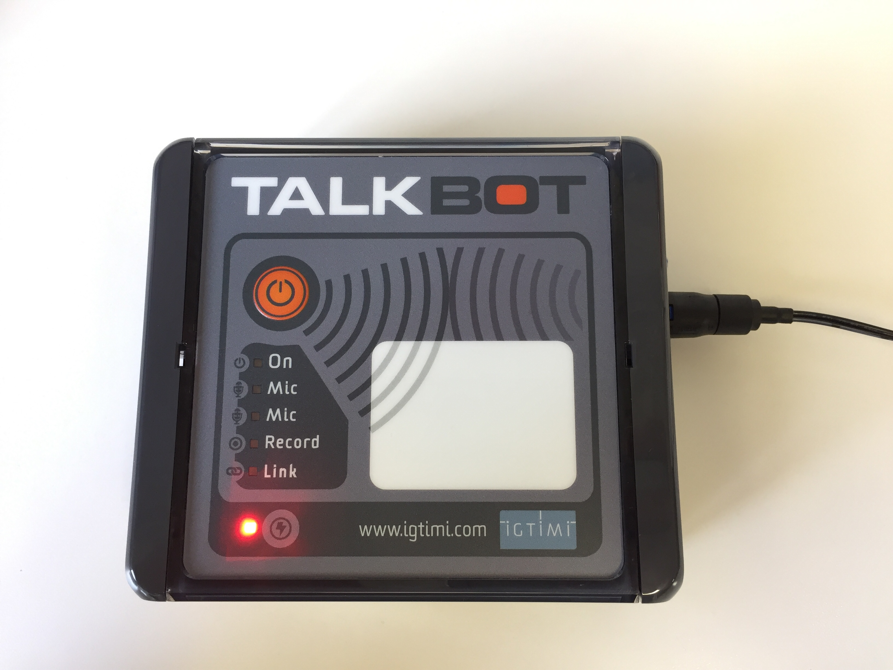

# Charging

To charge TalkBot, first remove waterproof cap before inserting the supplied power adapter.

Once power is applied to the unit, charging will begin, with the charge indicator flashing slowly.

Once charging is complete, the charge indicator will remain solid. If the charge indicator goes out at any stage during charging, this indicates that there is no power being supplied to the unit. 

When charging is finished, remove the power adapter from the unit and replace the waterproof cap.