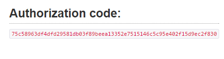

# First Steps

The Igtimi API is...
--------------------

... a [RESTFul](https://en.wikipedia.org/wiki/Representational_state_transfer) web service.  

  

The Igtimi API holds user accounts and data from devices.  It allows developers to build applications to work with those user accounts and device data.  An example of an application built on this framework is [http://www.yacht-bot.com](http://www.yacht-bot.com).

  

The [OAuth2 standard](https://en.wikipedia.org/wiki/OAuth) is used to authenticate users and authorise your application to access the API.  If you've developed applications that access Facebook, Google, Microsoft, DropBox (and many more) accounts directly, then you are already using it!

  

As a developer, by the time you have reached the end of this guide you should have a working application registered, and be able to access the API using command-line tools.

  

Become a developer
------------------

Before you can start working with the Igtimi API, your Igtimi account needs to be given developer status.  Contact us at info@igtimi.com, and we'll upgrade your account.

  

Once you have access, go to [https://www.igtimi.com](https://www.igtimi.com) and login with your credentials.  Under the "Developers" tab you will find the official API documentation and be able to register your first app.

  

Create an application
---------------------

Before you can access the API, you need to register an application.  Under the "Developers" tab, select "My Apps" then click the "Register App" button.

  

Your app will need a NAME and a REDIRECT\_URI.

  

*   NAME can be anything at all, but when a user accesses your app for the first time they will be asked to approve your application, using this name, to access their account.
*   REDIRECT\_URI is an OAuth2 concept.  Set this to _urn:ietf:wg:oauth:2.0:oob_ for now, you can change it later.

  

That's it!  After clicking "Create new app" you will be returned a CLIENT\_ID and CLIENT\_SECRET.  Don't share these with anyone, the CLIENT\_ID and CLIENT\_SECRET are what uniquely identifies and authorises your application to access the API.

  

Logging in with OAuth2
----------------------

**_OAuth_** _(Open Authorization) is an open standard for token-based authentication and authorization on the Internet. **OAuth**, which is pronounced "oh-auth," allows an end user's account information to be used by third-party services, such as Facebook, without exposing the user's password._

  

When a user begins to use your application, they will need to log in.  This is what OAuth2 does, then **it ultimately provides your application with an ACCESS\_TOKEN that it can use as an HTTP parameter to authenticate requests for data to the Igtimi API.**

OAuth2 provides several different mechanisms that allow a user to log in.  These are called _Grant Types._  Your application selects the appropriate _Grant Type_ to use depending on what 'type' of application you are writing.  You don't need to understand all this to get started, but you can read more about types of application, and how OAuth2 _Grant Types_ work at the following link for a good overview;

  

    [http://aaronparecki.com/articles/2012/07/29/1/oauth2-simplified](http://aaronparecki.com/articles/2012/07/29/1/oauth2-simplified)

  

Google also provide quality developer information on using OAuth2 here;

  

    [https://developers.google.com/identity/protocols/OAuth2](https://developers.google.com/identity/protocols/OAuth2)

  

Most of the _Grant Types_ work in a similar way; your application opens a web page (in a browser, or embedded web view) from Igtimi that allows the user to log in.  On success, Igtimi redirects your browser to the REDIRECT\_URI, attaching security information that your app uses to access the Igtimi API.

  

### Example login

We will use the TOKEN _Grant Type_ for your first app.  In this model, the users ACCESS\_TOKEN is provided directly to the application after the user enters their username and password.  Because we have set the REDIRECT\_URI to be _urn:ietf:wg:oauth:2.0:oob,_ this means that the ACCESS\_TOKEN is rendered in an HTML page, so that you can read it directly off the screen in your browser.  

  

  

  

Paste the following in to your browser window, replacing **<your client\_id>** with your CLIENT\_ID.

  

```https://www.igtimi.com/oauth/authorize?response\_type=token&client\_id=**<your client\_id>**&redirect\_uri=urn:ietf:wg:oauth:2.0:oob```

  

Now log in with your account.  You will be asked if you want to allow <your application name> to access your Igtimi account.  Approve this and you will see a page that looks like this...

  



The "Authorization code:" is your ACCESS\_TOKEN.  You are ready now to use this to access the API.  

  

Note:

*   ACCESS\_TOKENS do not expire.  This will change in the future.
*   The Igtimi API supports CODE, TOKEN, and PASSWORD grant types
*   Typically the REDIRECT\_URI will be a 'real' URI to your application, say [https://myapp.com/oauth/callback](https://myapp.com/oauth/callback).  After the user logs in the ACCESS\_TOKEN is returned as an HTTP parameter in a 302 REDIRECT which is handled programatically by your client application.
*   More than 1x REDIRECT\_URI may be provided, space delimited.
*   Igtimi highly recommends using 3rd party OAuth client libraries.
*   Developers are required to maintain confidentiality of users account information, passwords, and tokens.

  

Accessing the API
-----------------

One you have the ACCESS\_TOKEN, use the [developer information](https://www.igtimi.com/developers) to reference what API calls are available.  An example API call, on the command line using cURL, to access the users account information is; 

  

```
brent@gustro:~$ curl -k -H "Authorization: Bearer **<ACCESS\_TOKEN>** " "https://www.igtimi.com/api/v1/account"
{"user":{"id":1373,"first\_name":"Bob","surname":"Smith","email":'bob.smith@hotmail.com"}}


```

For more information and examples on calling the API, next read the [API Communication Fundamentals](../../Igtimi%20API/Getting%20Started/API%20communication%20fundamentals.md).