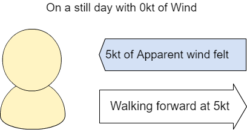
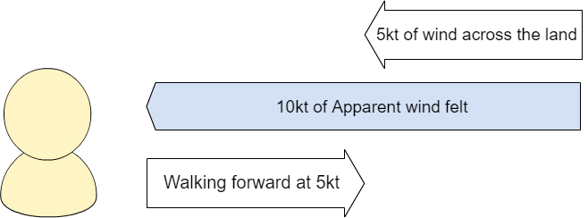

# How does the WindBot calculate True Wind

True wind is the Wind we feel when we are standing still as the wind moves across the land.  This is the wind that is talked about during weather forecasts.

  

Apparent wind, is the wind we feel when we are walking forward on a calm day.   If there is no wind and we walk forward at 5kt, we will feel a wind strength of 5kt on our face.

  

As we move around daily, the wind we feel is a combination of the True Wind and the Apparent wind we generate.

If there is a breeze of 5kt coming across the land, and we walk towards that breeze at 5kt, we would feel a wind strength of 10kt on our face.

  

The WindBot has three different sensor types to calculate what the True Wind is, even while we are moving around.  The three sensors include a Global Position Sensor (**GPS**), an Inertial Measurement Unit (**IMU**) and a **Wind sensor**.  The WindBot is able to determine the difference between the Apparent wind (the wind we feel while moving) and the True Wind (the wind on the land), by using these three sensors.

  

The **Wind sensor** measures the Apparent wind that the WindBot feels.  This is the same wind that you feel as you walk around.

  

The **GPS** allows the WindBot to know how fast it is moving.  In the first example of walking forwards at 5kt, If the Wind sensors reads 5kt, and the GPS reads a speed of 5kt, then the True Wind must be 0kt and the WindBot can calculate this.

  

The **IMU**, is like a compass.  The IMU can tell us what direction we are walking.   In the second example when there is a True Wind of 5kt moving across the land.  The compass will tell the WindBot if we are walking at 5kt away from the Wind, and would feel no wind on our face.  Or if we are walking at 5kt towards the Wind and feel 10kt on our face.

  

**The WindBot needs all three sensors to be working together to calculate the True Wind.**