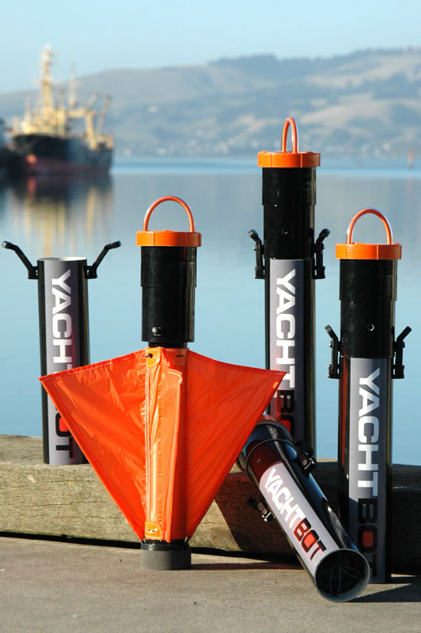

# Introducing TideBot

  

Your TideBot is a GPS-based tool that enables you measure water currents. It is part of the YachtBot product family and natively interfaces with the YachtBot website and the Igtimi API for easy data sharing, viewing and analyzing. Like all YachtBot devices, the TideBot features single button operation and arrives ready to go.   

  

Before you head out on the water …
----------------------------------

  

Register the device to your YachtBot account at [www.yacht-bot.com](http://www.yacht-bot.com) by entering the serial and tag numbers. You can find these on the bottom of TideBot’s pod by the charging port; just remove the bottom lid. Screw the pod back into the float, making sure it’s a snug and very tight fit.  

  

Preferably outside, with a full view of the sky, turn TideBot on using the magnetic switch. Hold the magnet over the switch until you hear two beeps, and see the top red power indicator go solid, the two bottom LEDs flash, and the screen turn on. The device now looks for GPS signal (bottom) and checks the data connection (top indicator) if a SIM was inserted. For the YachtBot website to recognize the TideBot, both indicators must flash and then go solid.

  

Ready to go!  

  

When back from your day on the water and ready to charge TideBot, make sure to open the lid facing down so that water trapped in the thread of the lid drops on the floor rather than inside the pod.

  

How does TideBot work?
----------------------

TideBot uses precision GPS and its way point feature to perform water current (WCT) measurements, which calculate the total drift distance and speed between being dropped in and taken out of the water.

  

If set up, it uses the local cell phone network to report location and heading data to the Igtimi servers. When not in cell coverage, the TideBot stores the location data and sends it to our servers as soon as the device is in coverage again and also does a sync cycle at power off.

  

  

Happy sailing!