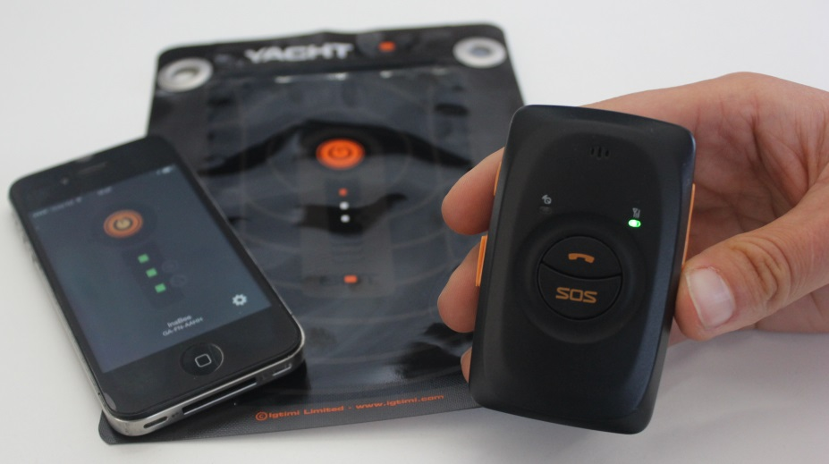

# Introduction to YachtBot Mini

## Summary

Your YachtBot Mini is a GPS-based tool to help you track your sailing. It is part of the YachtBot product family and natively interfaces with the YachtBot website and the Igtimi API for easy sharing, viewing and analyzing races and training sessions. Like all YachtBot devices, the YachtBot Mini features single button operation and arrives completely pre-configured.

## Quick Start

- Get a SIM card with a data plan, a large size for the 2G version and a micro SIM for the 3G version.

- Register the device to your YachtBot account at [www.yacht-bot.com](http://www.yacht-bot.com) by entering the serial and tag numbers.

- Open the unit with supplied screw driver. Add SIM card and re-fit battery and outside cover.

- Preferably outside, with a full view of the sky, push the power button on the side of the YachtBot Mini until you hear a beep and feel a vibration. The device now looks for GPS signal (blue indicator) and checks the data connection (green indicator). For YachtBot to recognize the 2G YachtBot Mini, both indicators must flash and then turn off. With the 3G YachtBot Mini, both indicators flash in unison every three seconds.

Ready to go! Happy sailing!

