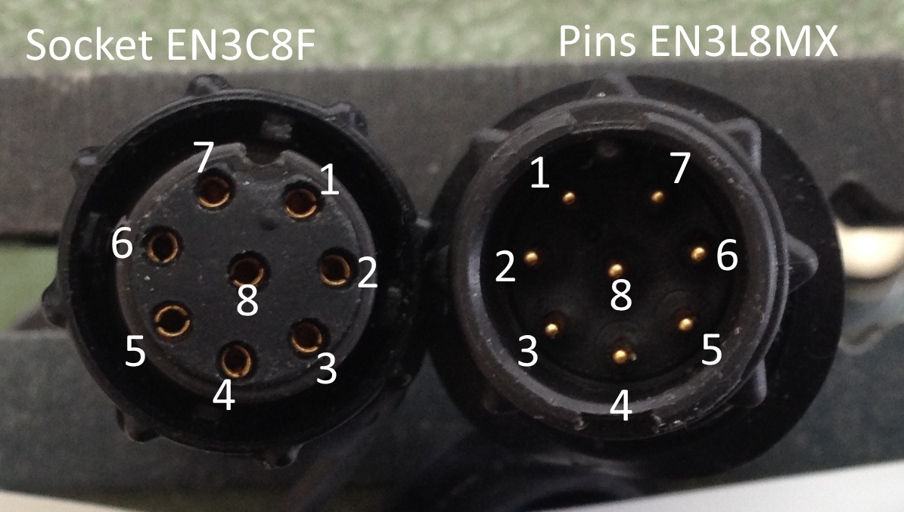

# Pigtail connector

The top section of your pole may be fitted with a pigtail cable, allowing data to be read out to a standalone display.

  

We use a Switchcraft "Cord Female" connector EN3C8FX, the mating connector on the WindBot brain is a Switchcraft "Inline Male" EN3L8MX.

  

<table id="table69646" border="1" cellspacing="0" cellpadding="0"><tbody><tr><td class=""><b>Pigtail</b></td><td class=""><b>Function</b></td><td class=""><b>Notes</b></td></tr><tr><td class="">1</td><td class="">GND</td><td> </td></tr><tr><td class="">2</td><td class="current">-</td><td> </td></tr><tr><td class="">3</td><td class="">TXD/OUT</td><td class="">4800 8n1 (NMEA0183)</td></tr><tr><td class="">4</td><td class="">12V out</td><td class="">300mA limit. Could be used to power wireless Bluetooth dongle.</td></tr><tr><td class="">5</td><td class="">CHG</td><td class="">8V-16V, 5W</td></tr><tr><td class="">6</td><td class="">GPIO/IO_IN</td><td> </td></tr><tr><td class="">7</td><td class="">
GPIO/IO_OUT
</td><td> </td></tr><tr><td class="">8</td><td class="">Shield</td><td> </td></tr></tbody></table>

  

