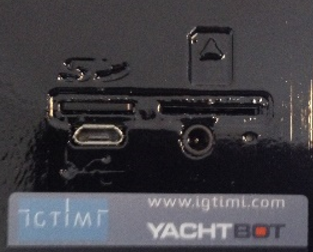

# Ports on TideBot

The ports on TideBot are identical to those on the YachtBot and WindBot products.

- The SD card must be inserted for correct operation. Use the SD card that arrived with your TideBot

- The SIM card is optional

- The USB port is used to access the SD card (there rarely is a need to remove the SD card and we advise against it) to change the config file or update the firmware

- The DC charge port is used for charging the battery. Only use the supplied charger

- The recessed reset button is for powering the device down in the unlikely event that the magnetic switch is not responsive
