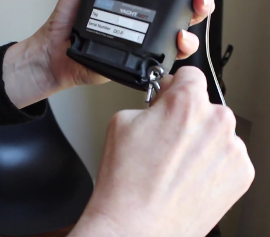

# Removing YachtBot's bung

This article applies to YachtBot, YachtBot Bio, and WindBot. A bung must **always** be fitted when used near water. Make sure the bung is greased regularly (using a machine grease such as INOX) to avoid damage to the YachtBot case.

  

Remove the bung to access the charging port, the SIM and SD card slots, and the reset button. Use a tool such as the supplied carabiner and remove the bung as shown in the video [here](https://www.youtube.com/watch?v=ftc8TsLwa2g).

  

Keep the bung well greased using machine grease, as it will keep the seal perfect and makes removing the bung easier. Never use a sharp tool to remove the bung as it damages the housing and the o-rings that provide the seal. If you have damaged a bung contact us for a replacement.