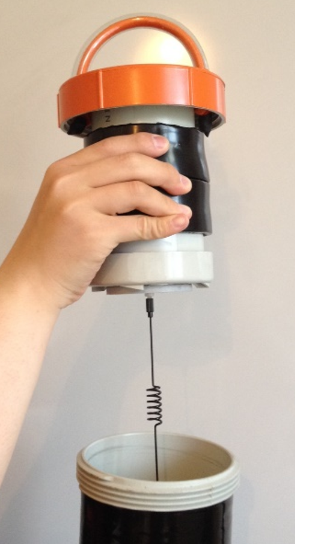

# Transporting TideBot

Storage
-------

When not in use for longer times, TideBot should be stored in a dry environment with all parts dried, cleaned, and free from salt and debris.

The cell phone antenna can be removed from the top of the pod and be stored hanging down from its lid using the provided Nylon bolt.