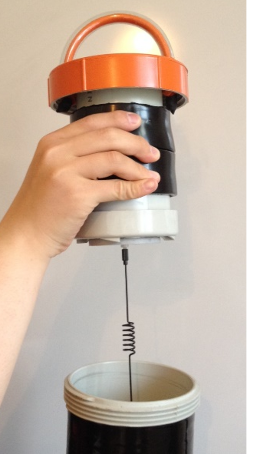

# FAQ

**Magnetic Inclination**

To get accurate readings, TideBot brain acquires the correct magnetic declination for your location and adjusts its internal compass reading. To take advantage of this feature, set

```NAV DECLINATION AUTO```

and make sure that your SD card is loaded with the World Magnetic Model coefficients (WMM.COF, supplied by us.) If you want to override this setting and set the declination manually, contact us.

  

  

**Transporting TideBot**

When not in use for longer times, TideBot should be stored in a dry environment with all parts dried, cleaned, and free from salt and debris.

The cell phone antenna can be removed from the top of the pod and be stored hanging down from its lid using the provided Nylon bolt.



  

**Replacing the bungee assembly**

If after a good amount of repeated use, the TideBot’s sails don’t spring out anymore when pulled from the storage tube, you can replace the bungee assembly with the supplied spare.

  

The bungee assembly holds the carbon rods under tension. Remove the old one by snipping the black shock chord that provides the tension and pull the rubber connectors from the rods. To reassemble, push the rubber connectors of the new assembly on and feed the new shock cord over the cloverleaf and back through the holes in the float. It is important to tighten both sides of the cord and secure them with a figure eight knot. All up, you need to pull out at least a foot of shock cord on each side.

  

### **Is the TideBot pod waterproof and does it sink if dropped it in the water?**

Yes, and Yes. - Take care out there!