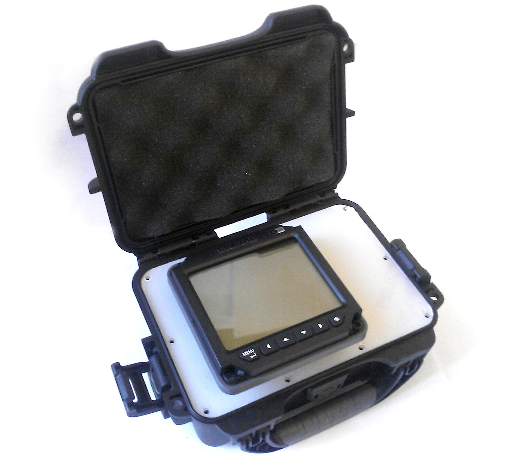

# Introduction WindBot Display

WindBot interfaces with a custom packaged Garmin or B&G display, which in standard operation is powered from the WindBot’s internal battery. If enabled, WindBot can be also be powered from your boat’s battery.

The display is most useful for displaying live True Wind (direction and speed) and waypoint measurements for measuring water currents. It is especially useful for race officials on committee boats and for situations where a live data feed via a SIM card is not an option.
