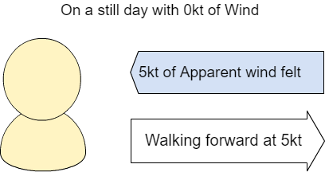

# Advanced Information

### **Contents:**

1\. How does the WindBot calculate True Wind

2\. Automatic Magnetic Inclination

3\. Connecting to a permanent power supply

4\. Pigtail connector

5\. Access data from the WindBot for analysis

### **1. How does the WindBot calculate True Wind**

True wind is the Wind we feel when we are standing still as the wind moves across the land.  This is the wind that is talked about during weather forecasts.

Apparent wind, is the wind we feel when we are walking forward on a calm day.   If there is no wind and we walk forward at 5kt, we will feel a wind strength of 5kt on our face.



As we move around daily, the wind we feel is a combination of the True Wind and the Apparent wind we generate.

If there is a breeze of 5kt coming across the land, and we walk towards that breeze at 5kt, we would feel a wind strength of 10kt on our face.


The WindBot has three different sensor types to calculate what the True Wind is, even while we are moving around.  The three sensors include a Global Position Sensor (**GPS**), an Inertial Measurement Unit (**IMU**) and a **Wind sensor**.  The WindBot is able to determine the difference between the Apparent wind (the wind we feel while moving) and the True Wind (the wind on the land), by using these three sensors.

The **Wind sensor** measures the Apparent wind that the WindBot feels.  This is the same wind that you feel as you walk around.

The **GPS** allows the WindBot to know how fast it is moving.  In the first example of walking forwards at 5kt, If the Wind sensors reads 5kt, and the GPS reads a speed of 5kt, then the True Wind must be 0kt and the WindBot can calculate this.

The **IMU**, is like a compass.  The IMU can tell us what direction we are walking.   In the second example when there is a True Wind of 5kt moving across the land.  The compass will tell the WindBot if we are walking at 5kt away from the Wind, and would feel no wind on our face.  Or if we are walking at 5kt towards the Wind and feel 10kt on our face.

**The WindBot needs all three sensors to be working together to calculate the True Wind.**

### **2. Automatic Magnetic Inclination**

To get accurate True Wind readings, WindBot brain acquires the correct magnetic declination for your location and adjusts its internal compass reading. To take advantage of this feature, set

`NAV DECLINATION AUTO`

and make sure that your SD card is loaded with the World Magnetic Model coefficients (WMM.COF, supplied by us.) If you want to override this setting and set the declination manually, contact us.

### **3. Connecting to a permanent power supply**

_For Firmware version 500 and greater._

The WindBot and YachtBot Base station products can be connected to a permanent power supply to ensure they are constantly running avoiding the requirement to recharge the internal batteries.

This setting makes the devices start and run when DC power is applied, then turn off when power is removed. Effectively it turns them into a "wall powered" device. This is particularly useful for WindBot poles on committee boats or coach RIBs, as it means they can be permanently connected and they start up automatically when the boat power is turned on at the beginning of the day.

Supply of permanent power to the WindBot requires the Pigtail connector on the WindBot pole. Power cables accessories are available to purchase or the pin out information is available [here](../../YachtBot%20Products/Deprecated%20articles/Pigtail%20connector.md).

To supply permanent power to the YachtBot Base station, use the supplied charging pack.  This will require the water proofing bung to be removed, so the YachtBot base station will not be water proof while running with permanent power.

NOTE: Plugging in a USB cable will not supply permanent power to the devices.

This feature is enabled by adding "POWER WIRED" to the config.ini file.

POWER WIRED takes some options, examples as follows:

```
POWER WIRED             # Will shut down 5 seconds after power fails.
POWER WIRED DELAY <x>   # <x> in minutes, how long the device will continue to operate when power fails.
POWER WIRED UPS         # Operate as long as battery allows when power fails.
```

In all these cases, when power is restored the device will start-up again.

The power button can:

\- Be safely used to power off, then on, a device that is running in POWER WIRED mode while the power connected. This allows operators to power cycle a device for troubleshooting, and the device will continue in POWER WIRED mode because power was present _at the moment when the operator restarted the device_.

\- Start a device that does not have power connected, even while in POWER WIRED mode. In this case it will detect that it had no power when it started, and operate _just once_ in POWER PORTABLE mode instead. This means that if power is later connected and removed, it will still run until the battery is flat, but once this has happened, it will still start automatically if power is applied again.

To switch between modes, POWER WIRED can be cancelled by setting POWER PORTABLE (the default). Note that the power mode is a persistent setting, which means;

\- once set it will continue even if the command is removed from the configuration, and\
\- if the power mode is changed the device will need to be power cycled once to run and apply the command.

In the event of extreme battery depletion the battery is completely disconnected to preserve it. POWER WIRED now handles this case too, and the device will also start normally from this condition when power is applied.

### **4. Pigtail connector**

The top section of your pole may be fitted with a pigtail cable, allowing data to be read out to a standalone display.

We use a Switchcraft "Cord Female" connector EN3C8FX, the mating connector on the WindBot brain is a Switchcraft "Inline Male" EN3L8MX.

<table border="1" cellpadding="0" cellspacing="0"><tbody><tr><td><strong>Pigtail</strong></td><td><strong>Function</strong></td><td><strong>Notes</strong></td></tr><tr><td>1</td><td>GND</td><td><br></td></tr><tr><td>2</td><td>-</td><td><br></td></tr><tr><td>3</td><td>TXD/OUT</td><td style="">4800 8n1 (NMEA0183)</td></tr><tr><td>4</td><td>12V out</td><td>300mA limit. Could be used to power wireless Bluetooth dongle.</td></tr><tr><td>5</td><td>CHG</td><td>8V-16V, 5W</td></tr><tr><td>6</td><td>GPIO/IO_IN</td><td><br></td></tr><tr><td>7</td><td>GPIO/IO_OUT<br></td><td><br></td></tr><tr><td>8</td><td>Shield</td><td><br></td></tr></tbody></table>


**5. Access data from the WindBot for analysis**

The WindBot allows access to the raw data both directly from the pole and through the [www.yacht-bot.com](http://www.yacht-bot.com) website.

**Access live data directly from the pole**

WHen the WindBot pole is operating is sends live raw data in a NMEA0183 format data through either the Pig tail connector, or wirelessly  using Bluetooth.

The pole outputs the following message types...

**rmc** - Recommended Minimum Navigation Information\
**gga** - Global Positioning System\
**zda** - Time and Date\
**mwva** or **mwvt** - Wind Speed and Angle ; AW (AWS/AWA); MWVA = Relative, MWVT = Theoretical\
**mwd** - Wind Direction & Speed; TW (TWS/TWD)\
**vtg** - COG/SOG\
**hdgm** - Magnetic heading\
**vdr** - Current Set and Drift; See 'Water Current' section\
**wpl**  - Waypoints; used for 'Water Current' events

A full description of the format of NMEA0183 messages can be found here... [https://www.tronico.fi/OH6NT/docs/NMEA0183.pdf](https://www.tronico.fi/OH6NT/docs/NMEA0183.pdf)

**Access logged data directly from the pole**

The WindBot logs the NMEA format messages to \*.nma log files stored on local memory.   Help on access the local memory is [here](<../../YachtBot%20Products/YachtBot%20product%20family%20fundamentals/SD%20(local%20memory%20storage)%20and%20SIM%20cards.md>).  Additional information on the additional sensor time stamping is [here](../../YachtBot%20Products/YachtBot%20product%20family%20fundamentals/Timed%20%22Sensor%22%20Log%20Files.md).

Example of additional time stamping of MWV messages.

```
$PISTE,33985,IIMWV,240,R,004.42,N,A\*78
$PISTE,34235,IIMWV,244,R,004.77,N,A\*7D
$PISTE,34485,IIMWV,243,R,005.25,N,A\*71
$PISTE,34735,IIMWV,238,R,005.30,N,A\*71
$PISTE,34985,IIMWV,237,R,005.01,N,A\*79
```

**Access CSV data from [www.yacht-bot.com](http://www.yacht-bot.com)**

Available to PRO level users;  Data can be downloaded from any YachtBot or WindBot device that is in a defined race.  Once the race is defined click on "Export".  Chose the time format and files options.  Click "Export".


The [www.yacht-bot.com](http://www.yacht-bot.com) website will generate the data as a background task and send you an email with a link to download the data.  It can take several minutes for the data to be prepared for download.

Below is example CSV data from a single combined file.

<table border="0" cellpadding="0" cellspacing="0" width="1335"><tbody><tr><td width="70">timestamp</td><td width="86">latitude</td><td width="91">longitude</td><td width="76" style="width: 3.4924%;">GPS_quality</td><td width="65" style="width: 5.0059%;">GPS_count</td><td width="135" style="width: 4.5751%;">Course_Over_Ground</td><td width="117" style="width: 9.8021%;">Heading_Magnetic</td><td width="88">Heading_True</td><td width="159" style="">Speed_Over_Ground(kph)</td><td width="64">Speed_Through_Water(kph)</td><td width="64">Apparent_Wind_Angle</td><td width="64">Apparent_Wind_Speed(kph)</td><td width="64">event_time</td><td width="64">heart_beat_count</td><td width="64">computed_heart_rate</td><td width="64">cadence</td></tr><tr><td align="right">40:55.0</td><td align="right">174.8622317</td><td align="right">-36.824165</td><td align="right" style="width: 3.4924%;">1</td><td align="right" style="width: 5.0059%;">7</td><td align="right" style="width: 4.5751%;">60.3</td><td style="width: 9.8021%;"><br></td><td><br></td><td align="right">2.4076</td><td><br></td><td><br></td><td><br></td><td><br></td><td><br></td><td><br></td><td><br></td></tr><tr><td align="right">40:55.5</td><td align="right">174.8622367</td><td align="right">-36.82416333</td><td style="width: 3.4924%;"><br></td><td style="width: 5.0059%;"><br></td><td align="right" style="width: 4.5751%;">66.3</td><td style="width: 9.8021%;"><br></td><td><br></td><td align="right">2.778</td><td><br></td><td><br></td><td><br></td><td><br></td><td><br></td><td><br></td><td><br></td></tr><tr><td align="right">40:56.0</td><td align="right">174.86224</td><td align="right">-36.82416333</td><td style="width: 3.4924%;"><br></td><td style="width: 5.0059%;"><br></td><td align="right" style="width: 4.5751%;">64.7</td><td style="width: 9.8021%;"><br></td><td><br></td><td align="right">2.5928</td><td><br></td><td><br></td><td><br></td><td><br></td><td><br></td><td><br></td><td><br></td></tr><tr><td align="right">40:56.5</td><td align="right">174.8622417</td><td align="right">-36.82416</td><td style="width: 3.4924%;"><br></td><td style="width: 5.0059%;"><br></td><td align="right" style="width: 4.5751%;">24.3</td><td style="width: 9.8021%;"><br></td><td><br></td><td align="right">2.0372</td><td><br></td><td><br></td><td><br></td><td><br></td><td><br></td><td><br></td><td><br></td></tr><tr><td align="right">40:57.0</td><td align="right">174.862245</td><td align="right">-36.82415833</td><td style="width: 3.4924%;"><br></td><td style="width: 5.0059%;"><br></td><td align="right" style="width: 4.5751%;">52.3</td><td style="width: 9.8021%;"><br></td><td><br></td><td align="right" style="">1.6668</td><td><br></td><td><br></td><td><br></td><td><br></td><td><br></td><td><br></td><td><br></td></tr><tr><td align="right">40:57.5</td><td align="right">174.8622467</td><td align="right">-36.82415667</td><td style="width: 3.4924%;"><br></td><td align="right" style="width: 5.0059%;">6</td><td align="right" style="width: 4.5751%;">49.4</td><td style="width: 9.8021%;"><br></td><td><br></td><td align="right">1.6668</td><td><br></td><td><br></td><td><br></td><td><br></td><td><br></td><td><br></td><td><br></td></tr><tr><td align="right">40:58.0</td><td align="right">174.8622467</td><td align="right">-36.824155</td><td style="width: 3.4924%;"><br></td><td style="width: 5.0059%;"><br></td><td align="right" style="width: 4.5751%;">16.1</td><td style="width: 9.8021%;"><br></td><td><br></td><td align="right">1.852</td><td><br></td><td><br></td><td><br></td><td><br></td><td><br></td><td><br></td><td><br></td></tr><tr><td align="right">40:58.5</td><td align="right">174.8622483</td><td align="right">-36.82415167</td><td style="width: 3.4924%;"><br></td><td style="width: 5.0059%;"><br></td><td align="right" style="width: 4.5751%;">10.3</td><td style="width: 9.8021%;"><br></td><td><br></td><td align="right">1.852</td><td><br></td><td><br></td><td><br></td><td><br></td><td><br></td><td><br></td><td><br></td></tr><tr><td align="right">40:59.0</td><td align="right">174.8622483</td><td align="right">-36.82415</td><td style="width: 3.4924%;"><br></td><td align="right" style="width: 5.0059%;">7</td><td align="right" style="width: 4.5751%;">21.6</td><td style="width: 9.8021%;"><br></td><td><br></td><td align="right">2.778</td><td><br></td><td><br></td><td><br></td><td><br></td><td><br></td><td><br></td><td><br></td></tr><tr><td align="right">40:59.5</td><td align="right">174.8622517</td><td align="right">-36.824145</td><td style="width: 3.4924%;"><br></td><td style="width: 5.0059%;"><br></td><td align="right" style="width: 4.5751%;">27.6</td><td style="width: 9.8021%;"><br></td><td><br></td><td align="right">3.3336</td><td><br></td><td><br></td><td><br></td><td><br></td><td><br></td><td><br></td><td><br></td></tr><tr><td align="right">41:00.0</td><td align="right">174.862255</td><td align="right">-36.82414167</td><td style="width: 3.4924%;"><br></td><td align="right" style="width: 5.0059%;">8</td><td align="right" style="width: 4.5751%;">40.2</td><td style="width: 9.8021%;"><br></td><td><br></td><td align="right">3.704</td><td><br></td><td><br></td><td><br></td><td><br></td><td><br></td><td><br></td><td><br></td></tr><tr><td align="right">41:00.5</td><td align="right">174.8622583</td><td align="right">-36.82413833</td><td style="width: 3.4924%;"><br></td><td style="width: 5.0059%;"><br></td><td align="right" style="width: 4.5751%;">38.7</td><td style="width: 9.8021%;"><br></td><td><br></td><td align="right">3.8892</td><td><br></td><td><br></td><td><br></td><td><br></td><td><br></td><td><br></td><td><br></td></tr><tr><td align="right">41:01.0</td><td align="right">174.862265</td><td align="right">-36.82413167</td><td style="width: 3.4924%;"><br></td><td style="width: 5.0059%;"><br></td><td style="width: 4.5751%;"><br></td><td style="width: 9.8021%;"><br></td><td><br></td><td><br></td><td><br></td><td><br></td><td><br></td><td><br></td><td><br></td><td><br></td><td><br></td></tr><tr><td align="right">41:01.5</td><td align="right">174.8622717</td><td align="right">-36.82412667</td><td style="width: 3.4924%;"><br></td><td align="right" style="width: 5.0059%;">7</td><td align="right" style="width: 4.5751%;">47.3</td><td style="width: 9.8021%;"><br></td><td><br></td><td align="right">6.482</td><td><br></td><td><br></td><td><br></td><td><br></td><td><br></td><td><br></td><td><br></td></tr><tr><td align="right">41:02.0</td><td align="right">174.86228</td><td align="right">-36.82412167</td><td style="width: 3.4924%;"><br></td><td style="width: 5.0059%;"><br></td><td align="right" style="width: 4.5751%;">59.2</td><td style="width: 9.8021%;"><br></td><td><br></td><td align="right">7.0376</td><td><br></td><td><br></td><td><br></td><td><br></td><td><br></td><td><br></td><td><br></td></tr><tr><td align="right">41:02.5</td><td align="right">174.8622917</td><td align="right">-36.82411667</td><td style="width: 3.4924%;"><br></td><td align="right" style="width: 5.0059%;">8</td><td align="right" style="width: 4.5751%;">68.6</td><td style="width: 9.8021%;"><br></td><td><br></td><td align="right">8.1488</td><td><br></td><td><br></td><td><br></td><td><br></td><td><br></td><td><br></td><td><br></td></tr><tr><td align="right">41:03.0</td><td align="right">174.862305</td><td align="right">-36.82411333</td><td style="width: 3.4924%;"><br></td><td align="right" style="width: 5.0059%;">9</td><td align="right" style="width: 4.5751%;">68.9</td><td style="width: 9.8021%;"><br></td><td><br></td><td align="right">8.1488</td><td><br></td><td><br></td><td><br></td><td><br></td><td><br></td><td><br></td><td><br></td></tr><tr><td align="right">41:03.5</td><td align="right">174.8623183</td><td align="right">-36.82411</td><td style="width: 3.4924%;"><br></td><td align="right" style="width: 5.0059%;">8</td><td align="right" style="width: 4.5751%;">69.4</td><td style="width: 9.8021%;"><br></td><td><br></td><td align="right">8.5192</td><td><br></td><td><br></td><td><br></td><td><br></td><td><br></td><td><br></td><td style=""><br></td></tr></tbody></table>

**Advanced Programming Access to all YachtBot and WindBot device data**

All data visualised on the [www.yacht-bot.com](http://www.yacht-bot.com) website is available through a programming interface called the Igtimi Cloud.  The Igtimi Cloud is a RESTFul API that allows programmatic data calls giving access to live data through web sockets, and historical data with JSON structures.   Access to the Igtimi has an additional cost, and more information can be found at [www.igtimi.com](http://www.igtimi.com).
