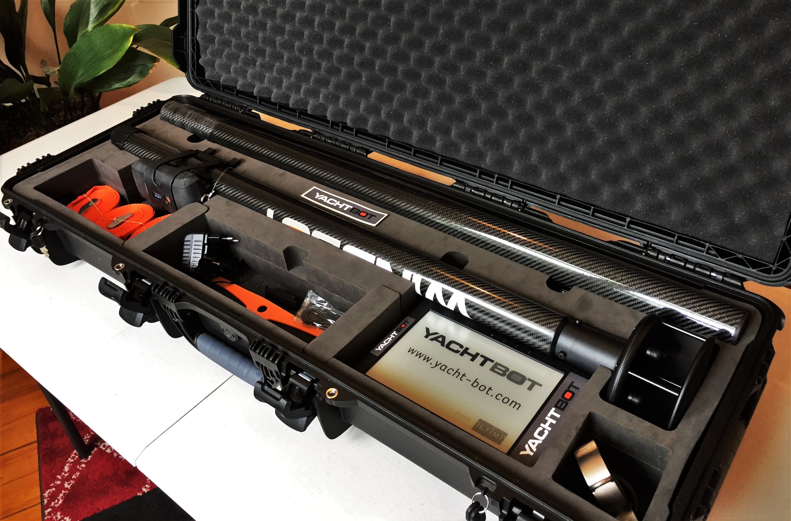
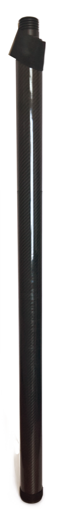
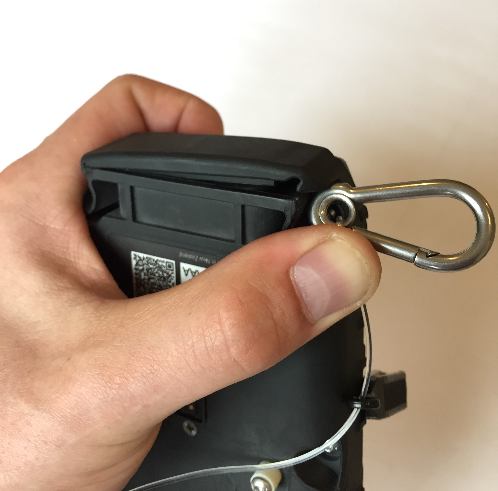
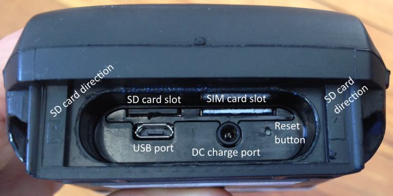
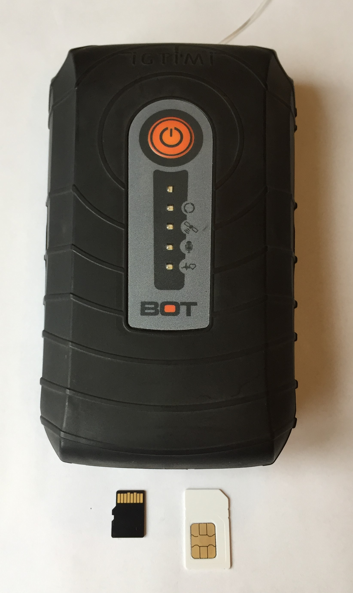
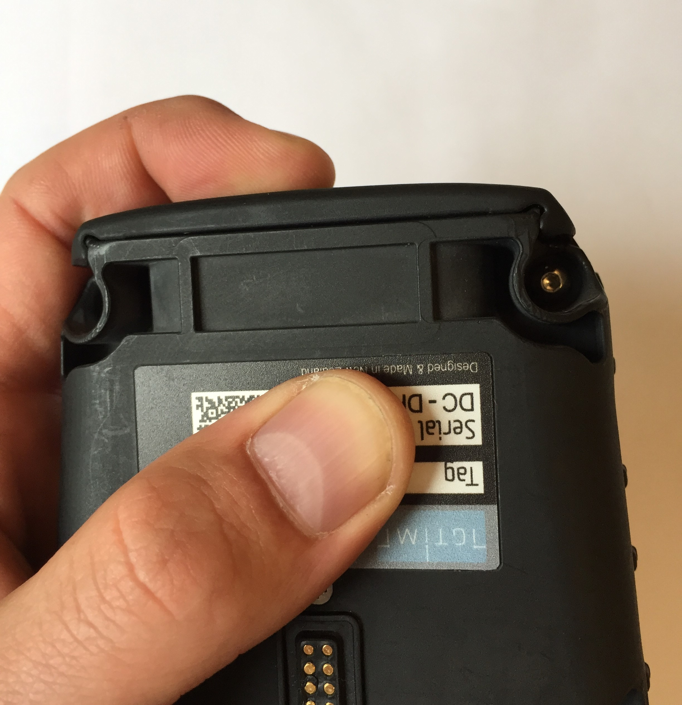
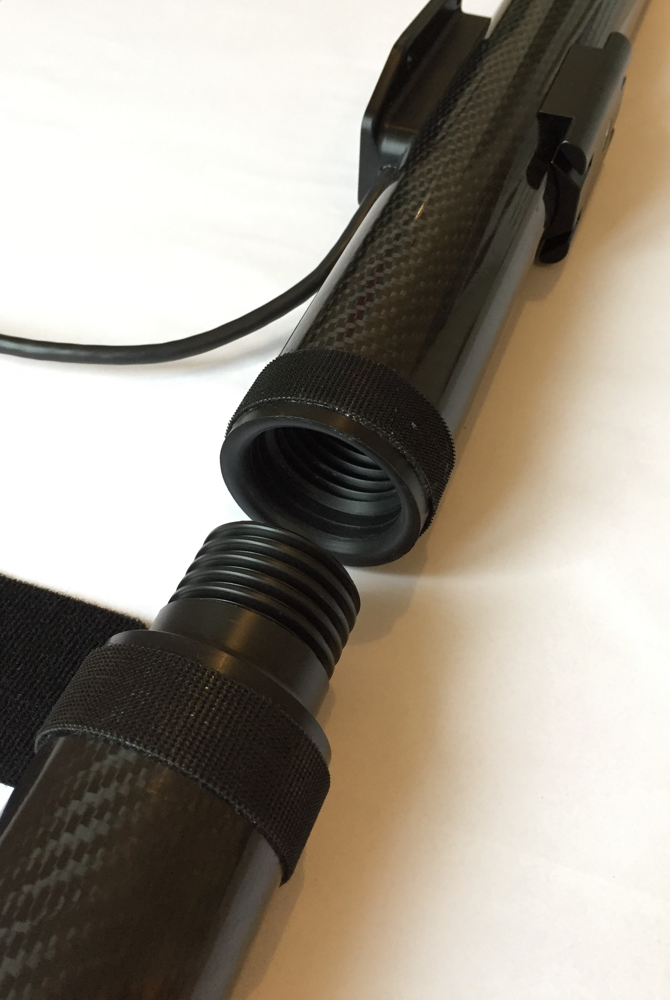

# Getting started

Before heading out on the water, here are a few tips and tricks for getting the most out of your WindBot system.

Watch the YouTube video on [Getting started with your WindBot](https://youtu.be/ZOwelCJcDx4)         [https://youtu.be/ZOwelCJcDx4](https://youtu.be/ZOwelCJcDx4)

If this is a brand new system, please ensure that you have received all components, and that everything is intact before beginning setup.

If you have purchased the Coaching Kit, you should have:

- WindBot 'Brain' unit
- Top section (with sensor attached)
- 2 Pole extensions
- Power supply
- USB cable
- 3 Tie down straps
- Stainless steel pole clamp
- Rubber pole cup
- Spare bung
- Spare 'ninja' strap
- E-Ink Bluetooth display
  - USB cable
  - Waterproof case (**Optional**)
  - Mounting kit (**Optional**)
- Power cable, to connect to the boat. **(Optional)**

To aid you in identifying the parts of your WindBot, below is an overview of the WindBot system components.

Left (top to bottom):

\> Spare orange ninja strap

\> Stainless steel pole clamp

Right (top to bottom):

\> USB Cable

\> Spare bung

\> Power supply

\> Tie down strap

\> Rubber cup

<table border="1" cellpadding="0" cellspacing="0" id="table84514" style="border-collapse: collapse; border: 1px solid rgb(175, 175, 175); max-width: 500px;"><tbody><tr><td style="width: 50%;">
WindBot Top Section:
 </td><td style="width: 50%;">
WindBot Pole extension:
 </td></tr><tr><td></td><td></td></tr></tbody></table>

**Assembling WindBot**

**Initial setup**

Before deploying your WindBot, we recommend first fully charging the 'brain' unit, and installing a SIM card. Note: The SIM card is large form factor, and requires an active data plan. Check out our related articles on [SIM cards](<../../YachtBot%20Products/YachtBot%20product%20family%20fundamentals/SD%20(local%20memory%20storage)%20and%20SIM%20cards.md>), [APN settings](../../YachtBot%20Products/YachtBot%20product%20family%20fundamentals/SIM%20card%20APN%20settings%20for%20common%20providers.md), and [trouble shooting advice](../../YachtBot%20Products/YachtBot%20product%20family%20fundamentals/Cellular%20connectivity%20trouble%20shooting.md).

To charge your device, remove the bung from the base of the 'brain' unit, and connect the supplied charger. For a 'how-to' on bung removal, watch on YouTube: [WindBot Bung Removal](https://youtu.be/ftc8TsLwa2g)

To install your SIM card, with the bung removed from the unit, simply insert the card into the right hand side slot. The left hand slot is for an SD card, and should already be installed. Note: This SD card is required for the device to run, so do make sure it is installed.

With your device charged, and SIM card installed, re-install the waterproofing bung. The WindBot is not waterproof without the bung installed.

With your device ready to go, head over to [www.yacht-bot.com](http://www.yacht-bot.com) to register your device, using the device serial and tag identifiers located on the back of the device. This step is required for you to see live data on the YachtBot website.

For more information on registering devices see [Registering devices](../../YachtBot%20Web/Getting%20started/Registering%20Devices.md).

**Pole assembly**

To assemble your WindBot system, begin by screwing the top section to the two pole extensions. These have a male and female threaded section on each end.

Ensure that the two sections are threaded together fully, and the two leading faces pull up tight.

For added security, secure the two sections together with the Velcro strap.

**Attaching the 'brain' device**

To attach the 'brain' to the pole,  place the device on the pole, and use the supplied ninja strap to secure in place. Watch on YouTube: [Installing WindBot Brain on pole](https://youtu.be/at4fanNPLi0)

Align unit on the pole and secure with rubber strap.

.

Don't forget to attach the safety lanyard around the pole also.

**Powering on WindBot**

To turn on your WindBot, head outside, with a full view of the sky and push the power button on the WindBot until you hear two beeps and see the 2nd and 3rd LEDs flash. The device is now looking for GPS signal and checking the data connection. For the YachtBot website to recognize the WindBot, both indicators must flash while connecting and then go solid when successfully connected.

**Powering off WindBot**

To turn off your WindBot, press and hold the power button until the unit beeps. The unit will then begin to shutdown. The lights may continue to flash for a while after, as the unit is synchronizing cached data to the cloud.

**Bluetooth Display**

There should be instructions provided with your system on setting up the Bluetooth display.

**Troubleshooting**

Visit our other support pages for more troubleshooting information.
