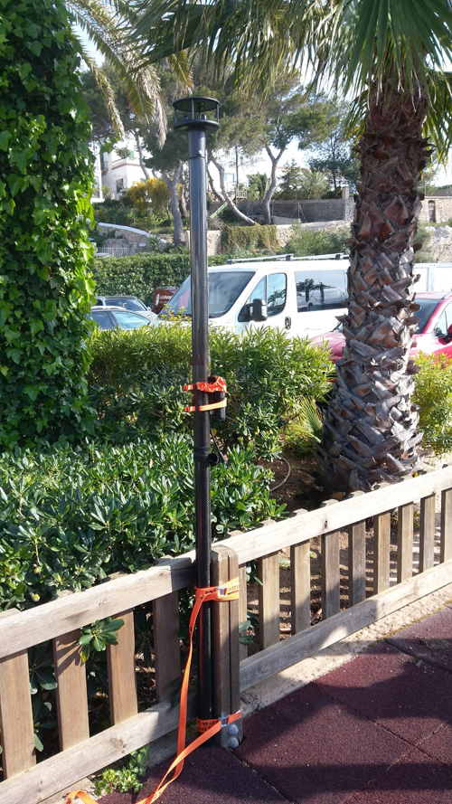

# NEW (Beta) - Field Calibration process

  

**WARNING:**    
**Field calibration of the WindBot pole is a new process that is currently being developed and refined.  Please only undertake this process in consultation with Igtimi and YachtBot staff.  Before starting please ensure you have emailed info@igtimi.com.**

  

Please read this full page before you undertake this process.  This process requires files to be emailed to Igtimi Staff and a time arranged for Igtimi Staff to access the WindBot Brain remotely.  This process may take a few days to complete.

  

Ensure that you are running firmware version Build 512 (Published 9 May 2019) or greater before using the process detailed in the article.  The latest firmware can be found here...

[http://support.yacht-bot.com/solution/articles/8000004686-firmware-updates-for-yachtbot-windbot-and-tidebot](../../YachtBot%20Products/Firmware%20and%20Configuration%20Downloads/Firmware%20updates%20for%20YachtBot,%20WindBot,%20and%20TideBot.md)

  

  

1.  Plug the WindBot brain into a computer using the USB cable.  Backup your existing config.ini file and copy the calibration config.ini from [here](https://yachtbot.freshdesk.com/helpdesk/attachments/8049102090).
2.  Take just the two top sections of the WindBot off your boat. In an outside space away from all metallic objects, lash the middle section of the pole against something to securely keep the poles vertical without any wobble.  If you have multiple poles, use the Pole that the WindBot brain is normally attached to.
3.  Please take a photo of this process so we can confirm that there are no interfering objects nearby.
4.  Tape or role the Velcro between the poles out of the way.
5.  Turn on the Brain wait until the GPS light on the brain stops flashing.
6.  Slowly unscrew the top section of the pole by two complete turns slowly so the brain moves through at least 720 degrees.
7.  Then slowly screw it back down
8.  Repeat this three to four times over two minutes.
9.  Turn off the brain.

  

During this process the WindBot brain will log the rotational movement.  This will give a clean set of measurements of just the horizontal motion of the brain that can be used to create a new calibration file for the WindBot brain.

  

Plug this brain into your computer with USB and send all the files on the WindBot drive to info@igtimi.com.

  

Igtimi staff will then need time to create a new calibration file and send it back to you. Copy the calibration file that was sent to you back onto the WindBot using the UBS cable.

  

Before using your WindBot again, be sure to restore your original config.ini file from the backup.

  

Set up a time with Igtimi staff, arranging when your WindBot brain can be turned and left on.  Igtimi staff will remotely connect to the WindBot brain to apply the calibration file.  You will need a SIM card in your WindBot brain for this process so that Igtimi can access your WindBot.