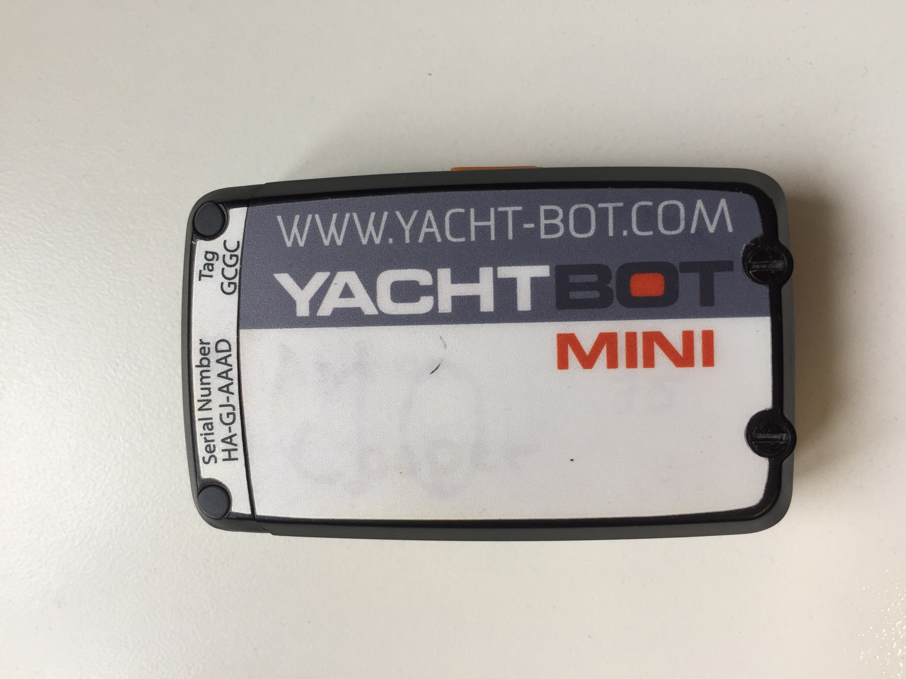
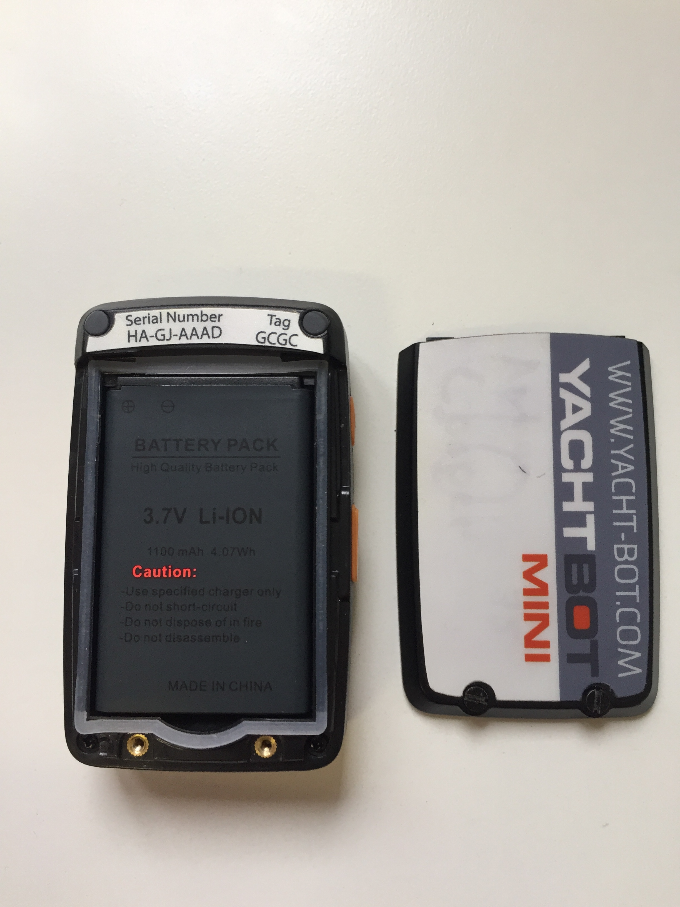
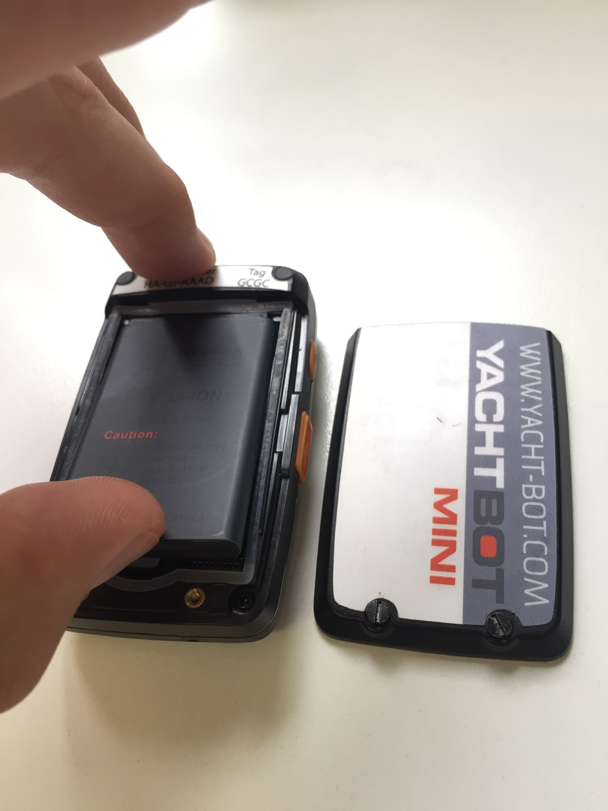
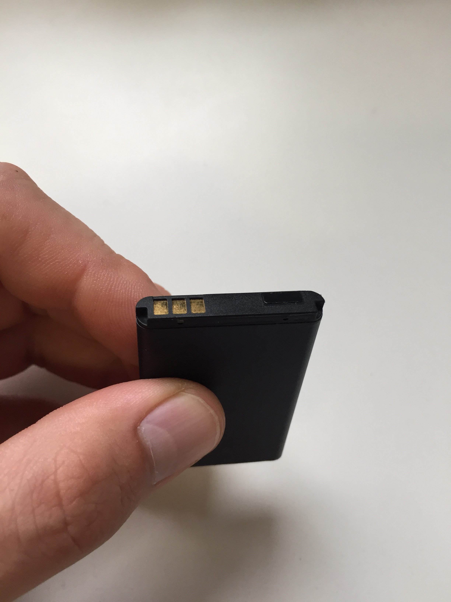
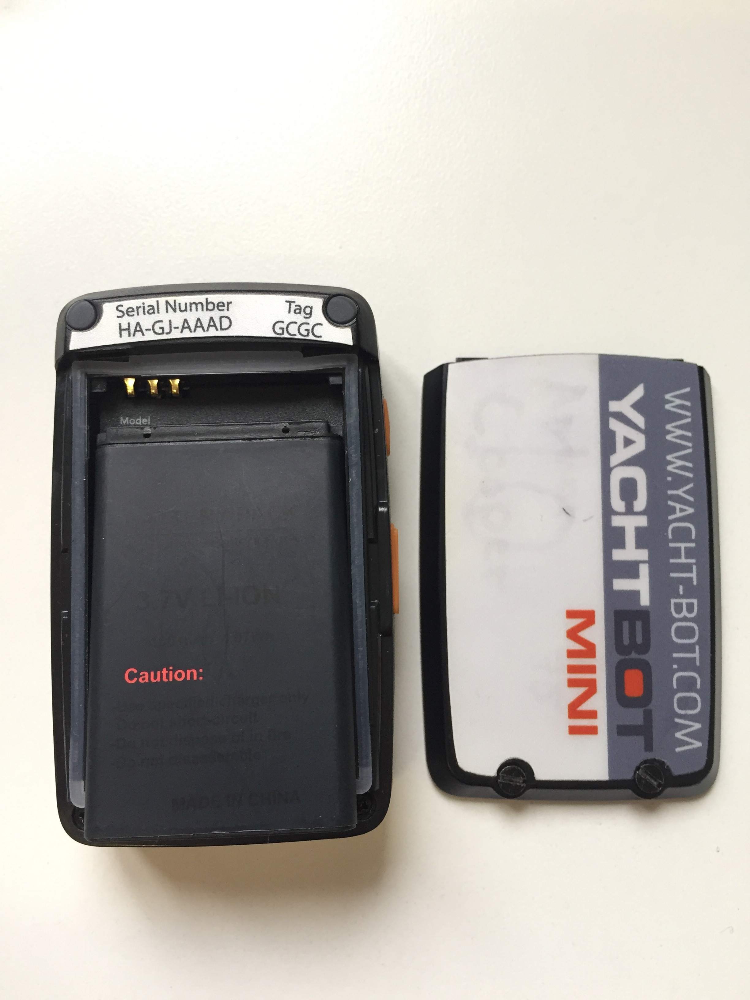

# Changing the battery

Use only supplied YachtBot batteries in YachtBot Mini. Incorrect installation of battery may cause damage to YachtBot Mini.

  

**Remove battery cover:**

On rear of device, loosen the two small screws that hold on the battery cover. Remove battery cover from the device.

These screws are captive and remain in the battery cover when loose.

  

  

  

**Remove Battery:**

Use a fingernail to gently lift the battery up from the bottom of the device. Remove battery from device.

Do not use sharp tooling to remove battery, as this may damage the battery.

  

  

  

**Install Battery:**

Insert new battery into YachtBot Mini with the battery’s gold contacts at top left, under the YachtBot Mini serial number sticker.

  

  

**Install Battery Cover:**

Replace the battery cover, ensuring that the top of the cover is seated well into the device.

Carefully tighten the two screws on the bottom of the cover, making sure the threads

of both screws are started before tightening the screws down all the way.

Do **not** over tighten the screws.