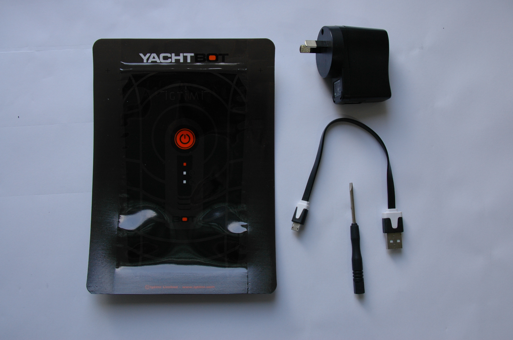
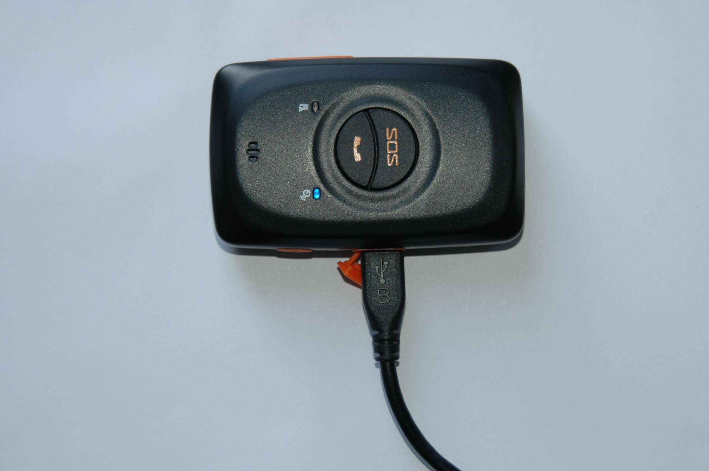
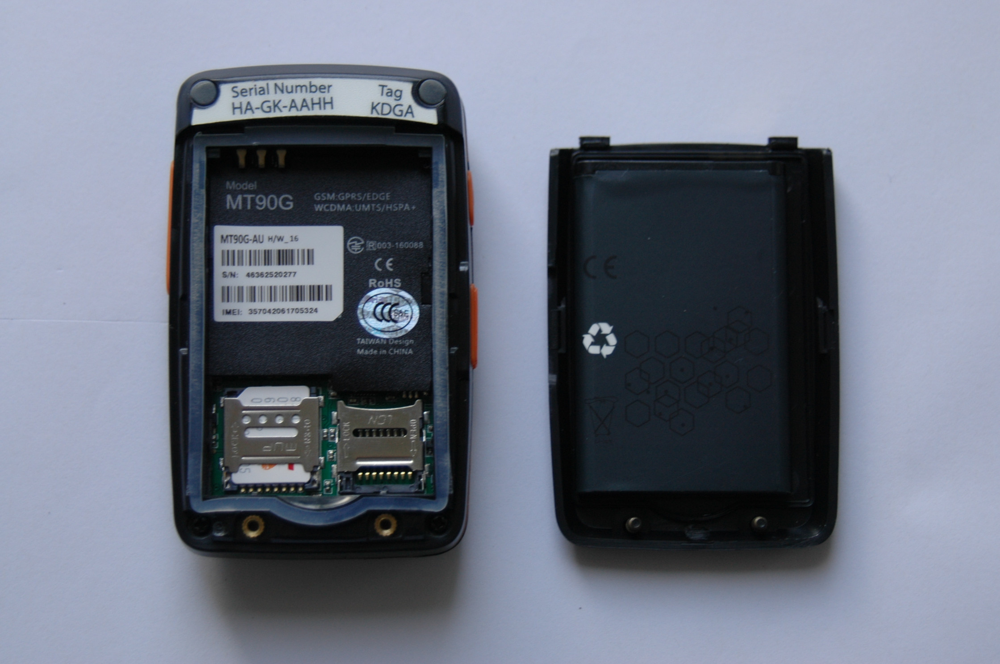

# Getting started

  

  

Before heading out on the water, here are a few tips and tricks for getting the most out of your YachtBot Bio system.

  

If this is a brand new system, please ensure that you have received all components, and that everything is intact before beginning setup.

  

You should have:

*   Screwdriver – Used to open the unit’s outside cover to add SIM card.
*   USB cable – Standard micro USB cable for charging
*   Power supply - (DC to USB) for charging
*   YachtBot bag

  

  

**Initial setup**

  

Before deploying your YachtBot Mini, we recommend first fully charging the unit, and installing a SIM card. Note: The SIM card is a large form factor for the 2G version and a micro SIM for the 3G version, and require an active data plan. Check out our related articles on [SIM card installation and APN settings](../../YachtBot%20Products/YachtBot%20Mini/SIM%20card%20installation%20and%20APN.md) and [trouble shooting advice](../../YachtBot%20Products/YachtBot%20product%20family%20fundamentals/Cellular%20connectivity%20trouble%20shooting.md).

  

To charge your device, pull out the orange plug on the left side of the device, and connect the supplied charger with the USB cable. Charging takes around three hours to fully charge, with a 95% charge after two hours. 

Note: the blue indicator does not turn off once the unit is charged.

  

  

  

To install the SIM card in your device open the unit with the supplied screw driver. Take out the battery and insert the SIM card into the larger metal slot on the right side. Re-fit the battery and outside cover.

  

  

With your device ready to go, head over to [www.yacht-bot.com](http://www.yacht-bot.com/) to register your device, using the device serial and tag identifiers located on the back of the device. This step is required for you to see live data on the YachtBot website.

For more information on registering devices see [Registering devices](../../YachtBot%20Web/Getting%20started/Registering%20Devices.md).

  

  

  

**Powering on YachtBot Mini**

  

With a full view of the sky, push the power button on the left side of the YachtBot Mini until you hear a beep and feel a vibration. The device now looks for GPS signal (blue indicator) and checks the data connection (green indicator). For YachtBot to recognize the 2G YachtBot Mini, both indicators must flash and then turn off. With the 3G YachtBot Mini, both indicators flash in unison every three seconds.

  

Indicators
----------

<table border="1" cellpadding="0" cellspacing="0"><tbody><tr><td><strong>Indicator</strong></td><td><strong>Mode</strong></td><td><strong>Description</strong></td></tr><tr><td>GPS (blue)</td><td>Steady on</td><td>Charging</td></tr><tr><td> </td><td>Blinking (1s cycle)</td><td>Fixing to satellites or invalid GPS</td></tr><tr><td>&nbsp;</td><td>Off</td><td>&nbsp;Fixed to satellites (2G) or powered off</td></tr><tr><td>&nbsp;</td><td>Blinking (3s cycle)</td><td>&nbsp;Fixed to satellites (3G)</td></tr><tr><td>&nbsp;Data (green)</td><td>&nbsp;Steady on</td><td>&nbsp;--</td></tr><tr><td>&nbsp;</td><td>&nbsp;Blinking (1s cycle)</td><td>&nbsp;Establishing a data connection or not receiving signal</td></tr><tr><td>&nbsp;</td><td>&nbsp;Off</td><td>&nbsp;Connected (2G) or powered off</td></tr><tr><td>&nbsp;</td><td>&nbsp;Blinking (3s cycle)</td><td>&nbsp;Connected (3G)</td></tr></tbody></table>

  

  

  

**Powering off YachtBot Mini**

  

To turn off your YachtBot Mini, press and hold the power button until the unit beeps. 

  

  

  

**Troubleshooting**

Visit our other support pages for more troubleshooting information.