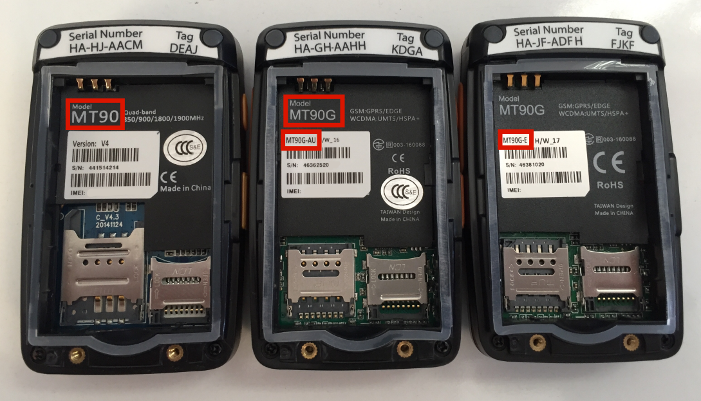

# Identify device cellular frequencies

YachtBot Mini comes in several different minor versions, with options for cellular frequencies.

If you have purchased your hardware post January 2018, then you can be confident that your unit is 3G.

If your hardware was purchased before January 2018, then use the below image to identify which model you have.

## Identify your device

## Device types

### MT90

Our MT90 units are 2G only.

### MT90G

Our MT90G units are 2G and 3G capable.

## Cellular bands

To determine the cellular bands your device is capable of, first identify your sub model (Small red box in the above image). Use the table below to identify the area and bands of your device.

<table border="1" cellpadding="0" cellspacing="0" id="table93638" style="border-collapse: collapse; border: 1px solid rgb(175, 175, 175); width: 92%;"><tbody><tr><td style="width: 17.7291%;"><strong>Model &nbsp; &nbsp;</strong> </td><td style="width: 49.8876%;"><strong>Cellular bands</strong> </td><td style="width: 32.1349%;"><strong>Area</strong> </td></tr><tr><td style="width: 17.7291%;">MT90G &nbsp; &nbsp; &nbsp; &nbsp; &nbsp; &nbsp; </td><td style="width: 49.8876%;">800/850/900/1900/2100 MHz </td><td style="width: 32.1349%;">Global </td></tr><tr><td style="width: 17.7291%;">MT90G_E </td><td style="width: 49.8876%;">900/2100 MHz </td><td style="width: 32.1349%;">Europe and Asia </td></tr><tr><td style="width: 17.7291%;">MT90G_A </td><td style="width: 49.8876%;">850/1900 MHz </td><td style="width: 32.1349%;">America </td></tr><tr><td style="width: 17.7291%;">MT90G_AU </td><td style="width: 49.8876%;">850/900/2100 MHz </td><td style="width: 32.1349%;">Australia only </td></tr><tr><td style="width: 17.7291%;">MT90G_JP </td><td style="width: 49.8876%;">800/900/2100 MHz </td><td style="width: 32.1349%;">Japan only </td></tr></tbody></table>
