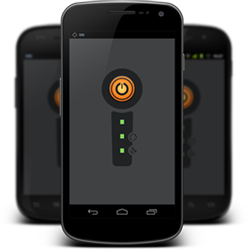

# Getting started

**Get the app for your phone**

Download the YachtBot Mobile App to your smartphone from Google Play or the App Store. It's free [here](https://play.google.com/store/apps/details?id=com.igtimi.yachtbot)!

**Use your YachtBot account**

Sign in on your YachtBot Mobile app, using the same login you created when you signed up to a [YachtBot account](../../YachtBot%20Web/Getting%20started/Create%20your%20YachtBot%20account.md).

Don't have an account? - Create one [here](http://www.yacht-bot.com)! Simply click 'sign up', and come back here once you are done.

**How it works**

Your phone automatically registers on YachtBot, as a device. Devices are the physical objects that provide data to our servers. Your phone will act like it's big brother, the YachtBot!

Your phone sends its location data over the cellular network to our servers. Once we have your data, we then display it over a map. for your viewing pleasure. Races look best when everyone is tracked, so it is best to get a few phones together and register them all to the same account.

To enable tracking, simply push the big orange button. This will begin sending your GPS position and speed to our servers.

**What do the indicator lights mean?**

Same as on the YachtBot hardware, the top light indicates power, the center indicator communicates connection to our servers, and the bottom one connectivity to the GPS network.

See [Understanding indicator lights](http://sfsdf) for more on what these mean.

**I want to see my device live on a map, please!**

Head over to [www.yacht-bot.com](http://www.yacht-bot.com), and log in with the same account details that you used for logging into the app.

Follow these instructions on how to create your first sailing session! [Create your first race](http://safddsf)

**It didn't work?**

## iOS

Make sure that location services are turned on, and that the YachtBot App is allowed to use mobile and/or roaming data.

## Android

Trouble logging in? If you can't login after a few tries, please remove the application from your phone and start over.

## Keeping your phone dry

Place you phone in a secure dry place where it still has good views of the sky. Note that carbon fiber shields signals very efficiently. On your body, such as in your buoyancy device can work very well.

Note that YachtBot Mobile App uses continuous GPS, a heavy use of the battery. We recommend starting with a full battery and using USB charge packs in addition.

Happy Sailing!
