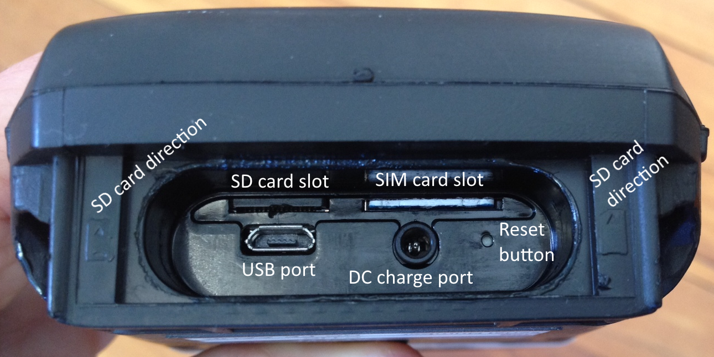

# Charging YachtBot and WindBot

**Standard Charging** 

  

Ensure that the device is turned off. Remove the bung at the bottom of the tracker and plug in the supplied power pack into the power charge socket. 

The power indicator will flash whilst charging, then turn on solid when the tracker is fully charged. 

When the charger is removed, the charge indicator should turn off. 

  

<table class="fr-no-borders" style="width: 100%;"><tbody><tr><td style="width: 29.8979%;">&nbsp; Charging: &nbsp; &nbsp;&nbsp; </td><td style="width: 69.9628%;">Charged: </td></tr><tr><td dir="ltr" style="width: 29.8979%;"></td><td style="width: 69.9628%;">&nbsp;</td></tr></tbody></table>

  

  

(The device can also be charged in the same way using a micro-USB cable.  It is not recommended to charge using the USB as charging is slower (between 12-24hours) and depends on the available current supply via DC pack or USB port.)

  

A 90% charge is achieved after approximately 4 hours, full charge between 6 and 8 hours.

  

**Trouble shooting if the device is not charging**

  

If the device has been left on a low charge for a while it will enter a low power mode to protect the battery.  This means that the device can't detect the normal charging process until there is enough charge in the battery to start the internal charging circuits.

  

If the device is in this state, it will not flash the charging light when plugged into charge, and if you press the power button it will fast flash for a few seconds.

  

Step 1:  Plug the charger into the DC charge port and leave for 15mins to 1hour.  This is giving the device a slow trickle charge.

  

Step 2: While its plugged in, try to turn it on.

  

If it turns on then,  

Step 3: Turn it off unplug from charge.  Wait for all the flights to stop flashing.  

  

Step 4: Plug back in for a normal fast charge.

  

If you cant turn it on, go back to step 1 and wait for a longer trickle charge.