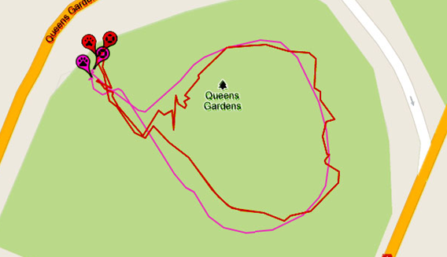
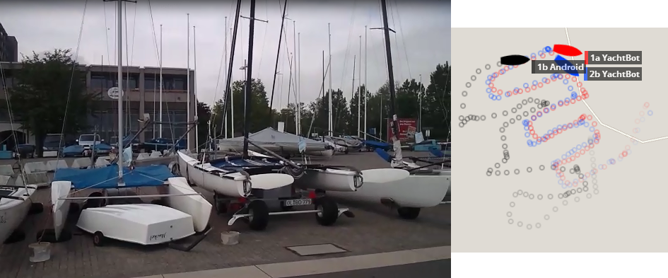
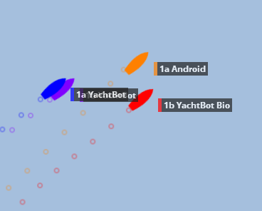

# GPS performance of YachtBot hardware

The problem: GPS performance in Sailing 
----------------------------------------

Sailing, dinghy racing in particular, is a tricky environment for GPS tracking. It's _dynamic,_ and roll and pitch play an important role. The sky view is often _obstructed_ by the mast, boom, and other competitors on the start line. _Multipath error_, caused by the signal bouncing on objects and the water, and resulting in a messy signal, becomes a limiting factor.

  

Manufacturers like to quote GPS positioning performance figures assuming perfect, laboratory-like conditions, which is not usually a close match to the real-world sailing environment. On larger boats it is possible to get close to “perfect” by installing high quality (larger) antenna clear behind the stern of the yacht. For smaller boats this is not possible and the quality of the tracking equipment determines the overall performance. 

  

In summary, your mileage may vary and buyer beware! We recommend exercising caution when reviewing glossy accuracy results. Contact us at info@igimi.com if your questions about GPS accuracy aren't answered below, or if you would like advise for your particular situation.

  

The solution: YachtBot product family
-------------------------------------

YachtBot's key features enable the highest positioning accuracy possible for dinghy racing and other equally challenging environments.

  

We offer three hardware products for tracking yachts; YachtBot, YachtBot Bio and YachtBot Mini.  

These are designed specifically for temporary installation on small dinghy style boats, with internal batteries and antenna. On demand, we supply YachtBot as system with external antenna, and the ability to add an external power source for permanent installation. 

  

YachtBot, YachtBot Bio,the WindBot and TideBot systems, are compatible with the choices of GPS modules listed below. 

  

YachtBot vs. phone grade GPS
----------------------------

### A walk in the park

The figure on the right demonstrates the differences between a consumer grade GPS in a cell phone (or also YachtBot Mini), and a YachtBot. The data was gathered at the same time. The red line is a cell phone; the pink line is a YachtBot Bio with a standard module.  

  

### At the start line

The figure below is a good example for a typical start-line situation, with many boats in close proximity. We zig-zagged through the catamarans with the tracking gear mounted on a laser mast. Note the two YachtBot’s have a very clean pattern in this difficult test. The Android phone performs badly, with many boat lengths of error. This is because phones have very poor performance in this high-multipath environment.

  

  

### Out on the boat

As an example of comparative GPS performance in the best possible conditions, consider the image below. There are two YachtBots co-located (Blue/Purple) on one vessel, and the Android phone co-located with a YachtBot Bio on another. This snapshot demonstrates some of the worst phone grade behaviour. In the same session the worst error for the YachtBot’s was about ¾ of a boat length.  

  

  

  

Choosing the right accuracy for YachtBot
----------------------------------------

One of the unique features of the YachtBot hardware is that it can be equipped with a range of GPS modules to suit different resolution requirements. In increasing accuracy, the four options are (with phone grade accuracy listed for completion):

  

<table id="table36866" border="1" cellspacing="0" cellpadding="0"><tbody><tr class="current"><td class="">#&nbsp;</td><td class=""><b>Option</b></td><td class=""><b>Technology</b></td><td><b>GPS Type</b></td><td><b>Accuracy RMS (m)</b></td><td class=""><b>Base station</b></td><td class=""><b>Notes&nbsp;</b></td></tr><tr class="current"><td class=""><i>&nbsp;0</i></td><td class=""><i>Phone grade</i></td><td class=""><i>Autonomous</i></td><td class=""><i>Consumer</i></td><td class=""><i>~10.0</i></td><td class=""><i>No</i></td><td class=""><i>As found in most smart phones and YachtBot Mini, using GPS only</i></td></tr><tr><td class="">&nbsp;1</td><td class="">Standard</td><td class="">Autonomous</td><td class="">Consumer</td><td class="">3.0</td><td class="">No</td><td class="current">Using GPS+GLONASS</td></tr><tr><td class="">&nbsp;2</td><td class="">SBAS</td><td class="">
Autonomous/SBAS
</td><td class="">Precision</td><td class="">1.7/0.5</td><td class="">No</td><td class="">0.5m accuracy only in areas of SBAS coverage</td></tr><tr><td class="">&nbsp;3</td><td class="">Differential</td><td class="">PSRDIFF</td><td class="">
Precision
</td><td class="">0.5</td><td class="">Yes</td><td>&nbsp;</td></tr><tr><td class="">&nbsp;4</td><td class="">RTK</td><td class="">RTK</td><td class="">
Precision
</td><td class="">0.05 RMS + 1PPM</td><td class="">Yes</td><td>&nbsp;</td></tr></tbody></table>

  

When accuracy is not the paramount concern, consider the YachtBot Mini for tracking sailing races. We support many races using YachtBot Mini, ask us for a recent example race.

  

Upgrades
--------

Upgrades between option 2 to 4 are by firmware unlock, the hardware requires no modification.

  

Glossary & Notes
----------------

  

<table id="table83456" border="1" cellspacing="0" cellpadding="0"><tbody class="current"><tr><td class=""><b>Term</b></td><td class=""><b>Note</b></td></tr><tr><td class="">GPS</td><td class="current">Global Positioning System. Used synonymically with everything satellite, it is in fact the American system.</td></tr><tr><td class="">GLONASS</td><td class="">Global Navigation Satellite System. Russian equivalent of GPS.</td></tr><tr><td class="">SBAS</td><td class="">“Space Based Augmentation Service” – more commonly known as WAAS in the USA and EGNOS in the EU. It provides correction data direct from the satellite in many areas (see&nbsp;<a href="http://en.wikipedia.org/wiki/File:SBAS_Service_Areas.png" target="_blank">map</a>) at no extra cost.</td></tr><tr><td class="">&nbsp;DGPS</td><td class="">“Differential GPS” – it provides correction data from a DGPS base station. Requires a DGPS base station, and the data is delivered automatically to the YachtBot over the internet and cell phone network via our web portal service.</td></tr><tr><td class="">&nbsp;RTK</td><td class="">“Real Time Kinematics” – similar to DGPS, but more accurate. Requires an RTK base station, and the data is delivered automatically to the YachtBot over the internet&nbsp;and cell phone network&nbsp;via our web portal service. </td></tr></tbody></table>

  

### GPS+GLONASS

With most GPS tracking systems it’s possible to see up to maximum of 15 satellites at any one time. However, the average number of visible satellites is less than 10, and it’s normal to have as low as 5 or 6 satellites visible at any given time. When coupled with a restricted sky view due to roll/pitch, and other obstructions, it’s normal for GPS accuracy to be severely compromised, or drop out altogether, in the real-world sailing environment.

In addition to GPS, YachtBot also uses GLONASS for positioning. Adding GLONASS positioning capability means that more satellites are visible in the sky – up to eight times more! This means more accuracy, and fewer “brown-outs”.

This applies to options 1 - 4.

  

_All details on this page are subject to change without warning._