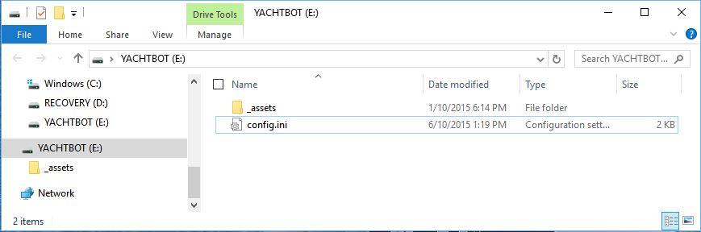

# Making configuration changes on YachtBot devices

# Making changes

The YachtBot configuration ('config') is stored as a file called "config.ini" on the micro-SD card, available under the bung in the YachtBot tracker.

**\*\*Warning\*\*** The config allows for extensive modifications to the operation of the unit and it is only recommended to make changes as directed by comments in the config file, or by consultation with YachtBot support.

To make config changes;

1. Remove the bung and connect YachtBot to a computer (Windows, Mac, Linux) using a micro-USB cable . After a few seconds the SD card will appear like a USB flash drive.
1. Copy and replace the config.ini file with a new one, or edit and save the config.ini file.
1. Eject the drive and unplug the tracker
1. You're DONE

## Important Notes

- The SD card appears as a storage device, like a flash USB drive, and you can edit the config.ini file in place with a text editor.

- There is rarely a need to remove the SD card from YachtBot and we recommend to never remove it.

- The SD card must be formatted as FAT32, and the configuration file must be named "config.ini".

- Default config files are provided with the [latest firmware](../../YachtBot%20Products/Firmware%20and%20Configuration%20Downloads/Firmware%20updates%20for%20YachtBot,%20WindBot,%20and%20TideBot.md) in an archive (ZIP format) file.  These archives contain other files or folders in addition to the config.ini file, which must also be copied to the SD card.

- When updating firmware, always start with a fresh default config as supplied in the config archive file with the firmware, then make customisations.

- If the SD card is not inserted (or not readable), or the configuration file has syntax errors (or is not compatible with the firmware version) then all the lights on the front of the device will blink when the device is powered on.  In this case reload the defaults provided with the firmware, or refer to the device log files to locate and correct the failed command.

-

## Latest and greatest

The latest config files can be found in the config archive file with the [latest firmware](../../YachtBot%20Products/Firmware%20and%20Configuration%20Downloads/Firmware%20updates%20for%20YachtBot,%20WindBot,%20and%20TideBot.md).
