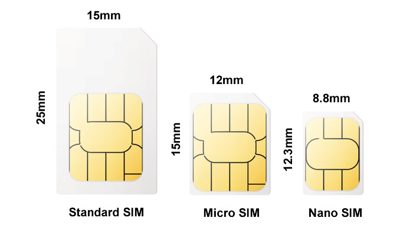

# SD (local memory storage) and SIM cards

## SD card (local memory storage)

YachtBot, WindBot and TideBot require the SD card to be inserted to operate. There is no need to remove the SD card to access any stored data files.  Stored data files can be access by plugging the device into a PC with a USB cable.

Ensure the device is turned off.  Attach the device to a computer and wait for 3 seconds.  The device will automatically turn on, and mount onto your computer like a USB key.  All \*.log files, \*.MNA files are stored on the SD card and can be deleted or copied from the SD card.

The SD card needs to contains the config.ini file and \_assets folder to ensure correct functioning and operation of your device.   Go to the [Firmware Downloads](../../YachtBot%20Products/Firmware%20and%20Configuration%20Downloads/Firmware%20updates%20for%20YachtBot,%20WindBot,%20and%20TideBot.md) section to get the latest files and firmware for your device.

If the SD card needs replaced, the direction to insert is indicated on the case of the device. Preferably use the supplied SD card, as only high quality SD cards function fully with YachtBot products.

## SIM card

SIM cards are optional, but required if a live data feed is needed. You need a large Standard (Mini) form-factor SIM card with data plan. The direction to insert is indicated on the case of the device. When fitting the SIM card, make sure that the SIM card is inserted straight.

When supplied by your cellular provider, ensure that you SIM card does not have a PIN, and is supplied ready to connect to the internet without any service provider re-directions for activation. You should be able to place the SIM in your smart phone and browse the internet.

  

The YachtBot family of devices will automatically set the APN for your SIM card.  However in some cases, the APN user name and password needs to be set before data transmission works. If you need to manually set the APN setting, see this help document, [Setting sim card configuration and APN details](../../YachtBot%20Products/YachtBot%20product%20family%20fundamentals/SIM%20data%20settings.md).

In some cases a new SIM needs to make contact to the network on a conventional smart phone first.

### Data usage

#### WindBot

The data usage for continuous operation is between 1MB and 4MB per hour and depends on the update rate and whether sync is enabled.

#### TideBot

The data usage for continuous operation is between 0.25MB and 1MB per hour and depends on the update rate and whether sync is enabled.
