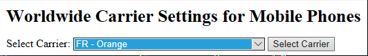
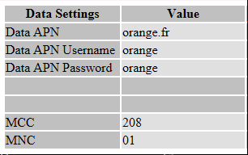
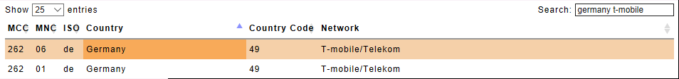

# SIM data settings

When installing a new SIM into a YachtBot or WindBot, the first step should always be just to install it and turn on the device. Usually, it will connect straight away - it will automagically find and use any "data settings" ([APN](https://www.lifewire.com/what-is-apn-access-point-name-2377408), username, and password) that may be required by the carrier that provided the SIM.

In some cases though, it may be necessary to enter these data settings manually to make the SIM work.

If you are responsible for preparing devices for use overseas, then it is a good idea to check the data settings are correct in advance to help ensure that any remote support is keep to a minimum.

## Finding the data settings

Start by getting the correct settings from the internet at [www.unlockit.co.nz/mobilesettings/](http://www.unlockit.co.nz/mobilesettings/). Select the provider of your SIM using the two-letter ISO country code and carrier name. For this example, we are going to search for Orange, in France.



Take note of all the "Data Settings".



Entering the data settings manually can be done in one of two ways; either by entering the details into config.ini, or adding a new entry to apns-user.xml, which you will find in the \_assets folder of the SD card.

The config.ini technique is the fastest way to enter the data settings. But if you travel and change your SIM a lot, then putting the settings into apns-user.xml will save you time in the future updating your config files.

## Adding data settings to config.ini

The APN, username, and password can be entered directly into the config.ini file by looking for the "Cell" section

```
\## Cell
##
#
# 'CELL APN SET custom.apn' sets APN to custom.apn
# 'CELL APN CLEAR' uses no APN
# 'CELL APN AUTO' attempts automatic setting of APN (default)
# 'CELL USER WEB'
# 'CELL PASS WEB'
#
#cell apn set internet
#
```

Uncomment and edit the #cell apn set internet line as instructed. If the username and password have been specified then add lines for the username and password instructions too.  All the data setting lines are optional, if your carrier does not specify the username or password, then do not add a line to set them.

```
\## Cell
##
#
# 'CELL APN SET custom.apn' sets APN to custom.apn
# 'CELL APN CLEAR' uses no APN
# 'CELL APN AUTO' attempts automatic setting of APN (default)
# 'CELL USER WEB'  Sets the user name
# 'CELL PASS WEB'  Sets the password
#
cell apn set orange.fr
cell user orange
cell pass orange
#
```

## Adding data settings to apns-user.xml

This file contains a list of XML <APN> tags that look like this;

```
<apn carrier="T-mobile/Telekom Germany"
mcc="262"
mnc="01"
apn="internet.t-mobile"
type="default"/>
```

Copy and paste this as a new <APN> tag, then edit to put in the new carrier details.

```
<apn carrier="Orange France"
mcc="208"
mnc="01"
apn="orange.fr"
user="orange"
password="orange"
type="default"/>
```

You can call the carrier anything you want, but best practice is to use the carrier name, followed by the country.

## Extra for experts

When editing the apns-user.xml file, it is highly recommended to check the MCC and MNC settings at [www.mcc-mnc.com/](http://www.mcc-mnc.com/). Many carriers operate more than one network, which means they have more than one MNC number. In this case, multiple entries will need to be placed into apns-user.xml.

A good example is T-mobile in Germany, which is pre-loaded into apns-user.xml for your reference. It operates two networks as follows;



Keep a copy of apns-user.xml handy, so that you can use this to update all your devices. Also, note that when you change firmware the file will be replaced and will need to be copied over again.

If you update apns-user.xml, please send a copy your verified working changes to support@igtimi.com. We can merge your updates into firmware updates - thanks!
