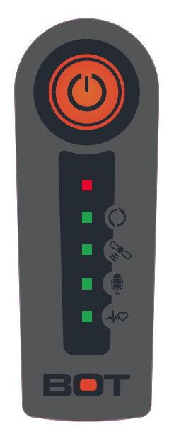

# Status LED Indicators

There are three status indicators on the YachtBot, TideBot, and WindBot and five status indicators on the YachtBot Bio.

The top indicator is the "Power Indicator" (red), then second the "Server Connection", "GPS (Global Position System) Connection", "Bluetooth Connection" (Bio Only), and "ANT+ Connection" (Bio Only).

## Power Indicator

- Solid On - Unit is turned on,

- Slow Flashing - The YachtBot is in Synchronisation Mode

- Fast Flashing on startup - Low power indicator, the YachtBot needs to be recharged

- Solid Off - YachtBot has been turned off

  When plugged in to charge the battery

- Slow Flashing - The YachtBot is charging.

- Solid On - Charging has finished .

## Server Connection Indicator

(Connection to the YachtBot server using the cell phone network)

- Solid Off - Cell module has been turned off in the Config.ini.
- Fast Flashing - Missing the SIM card.
- Slow Flashing - Trying to connect to the YachtBot server using the Cell settings in the Config.ini
- Solid On - Connected to the YachtBot servers

## GPS Connection Indicator

(Connection to the Global Position System satellites)

- Slow Flashing - Trying to connect to the GPS satellite. (Ensure the YachtBot has a clear view of the sky. Outside in an open area is best)
- Solid On - Connected to the GPS Satellites.

In addition, when running a GPS Correction Base Station

- Solid On with blip off - Connected to the GPS Satellites and receiving GPS corrections from a Base station.

## Bluetooth Connection Indicator

(Connection to a Bluetooth headset)

- Solid Off - Bluetooth has been turned off in the Config.ini
- Solid Off with a Blip on - In Pairing mode (see [Using Audio with YachtBot Bio](../../YachtBot%20Products/YachtBot/YachtBot%20Bio%20-%20Using%20Audio%20devices.md))
- Slow Flashing - Waiting for a connect from the Bluetooth headset device
- Solid On - Connected to the Bluetooth headset device

## ANT+ Connection Indicator

(Connection to an ANT+ device)

- Solid Off - ANT has been turned off in the Config.ini
- Slow Flashing - Waiting for a connect from the ANT+ device
- Solid On - Connected and receiving data from an ANT+ device.

**Combinations of lights**

On startup all lights, including the power light, blips (flash on) -  There is an invalid configuration file or the SD card isn't inserted correctly.
