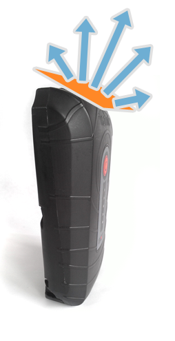
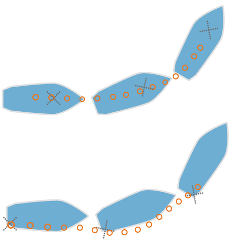

# The best place to install YachtBot on your sailing boat

The ideal installation place in a Dinghy or racing sailing boat is often a compromise on the best possible data due to available positions during racing.

  

Key items to watch when installing.....

---------------------------------------------------------------------------------------------------

Best possible view of the sky
-----------------------------

All GPS devices have an antenna that is tuned to receive information from the GPS satellite cluster. Understanding the type of antenna and position of that antenna in the device means that you will position your device at the best orientation to ensure it has the best view of the sky, giving you the best possible tracking data.

  
The YachtBot tracker antenna is located in the top of the case, tilted slightly forward. This tracker is best installed vertically, but can be laid down due to the tilt in the antenna.

  

Keep the top of the tracker clear of any metallic objects, for example don't mount directly under the boom, or a metal hand rail.

The carbon in carbon fibre sails also can cause bad signals for GPS devices, as the carbon in the sails is conductive, which means that the signals from the GPS satellites cant be received through these sails.

  

Central Mounting Position
-------------------------

The ideal mounting position is on the boats centre rotation point. This is of course not always practical depending on the type of boat, and for ideal view of the sky for the GPS antenna. Carbon fibre in the sails can affect the quality of the GPS position fix.

Central mounting gives the most accurate representation of the track that the boat makes.Mounting on the back tends to make the track of boat bow outwards as the stern of the boat swings out when it does a wide turning circle. This is because that is the track that the back of the boat makes, not the track that the centre of the boat makes.

  

### Small Olympic classes

There is a Velcro strap on the back of the tracker that can be used around a small mast.  

*   Optimist or Laser, mount on the mast away from lines running on the mast  
    
*   470, mount on the mast just under the deck.  
    
*   49er, mount in the sail pocket or the pocket on top of the kite pocket on the front deck.  
    

### Larger Keels boats

Mount on the middle rear safety line stanchion.​ In areas where the tracker maybe in a collision point with another sailing boat, remove the Velcro strap and use cable ties under the mounting bracket. Cable ties are strong and can be cut off at the end of a days racing.