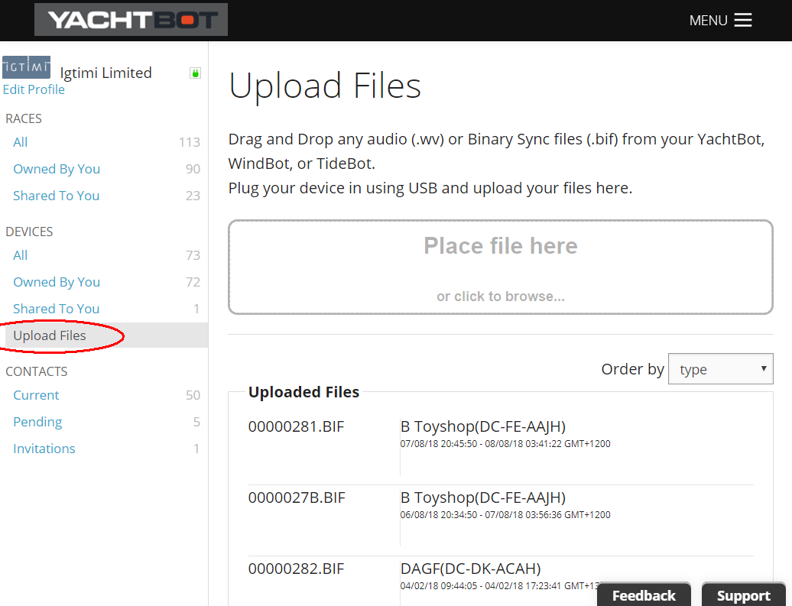
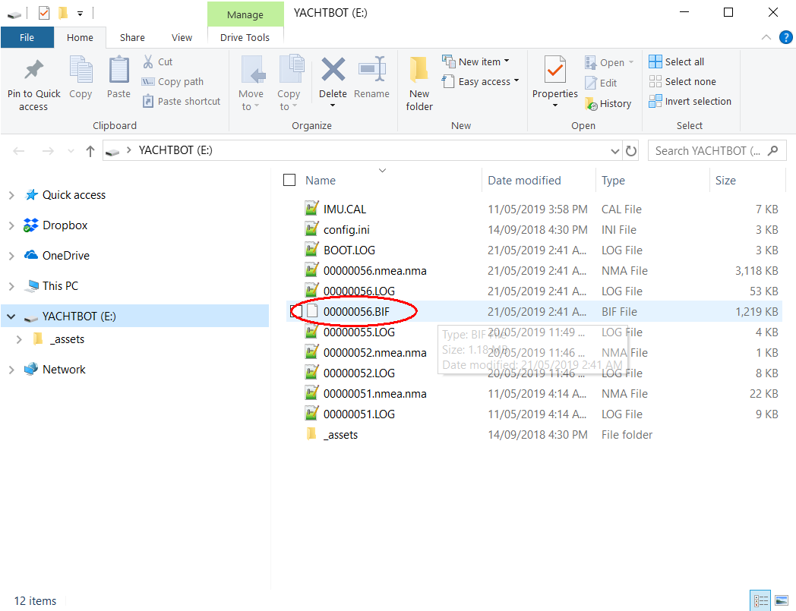

# Uploading YachtBot device files to the website for reviewing

**Uploading BIF files (data) or \*.wv (Audio) to the [www.yacht-bot.com](http://www.yacht-bot.com) website**

  

The YachtBot device range (except YachtBot Mini) can log raw data when they are not connected to the cellular network.  All data is logged into the \*.BIF files contained on the internal SD card.  The YachtBot Bio can also record audio files using the Bluetooth audio feature.

  

If your device is connected to the cellular network, the \*.BIF files will be automatically synced (loaded) to the yacht-bot.com servers and automatically removed from the SD card on completion.  

  

All audio files must be manually uploaded to the [www.yacht-bot.com](http://www.yacht-bot.com) website and will not automatically load to the www-yacht-bot.com servers.

  

If the YachtBot device isn't connected to the cellular network then the \*.BIF files will remain on the SD card and can be manually uploaded to the [www.yacht-bot.com](http://www.yacht-bot.com) website.

  

To manually upload files...

Log in to your [www.yacht-bot.com](http://www.yacht-bot.com) account and navigate to the Upload files page.

  

  

Connect the YachtBot device using the provided USB cable to your computer.  The YachtBot device will mount onto you computer like a USB flash drive.

  

Drag and drop your \*.BIF or \*.wv file onto the upload window where it says "place your files here".  The file will be uploaded to the [www.yacht-bot.com](http://www.yacht-bot.com) server, where the server will then queue these files to be processed.

  

**Trouble Shooting**

  

**I have uploaded my friends files but I cant see their data?**

When manually uploading files to the yacht-bot servers, this adds the data from the device in the same form as if it was automatically loaded over the cellular network.  This ensures that all security still exists on all data.  This means that you still need to be granted access to see the device that the data came from to see the data that you uploaded.

For example... if your friend gave you their \*.BIF files to upload so you can see their boat too, they still need to share the device to you.  You can still use your account to upload their data, but you also need to be granted access to the data from the owner of that data.  See device sharing. 

  

**I have uploaded my files but I cant see the data?**

It can take several minutes to an hour for the Yacht-Bot servers to process the data that you have uploaded, depending on the amount of data you uploaded.  

  

Ensure that you have registered your device to your account.  The registering process ensures that you own the device and the data it came from.  If you have files that are created before the time that you registered the device, then you wont automatically have access to see these files. 

  

If you are still having trouble please Contact info@yacht-bot.com for help.