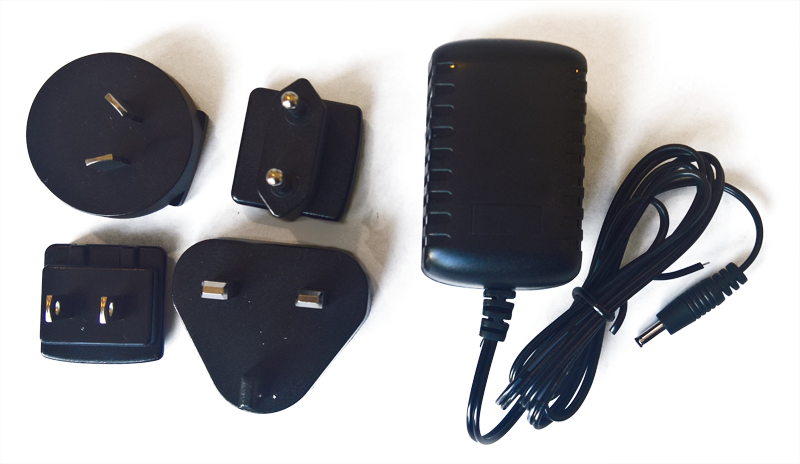
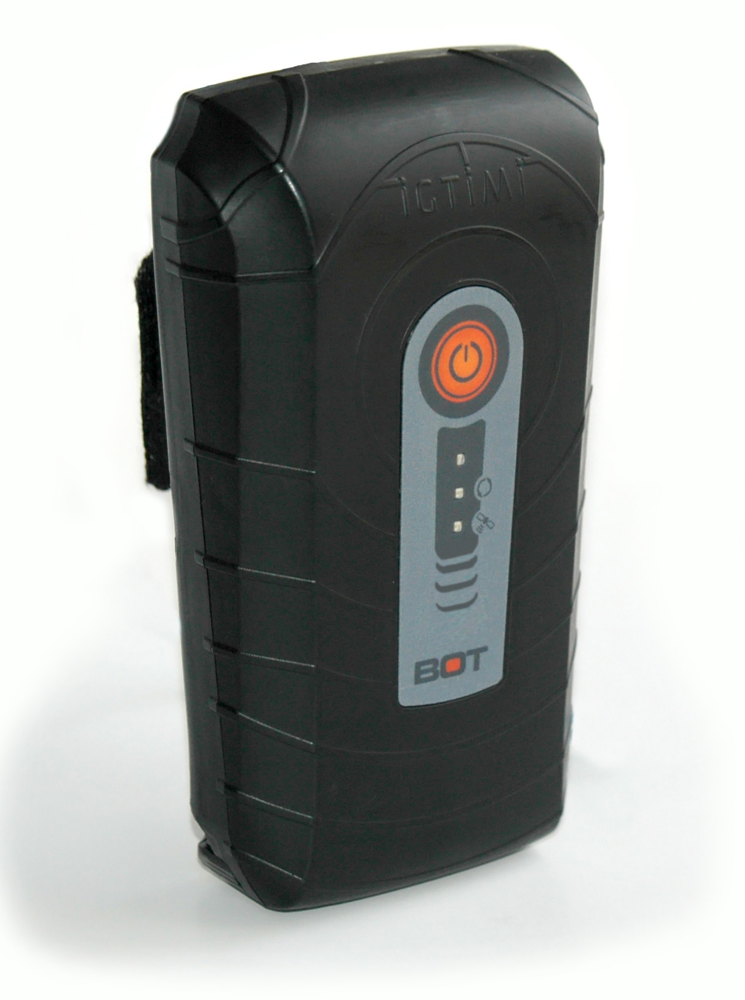
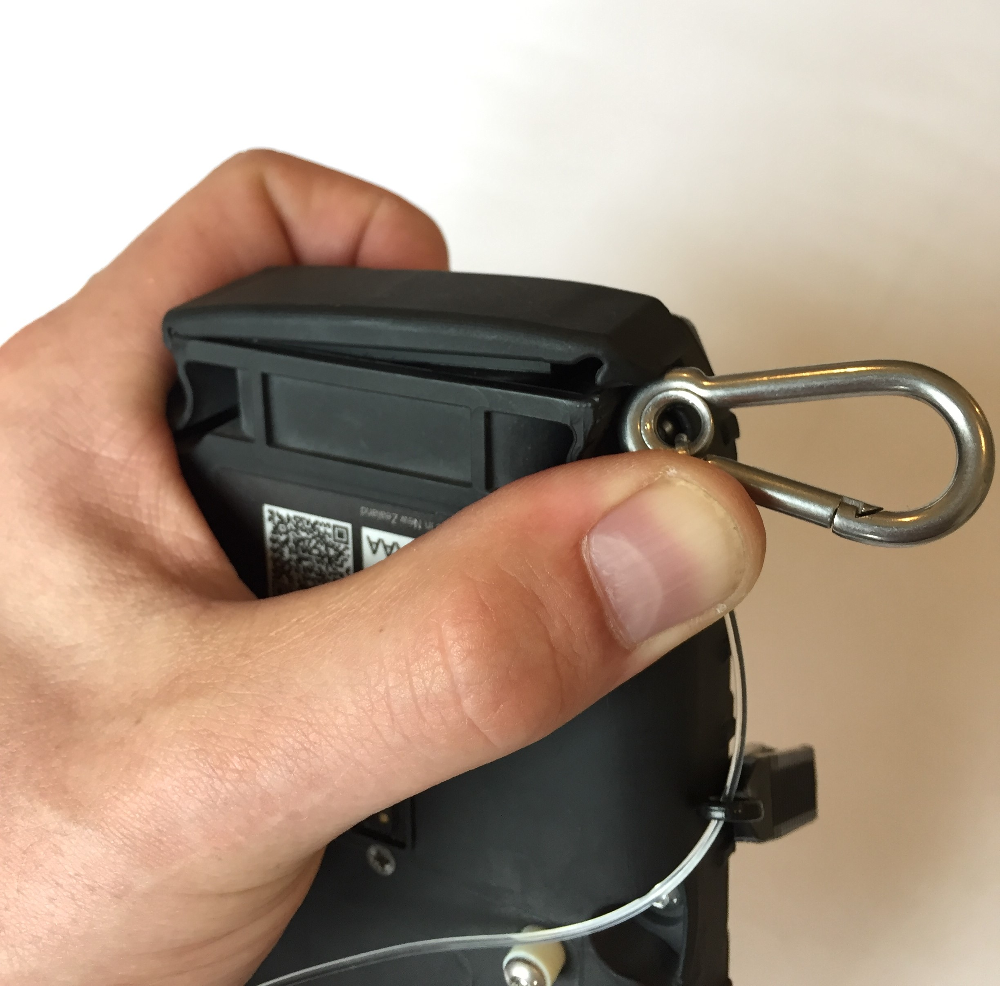
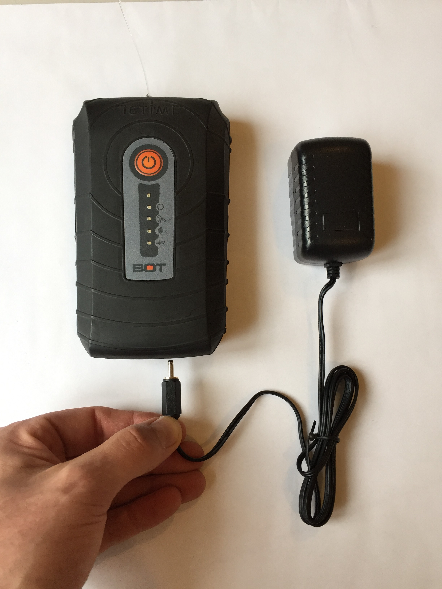
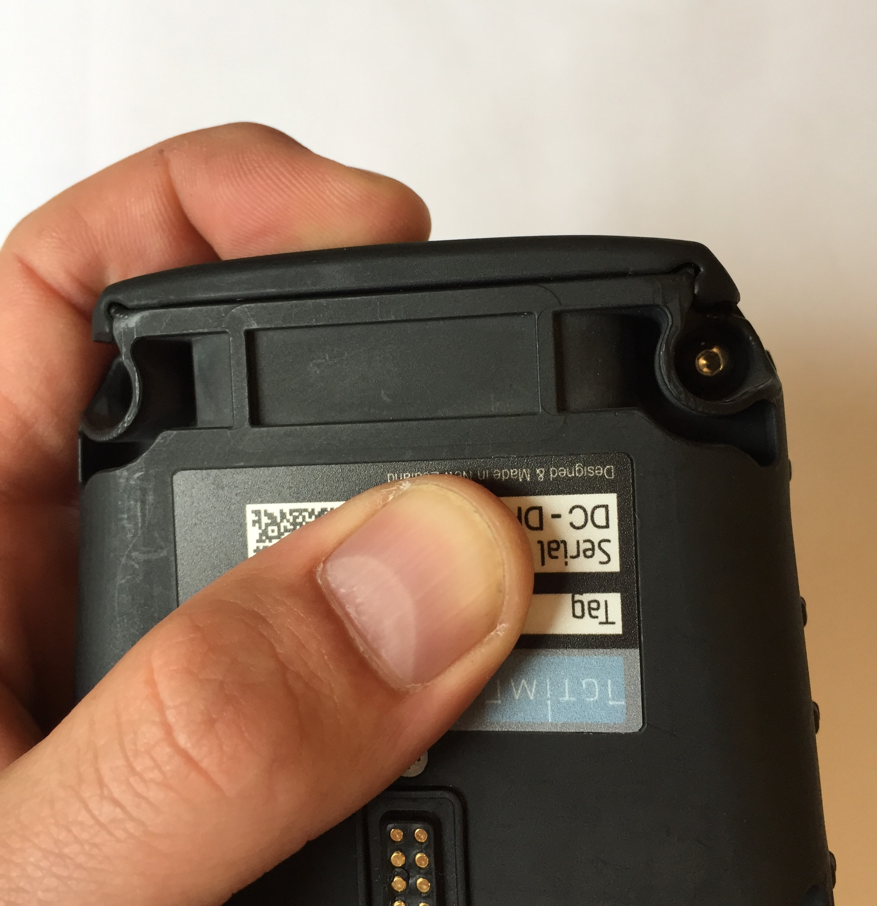

# Getting started

Before heading out on the water, here are a few tips and tricks for getting the most out of your YachtBot system.

If this is a brand new system, please ensure that you have received all components, and that everything is intact before beginning setup.

You should have:

- YachtBot tracker
- Power supply
- USB cable

<table border="1" cellpadding="0" cellspacing="0" id="table86451" style="border-collapse: collapse; border: 1px solid rgb(175, 175, 175); width: 71%;"><tbody><tr>
<td style="width: 46.9579%;"></td>
<td style="width: 52.8861%;"></td>
</tr></tbody></table>

**Initial setup**

Before deploying your YachtBot, we recommend first fully charging the unit, and installing a SIM card. Note: The SIM card is large form factor, and requires an active data plan. Check out our related articles on [SIM cards](<../../YachtBot%20Products/YachtBot%20product%20family%20fundamentals/SD%20(local%20memory%20storage)%20and%20SIM%20cards.md>), [APN settings](../../YachtBot%20Products/YachtBot%20product%20family%20fundamentals/SIM%20card%20APN%20settings%20for%20common%20providers.md), and [trouble shooting advice](../../YachtBot%20Products/YachtBot%20product%20family%20fundamentals/Cellular%20connectivity%20trouble%20shooting.md).

To charge your device, remove the bung from the base of the unit, and connect the supplied charger. For a 'how-to' on bung removal, watch on YouTube: [YachtBot Bung Removal](https://youtu.be/ftc8TsLwa2g)

To install your SIM card, with the bung removed from the unit, insert the SIM card into the right hand side slot. The left hand slot is for a MIcro SD card, and should already be installed. Note: This SD card is required for the device to run, so do make sure it is installed.

{insert correct picture with SD and SIM}

With your device charged, and SIM card installed, re-install the waterproofing bung. The YachtBot is not waterproof without the bung installed.

With your device ready to go, head over to [www.yacht-bot.com](http://www.yacht-bot.com/) to register your device, using the device serial and tag identifiers located on the back of the device. This step is required for you to see live data on the YachtBot website.

For more information on registering devices see [Registering devices](../../YachtBot%20Web/Getting%20started/Registering%20Devices.md).

**Powering on YachtBot**

To turn on your YachtBot, head outside, with a full view of the sky and push the power button on the YachtBot until you hear two beeps and see the 2nd and 3rd LEDs flash. The device is now looking for GPS signal and checking the data connection. For the YachtBot website to recognize the YachtBot, both indicators must flash while connecting and then go solid when successfully connected.

**Powering off YachtBot**

To turn off your YachtBot, press and hold the power button until the unit beeps. The unit will then begin to shutdown. The lights may continue to flash for a while after, as the unit is synchronizing cached data to the cloud.

**Recording heart rate**

YachtBot Bio can record heart rate, using the heart rate strap, via Bluetooth. To set this up visit the [Recording Heart Rate with YachtBot Bio](http://support.yacht-bot.com/a/solutions/) page.

**Recording audio**

YachtBot Bio can record audio, using the throat mic, via Bluetooth. To set this up visit the [Using audio with YachtBot Bio](http://support.yacht-bot.com/a/solutions/) page.

**Troubleshooting**

Visit our other support pages for more troubleshooting information.
