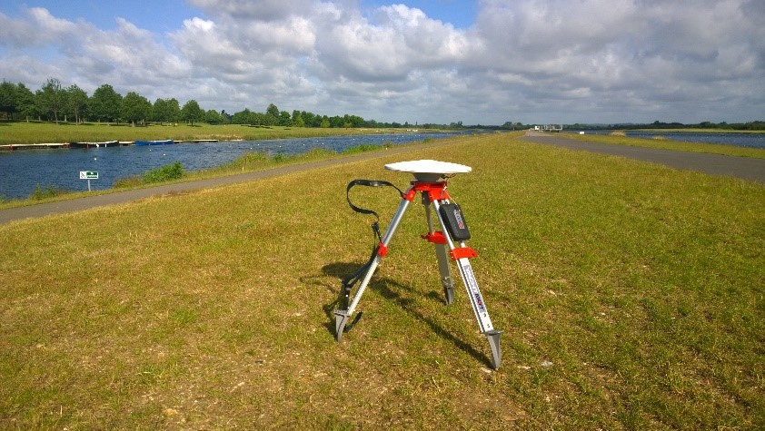

# Precision DGPS/RTK - Base Station setup

The YachtBot base station is fixed in one location acting as a reference point for the rover’s precise location measurements. Since it’s not moving, the location information provided by passing satellites can be used to extract a position correction for other nearby YachtBots.

These corrections are correlated in time and YachtBot base station requires a SIM card to send live data to the Igtimi servers.



## Where to mount

Location is paramount for the base station. A full, unobstructed 360 degree view of the sky is essential.

YachtBot base station can be permanently installed at a suitable site, such as on a roof top, or can be installed temporarily using a mobile tripod. The site survey mode (see below) must be enabled for each new location. Plan the timing of your site survey appropriately.

A suitable site must have a full view of the sky and be away from trees and tall structures. A partially obscured view will lead to fewer satellites being tracked by the base station and the correction signal is consequently degraded.

## Indicators

Same as [described for rover](../../YachtBot%20Products/YachtBot%20product%20family%20fundamentals/Status%20LED%20Indicators.md), with only difference

### Fourth (green) – Site survey mode indicator

Solid when correction data is being sent to the server AND rovers are asking for data

### Fifth (green) – not used

Configuration

A base station is configured as follows; generally these do not require adjustment unless instructed by Igtimi staff.

```
\## CORS
##
#log debug cors on
CORS BASE
CORS ON
```

Surveying Mode

By default, the surveying mode is turned on in the config of each Base Station. There is no disadvantage to leaving this enabled for a permanently installed unit, as the last known position is always used. If the measurement can be improved, the better result is used.

The surveying mode can be set to run for between 0.5 and 24 hours (to be entered in seconds, i.e. between 1800 and 86400 sec); on the understanding that anything below two hours is used only for debugging and demonstration purposes – never for earnest measurements. Longer surveying times mean more accurate position readings from a larger number of satellites.

The end of surveying mode is not indicated with status lights.

```
\## RTK Base time to site survey,
## 2 hours = 7200 seconds
##
gps startup cmd "$PASHS,POS,AVG,7200" 3 2 0
```

## Tips for using the mobile base station

When using the mobile base station and wanting to get going rapidly, initially set a short time of two hours and let it run undisturbed. Then incrementally change the time window of the survey.

## Maintaining YachtBot Base Station’s accuracy

For the Base Station to work reliably, it must be power cycled at least once a month. As explained above, this results in no loss of accuracy for the operation with a permanently installed base station, since the last surveyed location is used until a site survey is completed.
