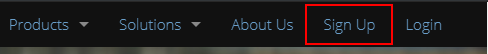
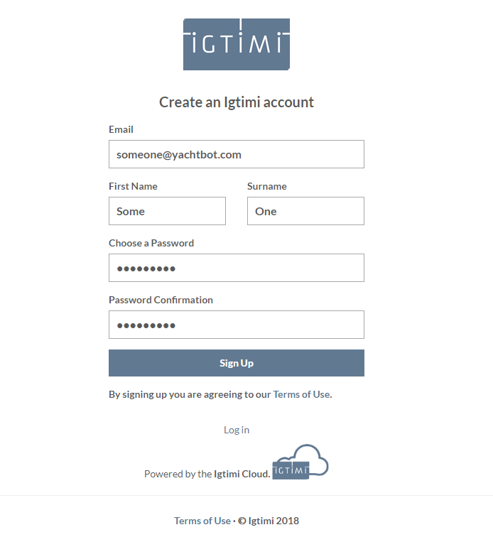
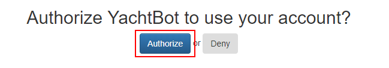
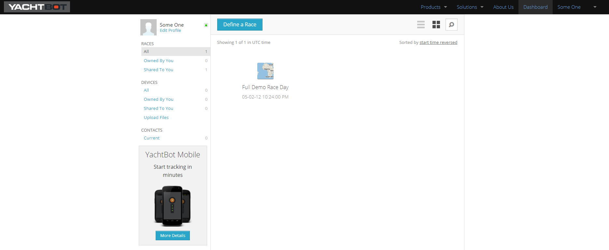
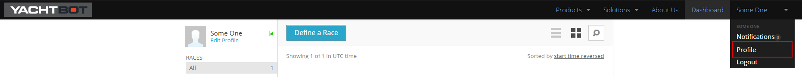

# Create your YachtBot account

To use YachtBot, you first need to create an account.

This account will be where your devices, races and contacts are stored. This is the same account that you will use to log in to the YachtBot Mobile app, too.

**Creating your account**

Creating an account on YachtBot is easy - and free! Simply go to [www.yacht-bot.com](http://www.yacht-bot.com) and click sign up in the top right corner.

Fill in the fields with your details, then click sign up.

When first logging in to YachtBot, you must allow YachtBot explicitly to use your account, click Authorize. - Igtimi is the server platform that powers the YachtBot Application.

You will now be redirected to your dashboard. This is where all the magic happens!

**Setup your profile**

Now is a great time to setup your account profile.

In the top right hand corner of the YachtBot dashboard, hover over your account name, and select account from the drop down menu.

We recommend setting the following options at a minimum:

**Avatar**

Click on 'Update Other Details' and upload an image file. On our homepage, public races will show your name and image. This can be a great way to let the world know about your sailing club or your organisation's activities!

**Timezone**

Setting your time zone correctly impacts on how times are displayed elsewhere on the website. Click on 'Update Other Details' to change the time zone.

**What's next?**

See [understanding your dashboard](http://understanding%2520your%2520dashboard) for an overview on what the dashboard is, and how you can use it to add devices and create race sessions!
