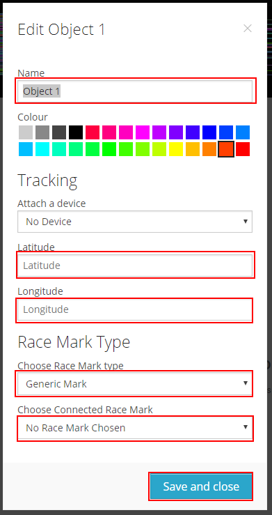

# Creating a YachtBot race session

In order to see your day's racing, or training efforts, you need to setup a YachtBot race session.

**What is a YachtBot race session?**

A YachtBot race session is the container that is used to define:

- a specified period in time (i.e. the time that the race is running from and to)
- a collection of physical tracking devices that will be deployed on the water (i.e. competitor trackers)
- and a set of marker objects that define the course layout on the map (i.e. course marks, start/finish lines, course boundaries).

Below is an example race, where we have a number of trackers deployed on boats, a number of course markers, and of course the race start and finish times.

**Do I need to set up a race session before I head out on the water?**

No, you can set up your race session after you have been out training. As long as you turn on your tracker while you are training, you can access your data once you are done training.

If you wish for spectators to view the racing or training efforts in real-time, then you would need to set up the race session prior to heading out on the water.

**Creating a YachtBot race session**

Defining a race is easy. Read below, or watch our short video on [Creating a race in YachtBot](https://www.youtube.com/watch?v=G4iUUH81MNw).

To make the process straight forward, we suggest that you have the following prepared in advance:

- Race name
- Race start and end times
- Competitor tracker assignments - Make sure that you have access to all the required devices (either shared or owned devices) See [Managing YachtBot devices](http://asdasd) for more information about managing devices.
- GPS coordinates of race marks (if including race marks in the race session)

To begin, make sure that you are logged in to YachtBot, and have navigated to the dashboard. Select the 'Races' tab, and click on 'Define a Race'.

This will bring you to the Race Editor, where we will setup our race session.

**Set session name**

Enter in a name for your session. This will be the name displayed at the top of the race session, and how you can locate it in the dashboard.

**Set session start and end times**

Use the UI elements to enter in a start and end time. Note, these are the start and end times of the session, and not the actual racing start time. We prefer to enter start and end times that are about 20 minutes either side of the race start and end times to allow for delayed race starts etc.

The tracking data will only be visible on the map between these two times, so a larger time period is a safe bet.

**Add race yachts**

To add race Yachts, locate the 'plus' icon to the right of the Yachts heading.

This will bring up a window enabling you to edit the competitors name, boat number, object colour, and physical tracking device assignment.

Do this for each competitor in your fleet.

**Adding race marks**

Adding race marks is similar to adding Yachts. Locate the 'Race Marks' heading, and click on the 'plus' icon. Enter in the mark GPS coordinates and click save. For more detailed information on setting race marks, see [Adding race marks](http://asdasd).

**Save the race session**

Now that you have a race containing a name, start and end times, yachts, and race marks (optional), go ahead and save the race.

You should now be able to see your race in the 'Races' section of the dashboard.

**View the race session**

To view the race session, simply select the race from the dashboard, and click the blue 'View' button. You will be redirected to the YachtBot Viewer, where you can view your race.

If your race is in the future (i.e. the data has not been captured yet), then you will get a grayed out map until the day of the race. If the race has already occurred (i.e. you have been out on the water with your device on), then you should see your yachts moving around.

**Share the race session**

There are two ways to share a race with others. By default races are setup as private, i.e. only the race creator account can see the race.

To enable sharing, select the race from the dashboard, and then click on the 'Share' button. This will bring up a dialog box to configure the race sharing settings.

If you wish to share the race with specific people, i.e. a coach for example, then you can enter their name or email into the field next to the blue invite button. Note: the recipient must already be a contact of your YachtBot account.

The more general way to share is make the race public to anyone with the race link. This is great for spectators watching the racing live.

To make the race public, select the 'Public' box, and click save.

**Getting a shareable race link**

To get a race link, you first need to make sure that the race is made public, otherwise general viewers will not be able to view the race.

With the race made public, select the race from the dashboard, and then click the blue 'View' button. This will load the YachtBot viewer. The URL in your browser is a shareable link that you can distribute to spectators for viewing.

**Making changes to the race session**

To make changes to the session, select the race from the dashboard, and click 'Edit'. This will take you back to the YachtBot Editor (where we set up the race initially), where you can edit the name, start and end times, etc. Don't forget to save your changes!

Happy sailing!
