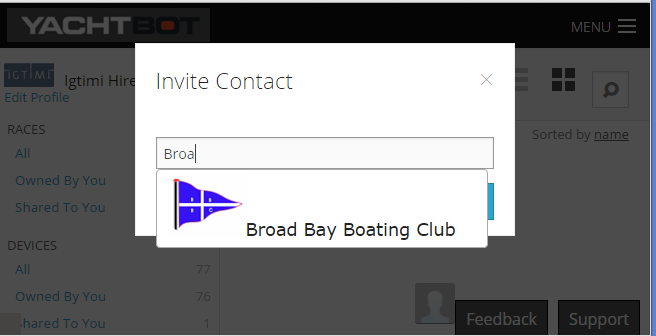
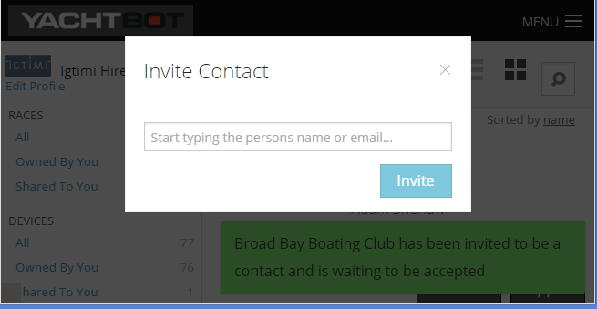

# Managing YachtBot Contacts

In YachtBot, contacts are people you have some sailing association with; it could be a coach, club, sailing buddy or your Mum. A contact must have their own YachtBot account. Before sharing private races with people, requesting data from another competitor's boat, or loaning your tracking unit to a friend, you will need to add those people to your contacts list.

To manage your contacts, login to YachtBot and from the Dashboard go to Contacts on the side menu.

## Inviting

Under "Invite Contact", type in your race director's YachtBot User ID, or find their name in the drop down list. If you don't know their User ID, ask for and type in the full email address associated with the account you want to connect to.

Select an entry from the list, the click Invite.

This send a request to the other party to be a shared contact. Until they have accepted your request, their name appears under Contacts as 'pending'. Once you have received confirmation of your contact request (by email, for example), log back into the site or refresh the page.

## Accepting

Accept a contact request by logging into your YachtBot account and clicking on 'accept'

## Removing

Remove a contact by selecting their name from your contact list and clicking on 'remove'.
