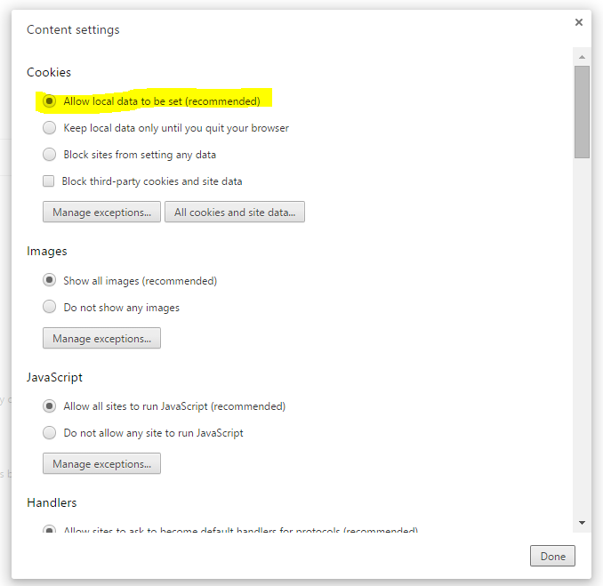
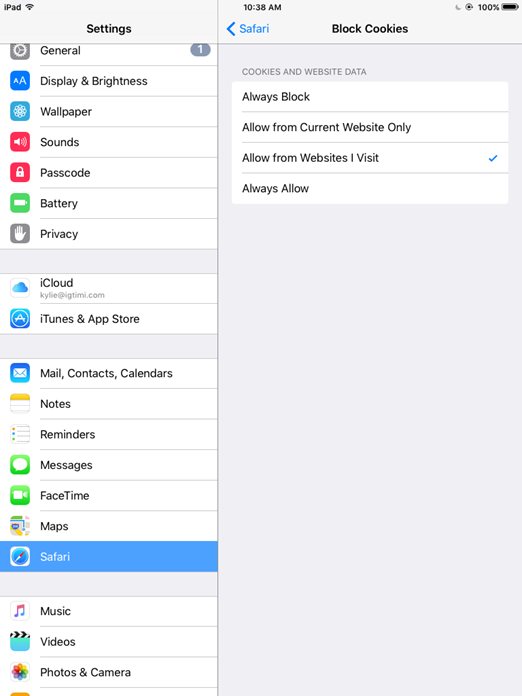

# Problems logging in? Check your cookie settings!

We recommend Chrome for editing and viewing YachtBot races.

To successfully login to YachtBot, your browser needs to allow third party cookies. That's because YachtBot uses the Igtimi API to manage user accounts and recorded data. Not allowing cookies can send you into an endless re-direct loop, which means you get back to the same page over and over again!

Here are some examples about how to fix your cookie settings. These vary from browser to browser and may change without much notice.

## On Windows, using Chrome

1\. Open the menu (navigation toggle button at top right) and select 'Settings'.

2\. Scroll down and click on 'Show advanced settings'.

3\. In the Privacy section, click on 'Content settings'.

4\. Under Cookies, select 'Allow local data to be set (recommended)'

5\. Click on 'Done' to save settings.

## On iOS, iPhone or iPad

### Safari

1\. Enable third-party Cookie s

> a. Settings => Safari => Block Cookies => “Allow from Websites I visit”
>
> b. Go back to Safari and refresh the page. If still in re-direct loop, go to step 2

2\. Clear Website Data for yacht-bot.com and \*.igtimi.com

> a. Settings => Safari => Advanced => Website Data => “Edit” => Remove yacht-bot.com and \*.igtimi.com
>
> b. Go back to Safari and refresh the page. If still in re-direct loop, go to step 3

3\. Clear All Website Data

> a. Settings => Safari => Clear History and Website Data

**Chrome**

1\. Enable Cookies

Note: At time of writing, a new version of Chrome has removed cookie settings. If you cannot find the “Accept Cookies” section and still cannot login/signup please skip to step 2 below.

> a. Open the menu (navigation toggle button at top right) and select 'Settings'.
>
> b. Scroll down find “Content Settings”
>
> c. Turn “Accept Cookies” on
>
> d. Refresh the page if still no working please go to step 2

2\. Clear cookies and Site Data

> a. Open the menu (navigation toggle button at top right) and select 'Settings'.
>
> b. Select “Privacy”
>
> c. Select “Clear Cookies, Site Data”

If you continue to have problems, please don't hesitate to contact us.
