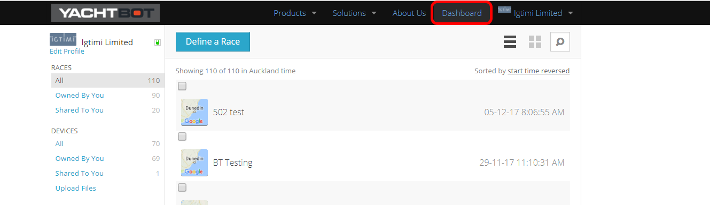
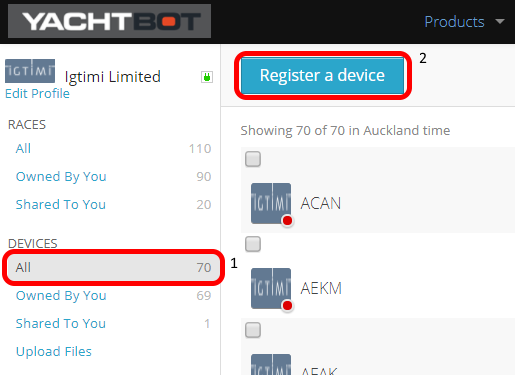
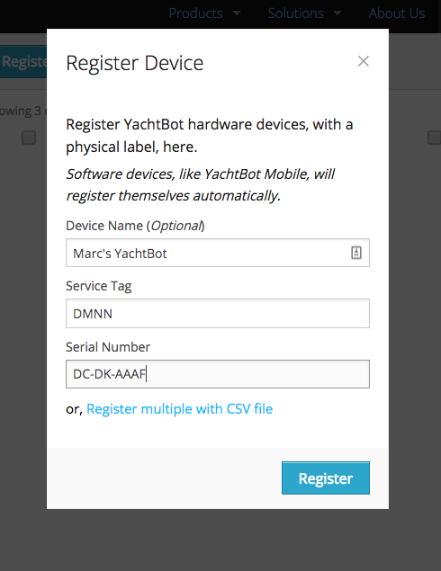
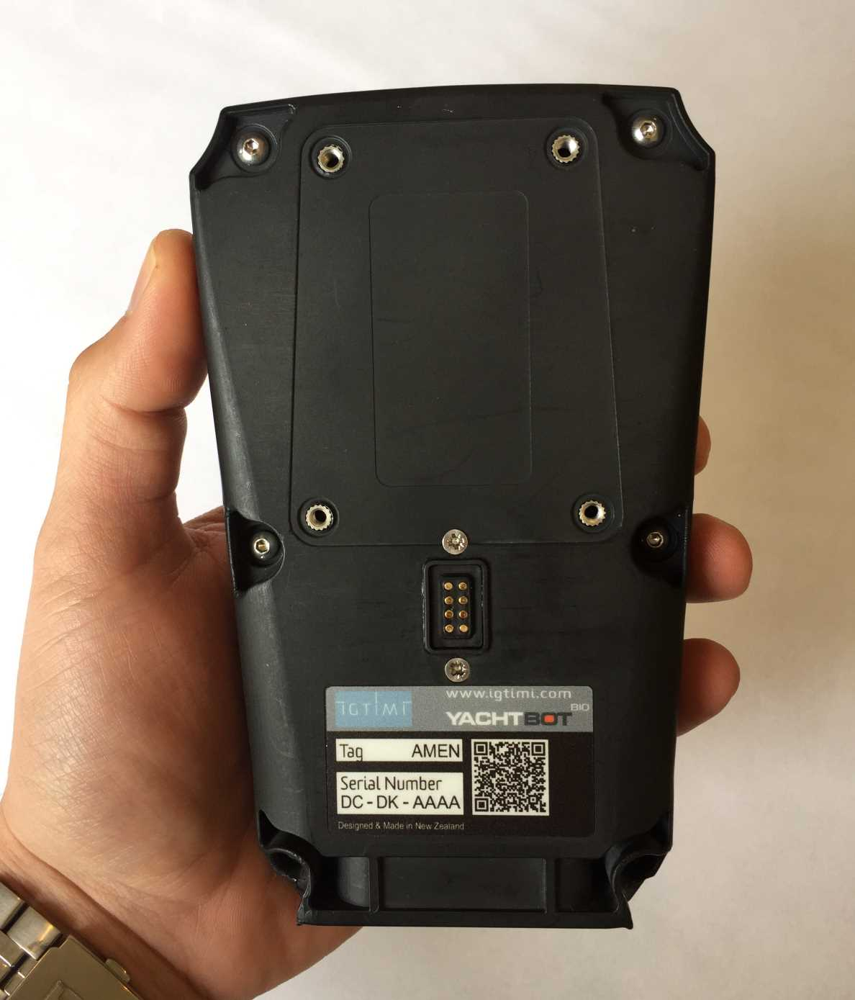
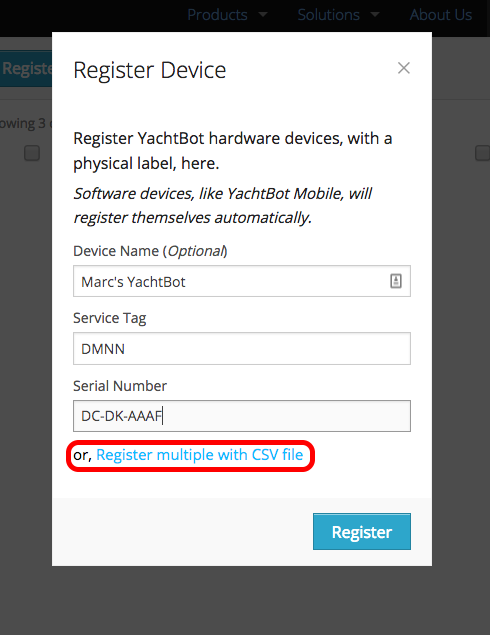

# Registering Devices

**Registering a single device**

* * *

To register a device with your YachtBot account, login to yacht-bot.com and navigate to your Dashboard. 

  



  

Once in the dashboard, locate the 'Devices' section in the menu on the left, and select 'All'.

  



  

Click on 'Register a device', then enter your device's details as shown on the the back of your device. Once the device details are entered, click 'Register'. 

  



  

Your device should now be registered to your account, and ready to go!

  

Registering your device only needs to be done once. If you wish to register the device to another account in future, only the device owner can un-register the device.

If you are wanting to lend your device to another account for only a period of time, then you can see how to share your device data on our [Sharing devices](../../YachtBot%20Web/Getting%20started/Sharing%20Devices.md) page.

  

  

**Registering multiple Devices at once**

* * *

If you have multiple devices to register, the 'Register multiple with CSV file' option is for you. 

This option allows you to use a Comma Delimited Value (CSV) file to register multiple devices at once. This is also useful if you want to update the names of your devices.

  

To load a list of devices, click on 'Register multiple with CSV file".

  



  

You will then be prompted to select and upload your CSV file from your computer.

Once the file has uploaded, you will see a list of all devices found in the file. Click 'Register' to register all devices.

Once the registering has been completed, the status column on the left indicates the result of the action.

Click 'Close' when complete.

  

**File format**

The device registering CSV file format is as follows:

<Serial Number>, <Tag>, <_optional name_\>

  

An example showing 3 devices to be registered:

```
GA-HK-AAAA,KMCD,Alan's YachtBot Bio
GA-GK-AFAA,KAAN,
HA-GK-ADAD,KAAA,Jim's YachtBot Mini
```

  

Note: The trailing comma when the optional name is not present. You must ensure the trailing comma is present when optional name is not used.

  

If the devices are already registered, you can use this feature to change the name of your device.