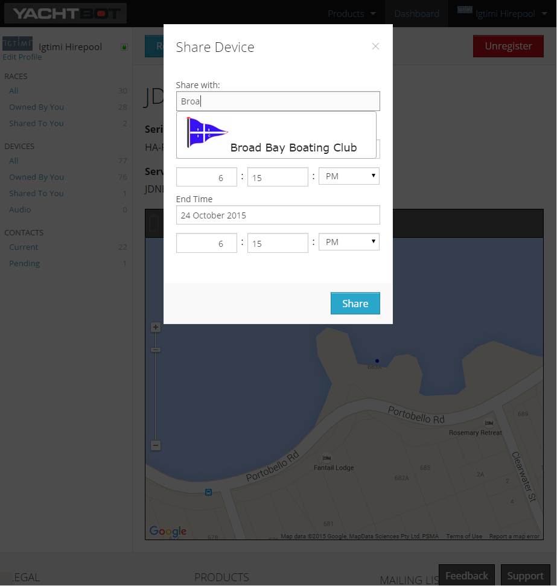
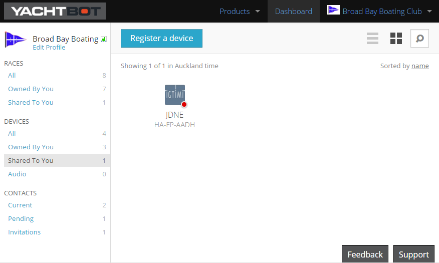

# Sharing Devices

In order to share devices with other YachtBot users, you first need to add them as a contact. You can find more information on YachtBot contacts [here](../../YachtBot%20Web/Getting%20started/Managing%20YachtBot%20Contacts.md).

  

  

**Sharing a device**

  

From the YachtBot Dashboard, click on 'Devices' in the side menu. Select the device you would like to share with your club or friends. 

This will bring you to the device page. On the device page click on "Share".

Find and select the contact you wish to share the device with and set the start date and end dates appropriately. You can share data from the past, data that spans the present, or is fully in the future.

  

  

  

  

  

  

  

  

  

  

  

  

  

  

  

  

  

  

  

  

  

  

  

  

If you are sharing with your club regularly, we recommend sharing for the entire sailing season.

  

  

**Accessing a shared device** 

The shared device will show up in the Devices list under "Shared to You" while the sharing window is active. The device will also show as available in the list of devices in the race editor, so you can assign it to a competitors yacht.

  

  

  

  

  

  

  

  

  

  

  

  

  

  

  

  

  

  

  

  

  

  

Happy sharing!