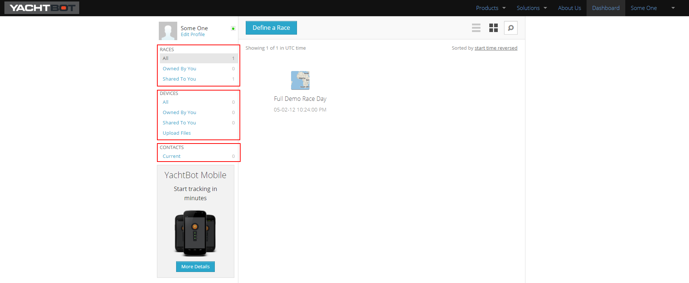

# Understanding the YachtBot Dashboard

Once you've created an account, you'll be greeted with the YachtBot dashboard. Think of this as the command center for everything YachtBot.

From the dashboard, you can:

- Create and edit race sessions
- Add and share tracking devices that you own
- Manage your YachtBot contacts.

Before we get in to the details of race creation and devices, here is a quick look around your dashboard:

**Navigation**

Navigation is via the left hand menu. There are three major sections; Races, Devices, and Contacts.

**Races**

Shows you all of the race sessions that you have defined. For more information on what race sessions are see [Creating YachtBot race sessions.](../../YachtBot%20Web/Getting%20started/Creating%20a%20YachtBot%20race%20session.md)

You can filter the view of races by whether they are owned by or shared to you, by selecting the appropriate tab. Alternatively, if looking for a particular race, select the 'All' tab and use the search box in the top right.

**Devices**

Lists all of the physical tracking hardware that you own, or have shared access to (see [Sharing YachtBot devices](../../YachtBot%20Web/Getting%20started/Sharing%20Devices.md) for more information on device sharing). This may be a combination of Mobile phones running the YachtBot app, or a collection of dedicated YachtBot hardware from the YachtBot product family. For more information on managing devices, see [Managing YachtBot devices](../../YachtBot%20Web/Race%20Editor/Serial%20numbers,%20tags,%20and%20device%20names.md).

You can filter the view of devices by whether they are owned by or shared to you, by selecting the appropriate tab. Alternatively, if looking for a particular device, select the 'All' tab and use the search box in the top right.

**Contacts**

Gives you control of other YachtBot accounts that you have connected with. This is useful for sharing devices with other accounts.

For more information on YachtBot contacts, see [Understanding YachtBot contacts](../../YachtBot%20Web/Getting%20started/Managing%20YachtBot%20Contacts.md).

Below is an example highlighting the navigation panel sections on the left hand side.

**What next?**

Now you have an overview of the YachtBot dashboard, see:

- [Creating YachtBot race sessions](../../YachtBot%20Web/Getting%20started/Creating%20a%20YachtBot%20race%20session.md)
- [Managing YachtBot devices](../../YachtBot%20Web/Race%20Editor/Serial%20numbers,%20tags,%20and%20device%20names.md)
- [Understanding YachtBot contacts](../../YachtBot%20Web/Getting%20started/Managing%20YachtBot%20Contacts.md)
