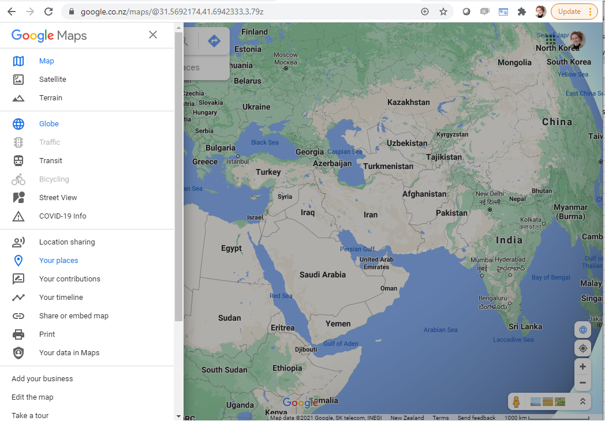
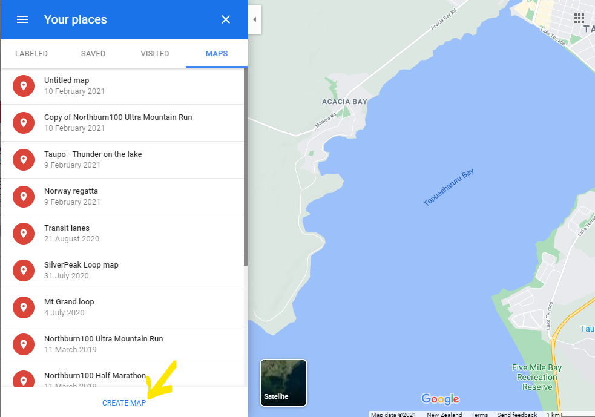
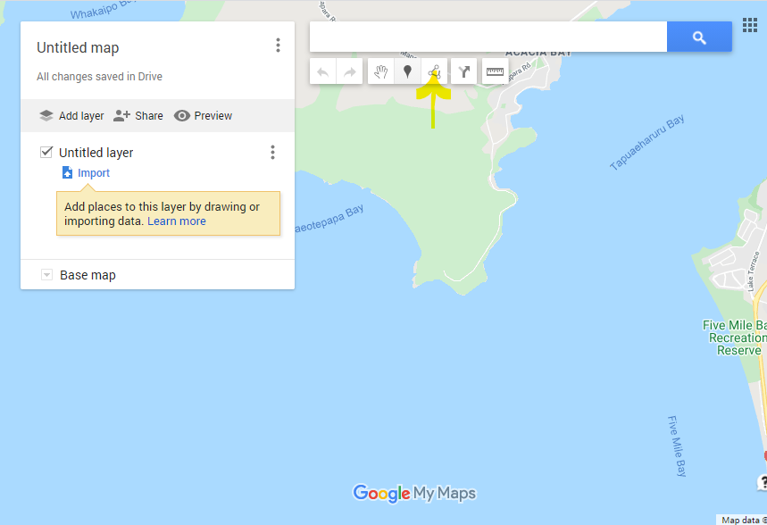
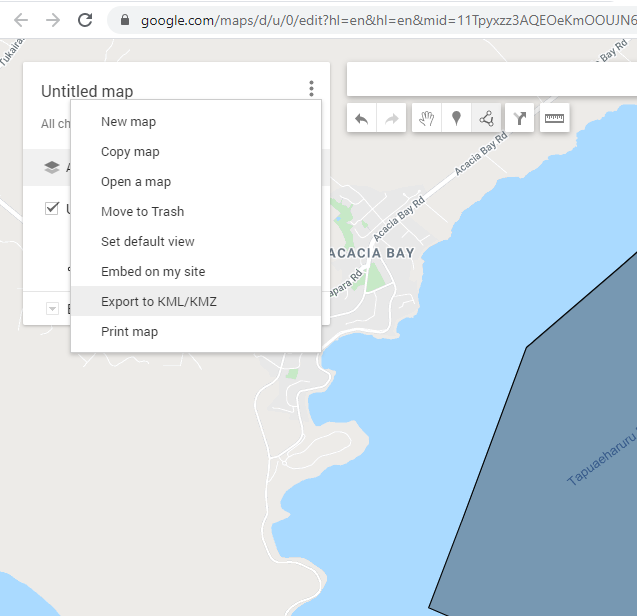
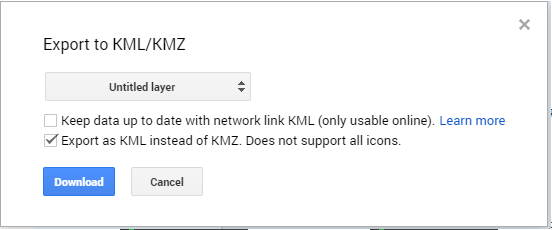
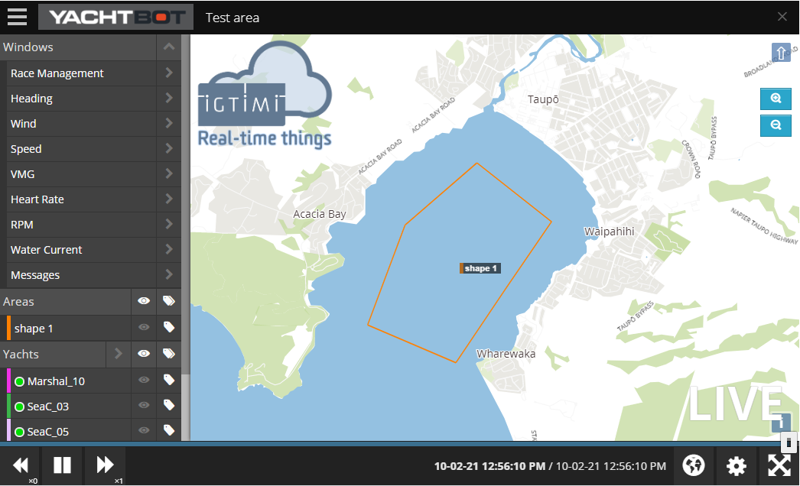

# Creating a race area

Areas are lines that are draw on our race can be used to show,

*   where the racing will take place, 
*   areas that are out-of-bounds,
*   the route that competitor will take,
*   any other shape that will help your viewers understand your race.

  

KML files are made using the google maps website.  Start by going to [www.google.com/maps](/maps)

  

Click the hamburger menu, select "your places"

Click "Create map"

  

Draw a line, "Add line or shape"

  

Click the 3 dots beside the map name to export to KML.

  

  

Now you can import the KML file into YachtBot.

