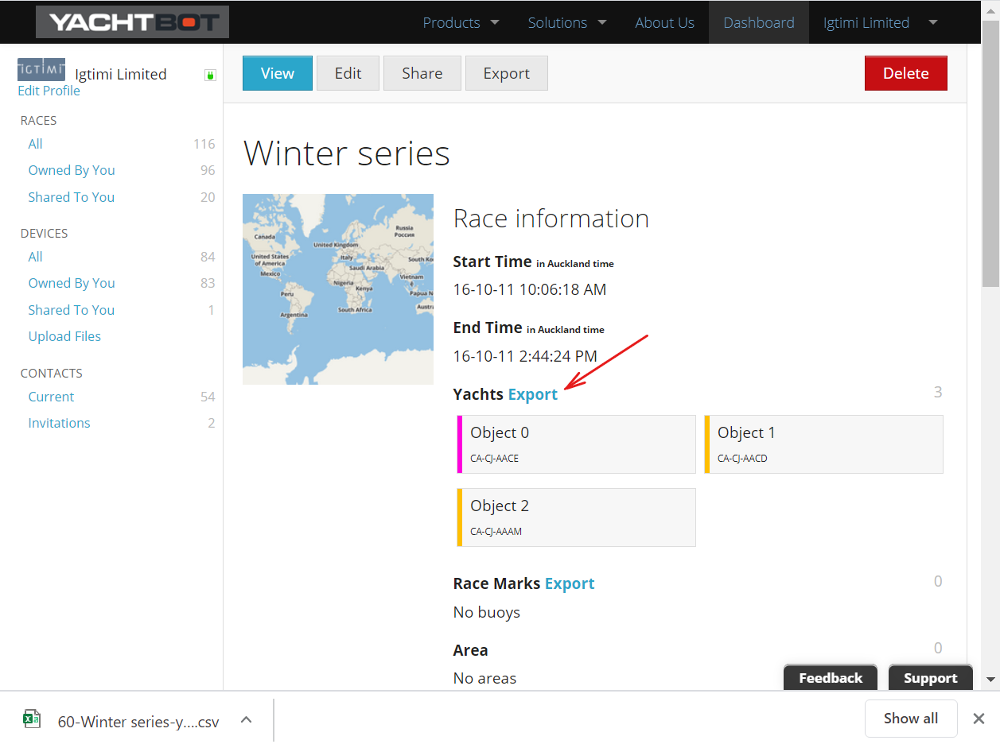
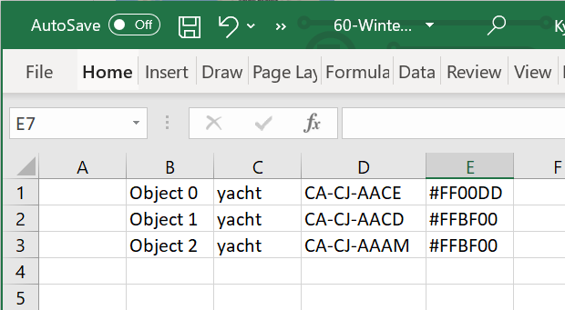
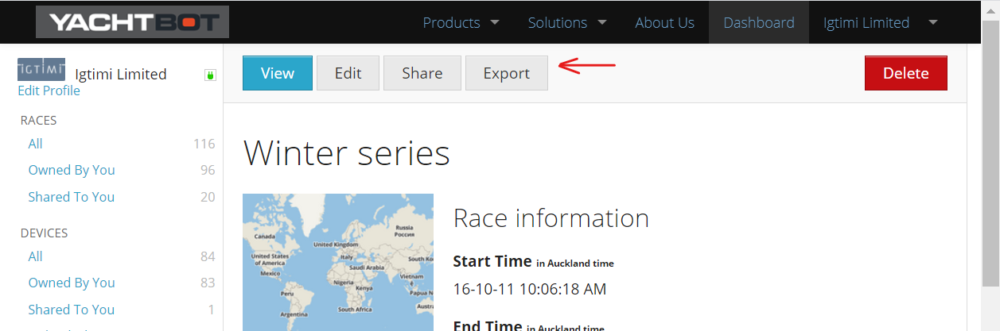
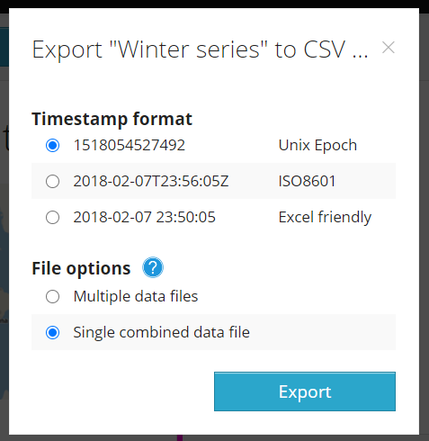

# Exporting to a CSV file

Data can be exported from the [www.yacht-bot.com]() website into a CSV (comma separated values) format.  This is a human readable format that can be viewed in a text editor or imported in Excel.

  

[www.yacht-bot.com]() enables you to export either,

1.  the **race session definition**, eg, the boat names, attached trackers and manual buoy locations, 
2.  or all the **device data from a race**, eg all the GPS positions, heading, wind of the YachtBot or WindBot hardware.

  

**1\. Export a race session definition into a CVS files**

From the [www.yacht-bot.com]() dashboard screen, select the race that you want to export the competitor list from.  From the race information screen you can export the list of Yacht, Race marks and Wind sensors.

  

Exported list looks like this...

,Object 0,yacht,CA-CJ-AACE,#FF00DD,,

,Object 1,yacht,CA-CJ-AACD,#FFBF00,,

,Object 2,yacht,CA-CJ-AAAM,#FFBF00,,

  

and imports into excel like this...

  

These CSV files can be used to make a new race by using [the import CSV described here](../../YachtBot%20Web/Race%20Editor/Load%20race%20competitors%20and%20race%20marks%20from%20file.md).

  

**2\. Export CSV device data from a race**

Available to PRO level users;  Data can be downloaded from any YachtBot or WindBot device that is in a defined race.  Once the race is defined click on "Export".  

Chose the time format and files options.  Click "Export".

The [www.yacht-bot.com](http://www.yacht-bot.com/) website will generate the data as a background task and send you an email with a link to download the data.  It can take several minutes for the data to be prepared for download.

Below is example CSV data from a single combined file. 

<table border="0" cellpadding="0" cellspacing="0" style="box-sizing: border-box; border-collapse: collapse; border-spacing: 0px; max-width: 100%; border: none; empty-cells: show; cursor: default; color: rgb(24, 50, 71); font-family: -apple-system, BlinkMacSystemFont, &quot;Segoe UI&quot;, Roboto, &quot;Helvetica Neue&quot;, Arial, sans-serif; font-size: 13px; font-style: normal; font-variant-ligatures: normal; font-variant-caps: normal; font-weight: 400; letter-spacing: normal; orphans: 2; text-align: start; text-indent: 0px; text-transform: none; white-space: normal; widows: 2; word-spacing: 0px; -webkit-text-stroke-width: 0px; text-decoration-style: initial; text-decoration-color: initial; margin-right: calc(0%); width: 100%;" width="1335"><tbody style="box-sizing: border-box;"><tr style="box-sizing: border-box;"><td style="box-sizing: border-box; padding: 4px; min-width: 5px; cursor: text; font-size: 13px; border: 1px solid rgb(175, 175, 175); width: 12.1124%;" width="70">timestamp</td><td style="box-sizing: border-box; padding: 4px; min-width: 5px; cursor: text; font-size: 13px; border: 1px solid rgb(175, 175, 175); width: 14.3411%;" width="86">latitude</td><td style="box-sizing: border-box; padding: 4px; min-width: 5px; cursor: text; font-size: 13px; border: 1px solid rgb(175, 175, 175); width: 15.1163%;" width="91">longitude</td><td style="box-sizing: border-box; padding: 4px; min-width: 5px; cursor: text; font-size: 13px; border: 1px solid rgb(175, 175, 175); width: 8.2364%;" width="76">GPS_ quality</td><td style="box-sizing: border-box; padding: 4px; min-width: 5px; cursor: text; font-size: 13px; border: 1px solid rgb(175, 175, 175); width: 7.2674%;" width="65">GPS_ count</td><td style="box-sizing: border-box; padding: 4px; min-width: 5px; cursor: text; font-size: 13px; border: 1px solid rgb(175, 175, 175); width: 9.3023%;" width="135">Course_ Over_ Ground</td><td style="box-sizing: border-box; padding: 4px; min-width: 5px; cursor: text; font-size: 13px; border: 1px solid rgb(175, 175, 175); width: 10.8527%;" width="117">Heading_ Magnetic</td><td style="box-sizing: border-box; padding: 4px; min-width: 5px; cursor: text; font-size: 13px; border: 1px solid rgb(175, 175, 175); width: 9.8421%;" width="88">Heading_ True</td><td style="box-sizing: border-box; padding: 4px; min-width: 5px; cursor: text; font-size: 13px; border: 1px solid rgb(175, 175, 175); width: 13.092%;" width="159">Speed_ Over_ Ground(kph)</td></tr><tr style="box-sizing: border-box;"><td align="right" style="box-sizing: border-box; padding: 4px; min-width: 5px; cursor: text; font-size: 13px; border: 1px solid rgb(175, 175, 175); width: 12.1124%;">40:55.0</td><td align="right" style="box-sizing: border-box; padding: 4px; min-width: 5px; cursor: text; font-size: 13px; border: 1px solid rgb(175, 175, 175); width: 14.3411%;">174.8622317</td><td align="right" style="box-sizing: border-box; padding: 4px; min-width: 5px; cursor: text; font-size: 13px; border: 1px solid rgb(175, 175, 175); width: 15.1163%;">-36.824165</td><td align="right" style="box-sizing: border-box; padding: 4px; min-width: 5px; cursor: text; font-size: 13px; border: 1px solid rgb(175, 175, 175); width: 8.2364%;">1</td><td align="right" style="box-sizing: border-box; padding: 4px; min-width: 5px; cursor: text; font-size: 13px; border: 1px solid rgb(175, 175, 175); width: 7.2674%;">7</td><td align="right" style="box-sizing: border-box; padding: 4px; min-width: 5px; cursor: text; font-size: 13px; border: 1px solid rgb(175, 175, 175); width: 9.3023%;">60.3</td><td style="box-sizing: border-box; padding: 4px; min-width: 5px; cursor: text; font-size: 13px; border: 1px solid rgb(175, 175, 175); width: 10.8527%;"> </td><td style="box-sizing: border-box; padding: 4px; min-width: 5px; cursor: text; font-size: 13px; border: 1px solid rgb(175, 175, 175); width: 9.8421%;"> </td><td align="right" style="box-sizing: border-box; padding: 4px; min-width: 5px; cursor: text; font-size: 13px; border: 1px solid rgb(175, 175, 175); width: 13.092%;">2.4076</td></tr><tr style="box-sizing: border-box;"><td align="right" style="box-sizing: border-box; padding: 4px; min-width: 5px; cursor: text; font-size: 13px; border: 1px solid rgb(175, 175, 175); width: 12.1124%;">40:55.5</td><td align="right" style="box-sizing: border-box; padding: 4px; min-width: 5px; cursor: text; font-size: 13px; border: 1px solid rgb(175, 175, 175); width: 14.3411%;">174.8622367</td><td align="right" style="box-sizing: border-box; padding: 4px; min-width: 5px; cursor: text; font-size: 13px; border: 1px solid rgb(175, 175, 175); width: 15.1163%;">-36.82416333</td><td style="box-sizing: border-box; padding: 4px; min-width: 5px; cursor: text; font-size: 13px; border: 1px solid rgb(175, 175, 175); width: 8.2364%;"> </td><td style="box-sizing: border-box; padding: 4px; min-width: 5px; cursor: text; font-size: 13px; border: 1px solid rgb(175, 175, 175); width: 7.2674%;"> </td><td align="right" style="box-sizing: border-box; padding: 4px; min-width: 5px; cursor: text; font-size: 13px; border: 1px solid rgb(175, 175, 175); width: 9.3023%;">66.3</td><td style="box-sizing: border-box; padding: 4px; min-width: 5px; cursor: text; font-size: 13px; border: 1px solid rgb(175, 175, 175); width: 10.8527%;"> </td><td style="box-sizing: border-box; padding: 4px; min-width: 5px; cursor: text; font-size: 13px; border: 1px solid rgb(175, 175, 175); width: 9.8421%;"> </td><td align="right" style="box-sizing: border-box; padding: 4px; min-width: 5px; cursor: text; font-size: 13px; border: 1px solid rgb(175, 175, 175); width: 13.092%;">2.778</td></tr><tr style="box-sizing: border-box;"><td align="right" style="box-sizing: border-box; padding: 4px; min-width: 5px; cursor: text; font-size: 13px; border: 1px solid rgb(175, 175, 175); width: 12.1124%;">40:56.0</td><td align="right" style="box-sizing: border-box; padding: 4px; min-width: 5px; cursor: text; font-size: 13px; border: 1px solid rgb(175, 175, 175); width: 14.3411%;">174.86224</td><td align="right" style="box-sizing: border-box; padding: 4px; min-width: 5px; cursor: text; font-size: 13px; border: 1px solid rgb(175, 175, 175); width: 15.1163%;">-36.82416333</td><td style="box-sizing: border-box; padding: 4px; min-width: 5px; cursor: text; font-size: 13px; border: 1px solid rgb(175, 175, 175); width: 8.2364%;"> </td><td style="box-sizing: border-box; padding: 4px; min-width: 5px; cursor: text; font-size: 13px; border: 1px solid rgb(175, 175, 175); width: 7.2674%;"> </td><td align="right" style="box-sizing: border-box; padding: 4px; min-width: 5px; cursor: text; font-size: 13px; border: 1px solid rgb(175, 175, 175); width: 9.3023%;">64.7</td><td style="box-sizing: border-box; padding: 4px; min-width: 5px; cursor: text; font-size: 13px; border: 1px solid rgb(175, 175, 175); width: 10.8527%;"> </td><td style="box-sizing: border-box; padding: 4px; min-width: 5px; cursor: text; font-size: 13px; border: 1px solid rgb(175, 175, 175); width: 9.8421%;"> </td><td align="right" style="box-sizing: border-box; padding: 4px; min-width: 5px; cursor: text; font-size: 13px; border: 1px solid rgb(175, 175, 175); width: 13.092%;">2.5928</td></tr><tr style="box-sizing: border-box;"><td align="right" style="box-sizing: border-box; padding: 4px; min-width: 5px; cursor: text; font-size: 13px; border: 1px solid rgb(175, 175, 175); width: 12.1124%;">40:56.5</td><td align="right" style="box-sizing: border-box; padding: 4px; min-width: 5px; cursor: text; font-size: 13px; border: 1px solid rgb(175, 175, 175); width: 14.3411%;">174.8622417</td><td align="right" style="box-sizing: border-box; padding: 4px; min-width: 5px; cursor: text; font-size: 13px; border: 1px solid rgb(175, 175, 175); width: 15.1163%;">-36.82416</td><td style="box-sizing: border-box; padding: 4px; min-width: 5px; cursor: text; font-size: 13px; border: 1px solid rgb(175, 175, 175); width: 8.2364%;"> </td><td style="box-sizing: border-box; padding: 4px; min-width: 5px; cursor: text; font-size: 13px; border: 1px solid rgb(175, 175, 175); width: 7.2674%;"> </td><td align="right" style="box-sizing: border-box; padding: 4px; min-width: 5px; cursor: text; font-size: 13px; border: 1px solid rgb(175, 175, 175); width: 9.3023%;">24.3</td><td style="box-sizing: border-box; padding: 4px; min-width: 5px; cursor: text; font-size: 13px; border: 1px solid rgb(175, 175, 175); width: 10.8527%;"> </td><td style="box-sizing: border-box; padding: 4px; min-width: 5px; cursor: text; font-size: 13px; border: 1px solid rgb(175, 175, 175); width: 9.8421%;"> </td><td align="right" style="box-sizing: border-box; padding: 4px; min-width: 5px; cursor: text; font-size: 13px; border: 1px solid rgb(175, 175, 175); width: 13.092%;">2.0372</td></tr><tr style="box-sizing: border-box;"><td align="right" style="box-sizing: border-box; padding: 4px; min-width: 5px; cursor: text; font-size: 13px; border: 1px solid rgb(175, 175, 175); width: 12.1124%;">40:57.0</td><td align="right" style="box-sizing: border-box; padding: 4px; min-width: 5px; cursor: text; font-size: 13px; border: 1px solid rgb(175, 175, 175); width: 14.3411%;">174.862245</td><td align="right" style="box-sizing: border-box; padding: 4px; min-width: 5px; cursor: text; font-size: 13px; border: 1px solid rgb(175, 175, 175); width: 15.1163%;">-36.82415833</td><td style="box-sizing: border-box; padding: 4px; min-width: 5px; cursor: text; font-size: 13px; border: 1px solid rgb(175, 175, 175); width: 8.2364%;"> </td><td style="box-sizing: border-box; padding: 4px; min-width: 5px; cursor: text; font-size: 13px; border: 1px solid rgb(175, 175, 175); width: 7.2674%;"> </td><td align="right" style="box-sizing: border-box; padding: 4px; min-width: 5px; cursor: text; font-size: 13px; border: 1px solid rgb(175, 175, 175); width: 9.3023%;">52.3</td><td style="box-sizing: border-box; padding: 4px; min-width: 5px; cursor: text; font-size: 13px; border: 1px solid rgb(175, 175, 175); width: 10.8527%;"> </td><td style="box-sizing: border-box; padding: 4px; min-width: 5px; cursor: text; font-size: 13px; border: 1px solid rgb(175, 175, 175); width: 9.8421%;"> </td><td align="right" style="box-sizing: border-box; padding: 4px; min-width: 5px; cursor: text; font-size: 13px; border: 1px solid rgb(175, 175, 175); width: 13.092%;">1.6668</td></tr><tr style="box-sizing: border-box;"><td align="right" style="box-sizing: border-box; padding: 4px; min-width: 5px; cursor: text; font-size: 13px; border: 1px solid rgb(175, 175, 175); width: 12.1124%;">40:57.5</td><td align="right" style="box-sizing: border-box; padding: 4px; min-width: 5px; cursor: text; font-size: 13px; border: 1px solid rgb(175, 175, 175); width: 14.3411%;">174.8622467</td><td align="right" style="box-sizing: border-box; padding: 4px; min-width: 5px; cursor: text; font-size: 13px; border: 1px solid rgb(175, 175, 175); width: 15.1163%;">-36.82415667</td><td style="box-sizing: border-box; padding: 4px; min-width: 5px; cursor: text; font-size: 13px; border: 1px solid rgb(175, 175, 175); width: 8.2364%;"> </td><td align="right" style="box-sizing: border-box; padding: 4px; min-width: 5px; cursor: text; font-size: 13px; border: 1px solid rgb(175, 175, 175); width: 7.2674%;">6</td><td align="right" style="box-sizing: border-box; padding: 4px; min-width: 5px; cursor: text; font-size: 13px; border: 1px solid rgb(175, 175, 175); width: 9.3023%;">49.4</td><td style="box-sizing: border-box; padding: 4px; min-width: 5px; cursor: text; font-size: 13px; border: 1px solid rgb(175, 175, 175); width: 10.8527%;"> </td><td style="box-sizing: border-box; padding: 4px; min-width: 5px; cursor: text; font-size: 13px; border: 1px solid rgb(175, 175, 175); width: 9.8421%;"> </td><td align="right" style="box-sizing: border-box; padding: 4px; min-width: 5px; cursor: text; font-size: 13px; border: 1px solid rgb(175, 175, 175); width: 13.092%;">1.6668</td></tr><tr style="box-sizing: border-box;"><td align="right" style="box-sizing: border-box; padding: 4px; min-width: 5px; cursor: text; font-size: 13px; border: 1px solid rgb(175, 175, 175); width: 12.1124%;">40:58.0</td><td align="right" style="box-sizing: border-box; padding: 4px; min-width: 5px; cursor: text; font-size: 13px; border: 1px solid rgb(175, 175, 175); width: 14.3411%;">174.8622467</td><td align="right" style="box-sizing: border-box; padding: 4px; min-width: 5px; cursor: text; font-size: 13px; border: 1px solid rgb(175, 175, 175); width: 15.1163%;">-36.824155</td><td style="box-sizing: border-box; padding: 4px; min-width: 5px; cursor: text; font-size: 13px; border: 1px solid rgb(175, 175, 175); width: 8.2364%;"> </td><td style="box-sizing: border-box; padding: 4px; min-width: 5px; cursor: text; font-size: 13px; border: 1px solid rgb(175, 175, 175); width: 7.2674%;"> </td><td align="right" style="box-sizing: border-box; padding: 4px; min-width: 5px; cursor: text; font-size: 13px; border: 1px solid rgb(175, 175, 175); width: 9.3023%;">16.1</td><td style="box-sizing: border-box; padding: 4px; min-width: 5px; cursor: text; font-size: 13px; border: 1px solid rgb(175, 175, 175); width: 10.8527%;"> </td><td style="box-sizing: border-box; padding: 4px; min-width: 5px; cursor: text; font-size: 13px; border: 1px solid rgb(175, 175, 175); width: 9.8421%;"> </td><td align="right" style="box-sizing: border-box; padding: 4px; min-width: 5px; cursor: text; font-size: 13px; border: 1px solid rgb(175, 175, 175); width: 13.092%;">1.852</td></tr><tr style="box-sizing: border-box;"><td align="right" style="box-sizing: border-box; padding: 4px; min-width: 5px; cursor: text; font-size: 13px; border: 1px solid rgb(175, 175, 175); width: 12.1124%;">40:58.5</td><td align="right" style="box-sizing: border-box; padding: 4px; min-width: 5px; cursor: text; font-size: 13px; border: 1px solid rgb(175, 175, 175); width: 14.3411%;">174.8622483</td><td align="right" style="box-sizing: border-box; padding: 4px; min-width: 5px; cursor: text; font-size: 13px; border: 1px solid rgb(175, 175, 175); width: 15.1163%;">-36.82415167</td><td style="box-sizing: border-box; padding: 4px; min-width: 5px; cursor: text; font-size: 13px; border: 1px solid rgb(175, 175, 175); width: 8.2364%;"> </td><td style="box-sizing: border-box; padding: 4px; min-width: 5px; cursor: text; font-size: 13px; border: 1px solid rgb(175, 175, 175); width: 7.2674%;"> </td><td align="right" style="box-sizing: border-box; padding: 4px; min-width: 5px; cursor: text; font-size: 13px; border: 1px solid rgb(175, 175, 175); width: 9.3023%;">10.3</td><td style="box-sizing: border-box; padding: 4px; min-width: 5px; cursor: text; font-size: 13px; border: 1px solid rgb(175, 175, 175); width: 10.8527%;"> </td><td style="box-sizing: border-box; padding: 4px; min-width: 5px; cursor: text; font-size: 13px; border: 1px solid rgb(175, 175, 175); width: 9.8421%;"> </td><td align="right" style="box-sizing: border-box; padding: 4px; min-width: 5px; cursor: text; font-size: 13px; border: 1px solid rgb(175, 175, 175); width: 13.092%;">1.852</td></tr><tr style="box-sizing: border-box;"><td align="right" style="box-sizing: border-box; padding: 4px; min-width: 5px; cursor: text; font-size: 13px; border: 1px solid rgb(175, 175, 175); width: 12.1124%;">40:59.0</td><td align="right" style="box-sizing: border-box; padding: 4px; min-width: 5px; cursor: text; font-size: 13px; border: 1px solid rgb(175, 175, 175); width: 14.3411%;">174.8622483</td><td align="right" style="box-sizing: border-box; padding: 4px; min-width: 5px; cursor: text; font-size: 13px; border: 1px solid rgb(175, 175, 175); width: 15.1163%;">-36.82415</td><td style="box-sizing: border-box; padding: 4px; min-width: 5px; cursor: text; font-size: 13px; border: 1px solid rgb(175, 175, 175); width: 8.2364%;"> </td><td align="right" style="box-sizing: border-box; padding: 4px; min-width: 5px; cursor: text; font-size: 13px; border: 1px solid rgb(175, 175, 175); width: 7.2674%;">7</td><td align="right" style="box-sizing: border-box; padding: 4px; min-width: 5px; cursor: text; font-size: 13px; border: 1px solid rgb(175, 175, 175); width: 9.3023%;">21.6</td><td style="box-sizing: border-box; padding: 4px; min-width: 5px; cursor: text; font-size: 13px; border: 1px solid rgb(175, 175, 175); width: 10.8527%;"> </td><td style="box-sizing: border-box; padding: 4px; min-width: 5px; cursor: text; font-size: 13px; border: 1px solid rgb(175, 175, 175); width: 9.8421%;"> </td><td align="right" style="box-sizing: border-box; padding: 4px; min-width: 5px; cursor: text; font-size: 13px; border: 1px solid rgb(175, 175, 175); width: 13.092%;">2.778</td></tr><tr style="box-sizing: border-box;"><td align="right" style="box-sizing: border-box; padding: 4px; min-width: 5px; cursor: text; font-size: 13px; border: 1px solid rgb(175, 175, 175); width: 12.1124%;">40:59.5</td><td align="right" style="box-sizing: border-box; padding: 4px; min-width: 5px; cursor: text; font-size: 13px; border: 1px solid rgb(175, 175, 175); width: 14.3411%;">174.8622517</td><td align="right" style="box-sizing: border-box; padding: 4px; min-width: 5px; cursor: text; font-size: 13px; border: 1px solid rgb(175, 175, 175); width: 15.1163%;">-36.824145</td><td style="box-sizing: border-box; padding: 4px; min-width: 5px; cursor: text; font-size: 13px; border: 1px solid rgb(175, 175, 175); width: 8.2364%;"> </td><td style="box-sizing: border-box; padding: 4px; min-width: 5px; cursor: text; font-size: 13px; border: 1px solid rgb(175, 175, 175); width: 7.2674%;"> </td><td align="right" style="box-sizing: border-box; padding: 4px; min-width: 5px; cursor: text; font-size: 13px; border: 1px solid rgb(175, 175, 175); width: 9.3023%;">27.6</td><td style="box-sizing: border-box; padding: 4px; min-width: 5px; cursor: text; font-size: 13px; border: 1px solid rgb(175, 175, 175); width: 10.8527%;"> </td><td style="box-sizing: border-box; padding: 4px; min-width: 5px; cursor: text; font-size: 13px; border: 1px solid rgb(175, 175, 175); width: 9.8421%;"> </td><td align="right" style="box-sizing: border-box; padding: 4px; min-width: 5px; cursor: text; font-size: 13px; border: 1px solid rgb(175, 175, 175); width: 13.092%;">3.3336</td></tr><tr style="box-sizing: border-box;"><td align="right" style="box-sizing: border-box; padding: 4px; min-width: 5px; cursor: text; font-size: 13px; border: 1px solid rgb(175, 175, 175); width: 12.1124%;">41:00.0</td><td align="right" style="box-sizing: border-box; padding: 4px; min-width: 5px; cursor: text; font-size: 13px; border: 1px solid rgb(175, 175, 175); width: 14.3411%;">174.862255</td><td align="right" style="box-sizing: border-box; padding: 4px; min-width: 5px; cursor: text; font-size: 13px; border: 1px solid rgb(175, 175, 175); width: 15.1163%;">-36.82414167</td><td style="box-sizing: border-box; padding: 4px; min-width: 5px; cursor: text; font-size: 13px; border: 1px solid rgb(175, 175, 175); width: 8.2364%;"> </td><td align="right" style="box-sizing: border-box; padding: 4px; min-width: 5px; cursor: text; font-size: 13px; border: 1px solid rgb(175, 175, 175); width: 7.2674%;">8</td><td align="right" style="box-sizing: border-box; padding: 4px; min-width: 5px; cursor: text; font-size: 13px; border: 1px solid rgb(175, 175, 175); width: 9.3023%;">40.2</td><td style="box-sizing: border-box; padding: 4px; min-width: 5px; cursor: text; font-size: 13px; border: 1px solid rgb(175, 175, 175); width: 10.8527%;"> </td><td style="box-sizing: border-box; padding: 4px; min-width: 5px; cursor: text; font-size: 13px; border: 1px solid rgb(175, 175, 175); width: 9.8421%;"> </td><td align="right" style="box-sizing: border-box; padding: 4px; min-width: 5px; cursor: text; font-size: 13px; border: 1px solid rgb(175, 175, 175); width: 13.092%;">3.704</td></tr><tr style="box-sizing: border-box;"><td align="right" style="box-sizing: border-box; padding: 4px; min-width: 5px; cursor: text; font-size: 13px; border: 1px solid rgb(175, 175, 175); width: 12.1124%;">41:00.5</td><td align="right" style="box-sizing: border-box; padding: 4px; min-width: 5px; cursor: text; font-size: 13px; border: 1px solid rgb(175, 175, 175); width: 14.3411%;">174.8622583</td><td align="right" style="box-sizing: border-box; padding: 4px; min-width: 5px; cursor: text; font-size: 13px; border: 1px solid rgb(175, 175, 175); width: 15.1163%;">-36.82413833</td><td style="box-sizing: border-box; padding: 4px; min-width: 5px; cursor: text; font-size: 13px; border: 1px solid rgb(175, 175, 175); width: 8.2364%;"> </td><td style="box-sizing: border-box; padding: 4px; min-width: 5px; cursor: text; font-size: 13px; border: 1px solid rgb(175, 175, 175); width: 7.2674%;"> </td><td align="right" style="box-sizing: border-box; padding: 4px; min-width: 5px; cursor: text; font-size: 13px; border: 1px solid rgb(175, 175, 175); width: 9.3023%;">38.7</td><td style="box-sizing: border-box; padding: 4px; min-width: 5px; cursor: text; font-size: 13px; border: 1px solid rgb(175, 175, 175); width: 10.8527%;"> </td><td style="box-sizing: border-box; padding: 4px; min-width: 5px; cursor: text; font-size: 13px; border: 1px solid rgb(175, 175, 175); width: 9.8421%;"> </td><td align="right" style="box-sizing: border-box; padding: 4px; min-width: 5px; cursor: text; font-size: 13px; border: 1px solid rgb(175, 175, 175); width: 13.092%;">3.8892</td></tr><tr style="box-sizing: border-box;"><td align="right" style="box-sizing: border-box; padding: 4px; min-width: 5px; cursor: text; font-size: 13px; border: 1px solid rgb(175, 175, 175); width: 12.1124%;">41:01.0</td><td align="right" style="box-sizing: border-box; padding: 4px; min-width: 5px; cursor: text; font-size: 13px; border: 1px solid rgb(175, 175, 175); width: 14.3411%;">174.862265</td><td align="right" style="box-sizing: border-box; padding: 4px; min-width: 5px; cursor: text; font-size: 13px; border: 1px solid rgb(175, 175, 175); width: 15.1163%;">-36.82413167</td><td style="box-sizing: border-box; padding: 4px; min-width: 5px; cursor: text; font-size: 13px; border: 1px solid rgb(175, 175, 175); width: 8.2364%;"> </td><td style="box-sizing: border-box; padding: 4px; min-width: 5px; cursor: text; font-size: 13px; border: 1px solid rgb(175, 175, 175); width: 7.2674%;"> </td><td style="box-sizing: border-box; padding: 4px; min-width: 5px; cursor: text; font-size: 13px; border: 1px solid rgb(175, 175, 175); width: 9.3023%;"> </td><td style="box-sizing: border-box; padding: 4px; min-width: 5px; cursor: text; font-size: 13px; border: 1px solid rgb(175, 175, 175); width: 10.8527%;"> </td><td style="box-sizing: border-box; padding: 4px; min-width: 5px; cursor: text; font-size: 13px; border: 1px solid rgb(175, 175, 175); width: 9.8421%;"> </td><td style="box-sizing: border-box; padding: 4px; min-width: 5px; cursor: text; font-size: 13px; border: 1px solid rgb(175, 175, 175); width: 13.092%;"> </td></tr><tr style="box-sizing: border-box;"><td align="right" style="box-sizing: border-box; padding: 4px; min-width: 5px; cursor: text; font-size: 13px; border: 1px solid rgb(175, 175, 175); width: 12.1124%;">41:01.5</td><td align="right" style="box-sizing: border-box; padding: 4px; min-width: 5px; cursor: text; font-size: 13px; border: 1px solid rgb(175, 175, 175); width: 14.3411%;">174.8622717</td><td align="right" style="box-sizing: border-box; padding: 4px; min-width: 5px; cursor: text; font-size: 13px; border: 1px solid rgb(175, 175, 175); width: 15.1163%;">-36.82412667</td><td style="box-sizing: border-box; padding: 4px; min-width: 5px; cursor: text; font-size: 13px; border: 1px solid rgb(175, 175, 175); width: 8.2364%;"> </td><td align="right" style="box-sizing: border-box; padding: 4px; min-width: 5px; cursor: text; font-size: 13px; border: 1px solid rgb(175, 175, 175); width: 7.2674%;">7</td><td align="right" style="box-sizing: border-box; padding: 4px; min-width: 5px; cursor: text; font-size: 13px; border: 1px solid rgb(175, 175, 175); width: 9.3023%;">47.3</td><td style="box-sizing: border-box; padding: 4px; min-width: 5px; cursor: text; font-size: 13px; border: 1px solid rgb(175, 175, 175); width: 10.8527%;"> </td><td style="box-sizing: border-box; padding: 4px; min-width: 5px; cursor: text; font-size: 13px; border: 1px solid rgb(175, 175, 175); width: 9.8421%;"> </td><td align="right" style="box-sizing: border-box; padding: 4px; min-width: 5px; cursor: text; font-size: 13px; border: 1px solid rgb(175, 175, 175); width: 13.092%;">6.482</td></tr><tr style="box-sizing: border-box;"><td align="right" style="box-sizing: border-box; padding: 4px; min-width: 5px; cursor: text; font-size: 13px; border: 1px solid rgb(175, 175, 175); width: 12.1124%;">41:02.0</td><td align="right" style="box-sizing: border-box; padding: 4px; min-width: 5px; cursor: text; font-size: 13px; border: 1px solid rgb(175, 175, 175); width: 14.3411%;">174.86228</td><td align="right" style="box-sizing: border-box; padding: 4px; min-width: 5px; cursor: text; font-size: 13px; border: 1px solid rgb(175, 175, 175); width: 15.1163%;">-36.82412167</td><td style="box-sizing: border-box; padding: 4px; min-width: 5px; cursor: text; font-size: 13px; border: 1px solid rgb(175, 175, 175); width: 8.2364%;"> </td><td style="box-sizing: border-box; padding: 4px; min-width: 5px; cursor: text; font-size: 13px; border: 1px solid rgb(175, 175, 175); width: 7.2674%;"> </td><td align="right" style="box-sizing: border-box; padding: 4px; min-width: 5px; cursor: text; font-size: 13px; border: 1px solid rgb(175, 175, 175); width: 9.3023%;">59.2</td><td style="box-sizing: border-box; padding: 4px; min-width: 5px; cursor: text; font-size: 13px; border: 1px solid rgb(175, 175, 175); width: 10.8527%;"> </td><td style="box-sizing: border-box; padding: 4px; min-width: 5px; cursor: text; font-size: 13px; border: 1px solid rgb(175, 175, 175); width: 9.8421%;"> </td><td align="right" style="box-sizing: border-box; padding: 4px; min-width: 5px; cursor: text; font-size: 13px; border: 1px solid rgb(175, 175, 175); width: 13.092%;">7.0376</td></tr><tr style="box-sizing: border-box;"><td align="right" style="box-sizing: border-box; padding: 4px; min-width: 5px; cursor: text; font-size: 13px; border: 1px solid rgb(175, 175, 175); width: 12.1124%;">41:02.5</td><td align="right" style="box-sizing: border-box; padding: 4px; min-width: 5px; cursor: text; font-size: 13px; border: 1px solid rgb(175, 175, 175); width: 14.3411%;">174.8622917</td><td align="right" style="box-sizing: border-box; padding: 4px; min-width: 5px; cursor: text; font-size: 13px; border: 1px solid rgb(175, 175, 175); width: 15.1163%;">-36.82411667</td><td style="box-sizing: border-box; padding: 4px; min-width: 5px; cursor: text; font-size: 13px; border: 1px solid rgb(175, 175, 175); width: 8.2364%;"> </td><td align="right" style="box-sizing: border-box; padding: 4px; min-width: 5px; cursor: text; font-size: 13px; border: 1px solid rgb(175, 175, 175); width: 7.2674%;">8</td><td align="right" style="box-sizing: border-box; padding: 4px; min-width: 5px; cursor: text; font-size: 13px; border: 1px solid rgb(175, 175, 175); width: 9.3023%;">68.6</td><td style="box-sizing: border-box; padding: 4px; min-width: 5px; cursor: text; font-size: 13px; border: 1px solid rgb(175, 175, 175); width: 10.8527%;"> </td><td style="box-sizing: border-box; padding: 4px; min-width: 5px; cursor: text; font-size: 13px; border: 1px solid rgb(175, 175, 175); width: 9.8421%;"> </td><td align="right" style="box-sizing: border-box; padding: 4px; min-width: 5px; cursor: text; font-size: 13px; border: 1px solid rgb(175, 175, 175); width: 13.092%;">8.1488</td></tr><tr style="box-sizing: border-box;"><td align="right" style="box-sizing: border-box; padding: 4px; min-width: 5px; cursor: text; font-size: 13px; border: 1px solid rgb(175, 175, 175); width: 12.1124%;">41:03.0</td><td align="right" style="box-sizing: border-box; padding: 4px; min-width: 5px; cursor: text; font-size: 13px; border: 1px solid rgb(175, 175, 175); width: 14.3411%;">174.862305</td><td align="right" style="box-sizing: border-box; padding: 4px; min-width: 5px; cursor: text; font-size: 13px; border: 1px solid rgb(175, 175, 175); width: 15.1163%;">-36.82411333</td><td style="box-sizing: border-box; padding: 4px; min-width: 5px; cursor: text; font-size: 13px; border: 1px solid rgb(175, 175, 175); width: 8.2364%;"> </td><td align="right" style="box-sizing: border-box; padding: 4px; min-width: 5px; cursor: text; font-size: 13px; border: 1px solid rgb(175, 175, 175); width: 7.2674%;">9</td><td align="right" style="box-sizing: border-box; padding: 4px; min-width: 5px; cursor: text; font-size: 13px; border: 1px solid rgb(175, 175, 175); width: 9.3023%;">68.9</td><td style="box-sizing: border-box; padding: 4px; min-width: 5px; cursor: text; font-size: 13px; border: 1px solid rgb(175, 175, 175); width: 10.8527%;"> </td><td style="box-sizing: border-box; padding: 4px; min-width: 5px; cursor: text; font-size: 13px; border: 1px solid rgb(175, 175, 175); width: 9.8421%;"> </td><td align="right" style="box-sizing: border-box; padding: 4px; min-width: 5px; cursor: text; font-size: 13px; border: 1px solid rgb(175, 175, 175); width: 13.092%;">8.1488</td></tr><tr style="box-sizing: border-box;"><td align="right" style="box-sizing: border-box; padding: 4px; min-width: 5px; cursor: text; font-size: 13px; border: 1px solid rgb(175, 175, 175); width: 12.1124%;">41:03.5</td><td align="right" style="box-sizing: border-box; padding: 4px; min-width: 5px; cursor: text; font-size: 13px; border: 1px solid rgb(175, 175, 175); width: 14.3411%;">174.8623183</td><td align="right" style="box-sizing: border-box; padding: 4px; min-width: 5px; cursor: text; font-size: 13px; border: 1px solid rgb(175, 175, 175); width: 15.1163%;">-36.82411</td><td style="box-sizing: border-box; padding: 4px; min-width: 5px; cursor: text; font-size: 13px; border: 1px solid rgb(175, 175, 175); width: 8.2364%;"> </td><td align="right" style="box-sizing: border-box; padding: 4px; min-width: 5px; cursor: text; font-size: 13px; border: 1px solid rgb(175, 175, 175); width: 7.2674%;">8</td><td align="right" style="box-sizing: border-box; padding: 4px; min-width: 5px; cursor: text; font-size: 13px; border: 1px solid rgb(175, 175, 175); width: 9.3023%;">69.4</td><td style="box-sizing: border-box; padding: 4px; min-width: 5px; cursor: text; font-size: 13px; border: 1px solid rgb(175, 175, 175); width: 10.8527%;"> </td><td style="box-sizing: border-box; padding: 4px; min-width: 5px; cursor: text; font-size: 13px; border: 1px solid rgb(175, 175, 175); width: 9.8421%;"> </td><td align="right" style="box-sizing: border-box; padding: 4px; min-width: 5px; cursor: text; font-size: 13px; border: 1px solid rgb(175, 175, 175); width: 13.092%;">8.5192</td></tr></tbody></table>

  

Other data columns includes...

*   Speed\_Through\_Water(kph)
*   Apparent\_Wind\_Angle
*   Apparent\_Wind\_Speed(kph)
*   event\_time
*   heart\_beat\_count
*   computed\_heart\_rate
*   cadence