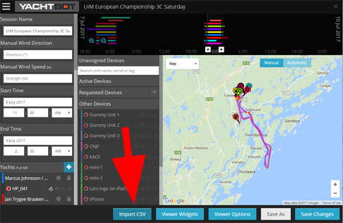

# Load race competitors and race marks from file

When creating races with large numbers of competitors, or race marks, file importing makes this process easy.

  

**File format**

* * *

For importing race objects into YachtBot, we use the CSV file format. This is a "Comma separated Values" text file that contains your competitors and/or race marks.

For each object, there is a reference to a physical tracking device or a defined position.

  

The format is as follows: 

<_Boat Number_\>, <Boat Name>, <Type>, <_Serial Number_\>, <_Colour_\>, <_Latitude_\>, <_Longitude_\>

  

**Boat Number** 

Can be letters and numbers, and no longer than 25 characters long.  This could be the competitors sail number, race number, or short name. This field can't contain special characters "&amp;amp;amp;, ', >, <," etc.

  

**Boat Name**  
Can be letters and numbers. Cannot contain special characters "&amp;amp;amp;,',>,<," etc.

  

**Type**

The type must be lower case, and can only be one of the following supported types. These types correlate to those available in the race editor.

        _yacht_    \- Defines a Boat object, and must have a serial number to attach to the boat object.

        _buoy_    \- Defines a generic buoy object, that is attached to a serial number if supplied, or will be positioned at the provided Latitude and Longitude position.  

        _target_    \- Defines a Target object, that can be attached to a serial number if supplied, or will be positioned at the provided Latitude and Longitude position.

        _other_    - Defines a generic other object, that can be attached to a serial number if supplied, or will be positioned at provided the Latitude and Longitude position.

  

**Serial Number**

The serial number must be formatted with hyphens AA-AA-AAAA. If you do not have access to a serial number that is assigned to an object, then the "Failed Dialog" will be displayed, indicating which serial number cannot be accessed.

  

**Colour**

If no colour is defined for an object, then a random colour will be generated.  If you want to specify an object's colour, the format is hex RGB.  For more information on hex colours visit [http://www.colorpicker.com/](http://www.colorpicker.com/).  

Hex format: "#RRGGBB" with, RR = Red colour component, GG = Green colour component, and BB = Blue colour component.  

  

**Latitude and Longitude**

To position an object at a location, you can either define a position, or assign a serial number. If both serial number and a Latitude and Longitude are supplied, the object will default to using the device serial number in preference.

The position Latitude and Longitude can be entered in any of the following formats

*   24.466135,118.18566
*   24 26.8594,118 11.0611
*   24 26.8594N,118 11.0611E

  

Example usage for 4 physically tracked boats, and 3 statically defined marks.

  

```
01,Boat01,yacht,GA-GP-AAAH,#42f4b6, ,
02,Boat02,yacht,GA-GK-AAFF,#4153f4, ,
03,Boat05,yacht,GA-GK-AAFFA,#4153f4, ,
04,Boat04,yacht,GA-GK-AAFFA,#4153f4, ,
  ,RaceMark01,buoy, , , 24 27.7419,118 11.6868
  ,RaceMark02,buoy, , , 24.466135,118.18566
  ,Target01,target, , , 24 26.8594,118 11.0611
```

  

Example usage for 4 physically tracked boats, 2 statically defined marks, and 1 physically defined mark with defined colour.

```
01,Boat01,yacht,GA-GP-AAAH,#42f4b6, ,
02,Boat02,yacht,GA-GK-AAFF,#4153f4, ,
03,Boat05,yacht,GA-GK-AAFFA,#4153f4, ,
04,Boat04,yacht,GA-GK-AAFFA,#4153f4, ,
  ,RaceMark01,buoy, , , 24 27.7419,118 11.6868
  ,RaceMark02,buoy, GA-GP-AAAC,#4153f4, ,
  ,Target01,target, , , 24 26.8594,118 11.0611
```

  

The Boat Name, and type columns are mandatory. Note however, all empty columns require a delimiting comma. For example ",Boat01,yacht,,,,".

  

  

**Importing into the Race session**

* * *

From the Race Editor, click 'Import CSV'.

  



  

You will then be prompted to select the file to upload from your computer.

Once the upload is complete, you should see a list of objects that were defined in your file. To add these to your race, click 'Create'.

  

You should now see the created objects in the race editor.

  

  

**Exporting objects from Race session**

* * *

In the YachtBot Race dashboard, open the race you want to export from.

Scroll down the page until you see the lists of objects contained in the race session.

Click on the 'Export' button beside the relevant object list to export the objects to file. 

More detail can be found in this article...

[http://support.yacht-bot.com/support/solutions/articles/8000063250-exporting-to-data-a-csv-file](../../YachtBot%20Web/Race%20Editor/Exporting%20to%20a%20CSV%20file.md)