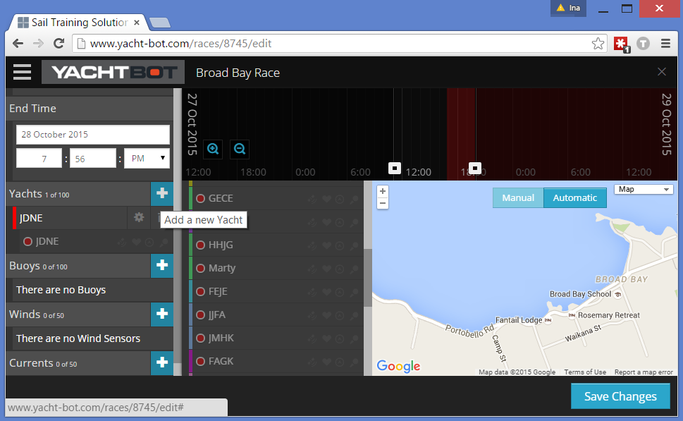
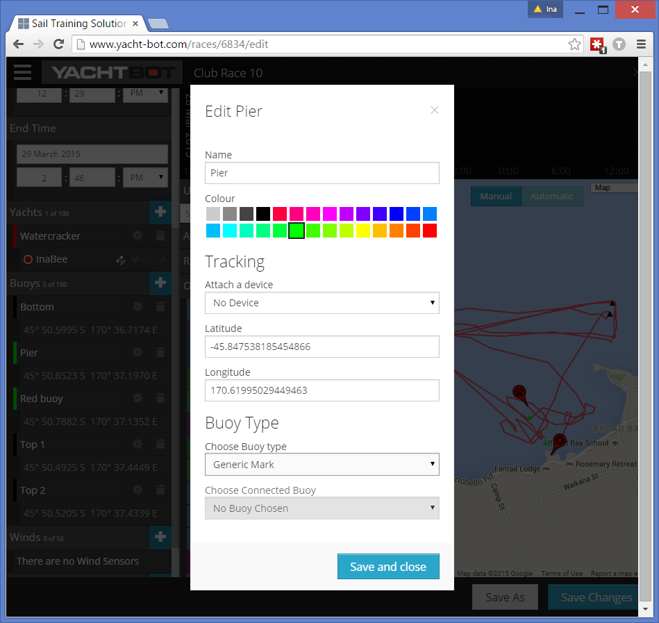

# Managing races (advanced)

To see your day's racing you need to create a YachtBot race. You can set up the race before you go out (sharing it with people allows them to watch live), or set it up after all data is collected.

  

Defining a basic race
---------------------

Refer to the [Defining a race](../../YachtBot%20Web/Getting%20started/Creating%20a%20YachtBot%20race%20session.md) article.

  

Manual Wind
-----------

Wind matters, of course. In the editor, fill in the wind direction and speed fields; if you're setting the race up before it happens, use forecast values and if you're setting it after the fact, use an average of the actual. This shows a wind rose on the viewer. The values set in the editor only set up the _default_ wind rose; anyone viewing the race in their browser can adjust the manual wind values by typing in values or dragging the pointer. We recommend setting up wind for all races. 

  

Deleting races
--------------

To free up races once you've hit your account limit, you either delete older races (remembering that you can easily re-create it if you need to, as the underlying data doesn't get removed for two years) or upgrade your account. Contact us if you wish to retain more than 100 races.  

  

Understanding objects
---------------------

For brevity later in this article, we'd like to introduce the concept of objects. Objects are entities that show up on your race map. They can, but don't have to, have a tracking device associated with them, and they can be associated with one another. 

  

Yachts
------

Showing more than one yacht brings out the best in YachtBot. To add more than one yacht to your race, you need to have an upgraded account that allows as many yachts as you need.

  

Also, you need access to that device's data, i.e. you need to be the device owner (with the device registered to your YachtBot account), or the device has been shared to you. Refer to the [Sharing Devices](../../YachtBot%20Web/Getting%20started/Sharing%20Devices.md) article. Devices are shared to you for a specific time window and the race editor will show them as active only when the start and end time of the race overlap with the sharing window - so, set your race start and end time before adding yachts.

  

To add a yacht, simply click and drag it from the 'Unassigned Devices' panel in the race editor to the yacht panel. Alternatively, click on the blue plus button next to the list of yachts.

  

  

To delete a yacht, click on the delete icon next to the object. Note that assigning a tracker from one object to another removes it from the first object: a tracker can only ever be assigned to one yacht or buoy.

  

### Yacht properties

When adding a new yacht, or editing an existing one, you are asked to enter race specific properties for this yacht. Typically, this is a name for the yacht (defaulting to the device name), a colour, and the tag of the associated tracking device. Save and close.

  

Buoys
-----

Buoys are added to your race in the same way yachts are, refer to above. Buoys have a more varied selection of properties, making them versatile in use. Generally, we recommend to use buoys for any stationary or tracked object that is of interest in your race, incl. committee boat, race marks, pace boats and coaching vessels. In contrast to yachts, buoys can't be followed, i.e. the automatic map panning ignores them.  

  

### Tracked vs. fixed buoys

Winds change and courses get adjusted at the last minute, it's a reality. For best live and replay experiences, we recommend tracking race marks. When tracking marks is not an option, adding a fixed long/lat value (always in decimals) is available. See the [Placing Buoys and markers](../../YachtBot%20Web/Race%20Management/Placing%20Buoys%20and%20markers.md) article.

  

(At Broad Bay, the end of the pier is used as the committee boat, making it a perfect candidate for a fixed position!)

  

  

### Buoy types

By default, each new buoy is a generic mark. However, there are a number of types of buoys you can set to identify specific marks on your race course. Note that Gates and Pins need to be connected to another buoy so that laylines and start lines are shown. See the [Setting up a race course](../../YachtBot%20Web/Race%20Management/Setting%20up%20a%20race%20course.md) article.

  

Wind and Current
----------------

Wind and current devices are added in the same way yachts are, refer to above. There are no additional settings. In the viewer, a live wind device appears as the preferred option for the wind widget and a current device creates a new current widget. Both show a small version of their widget in their current GPS location.

  

Editing races
-------------

You can only edit races that you have created. Races that are shared with you can only be edited by the owner of that race. When editing a race you can choose to save over the top of the original race, or create a copy of the race with a new name.

  

Happy race editing!