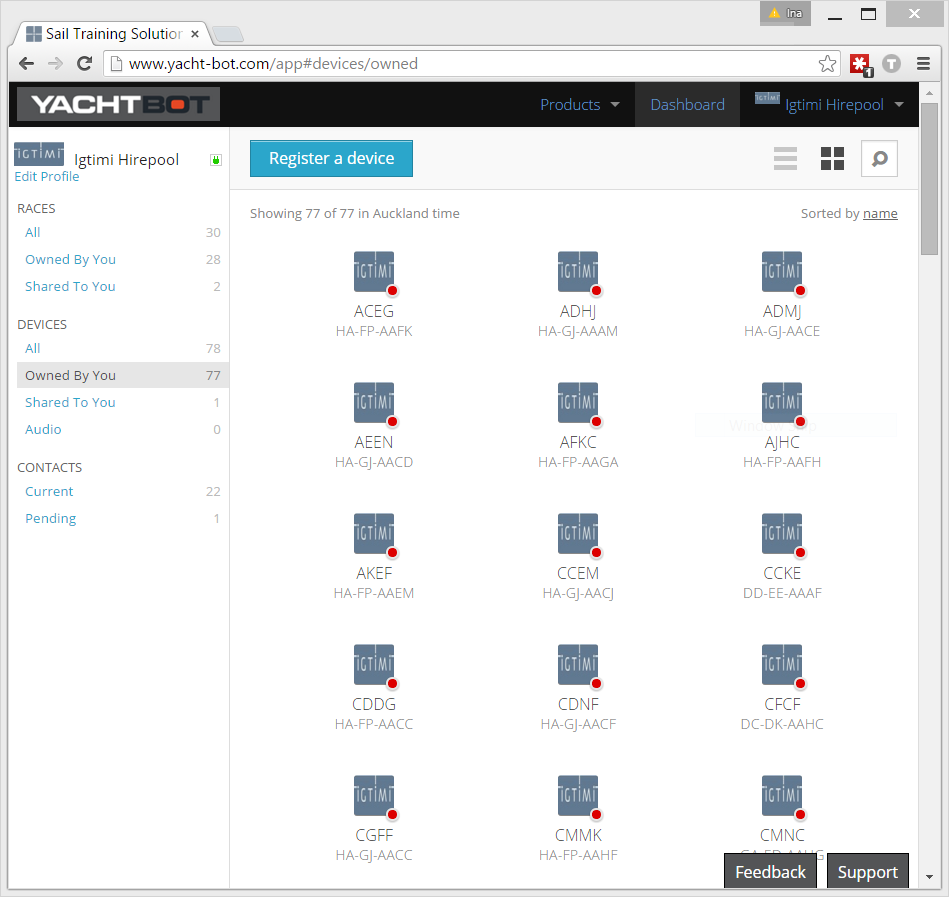
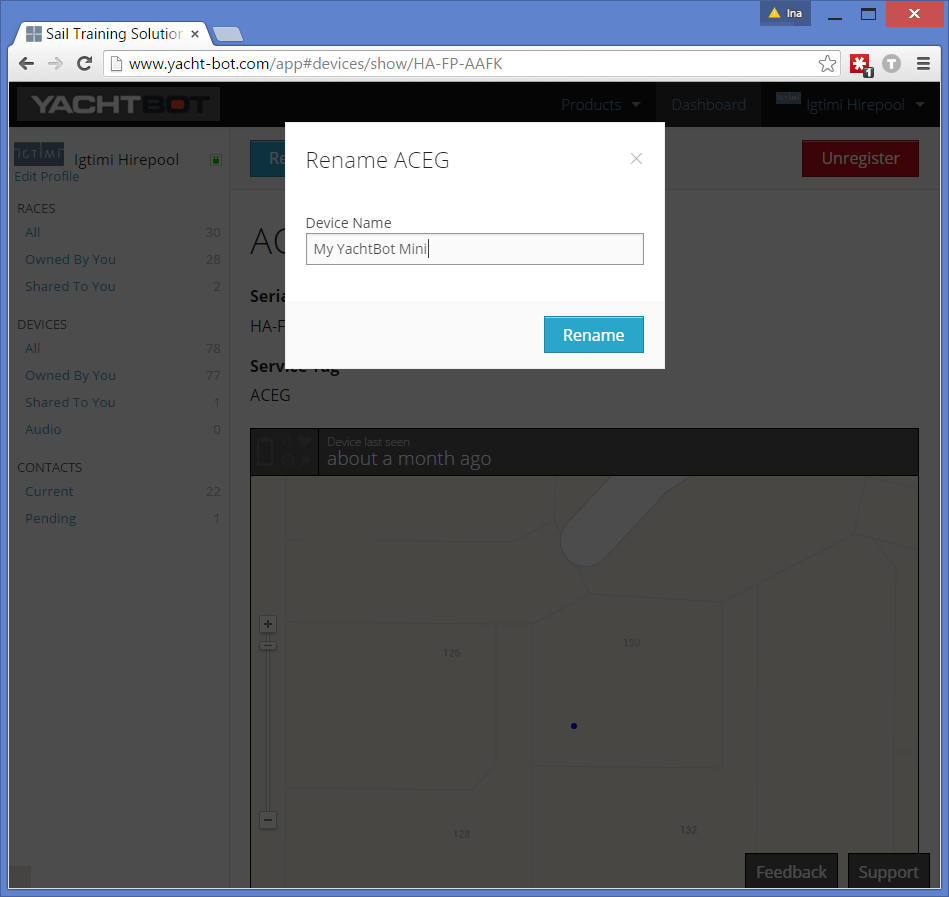
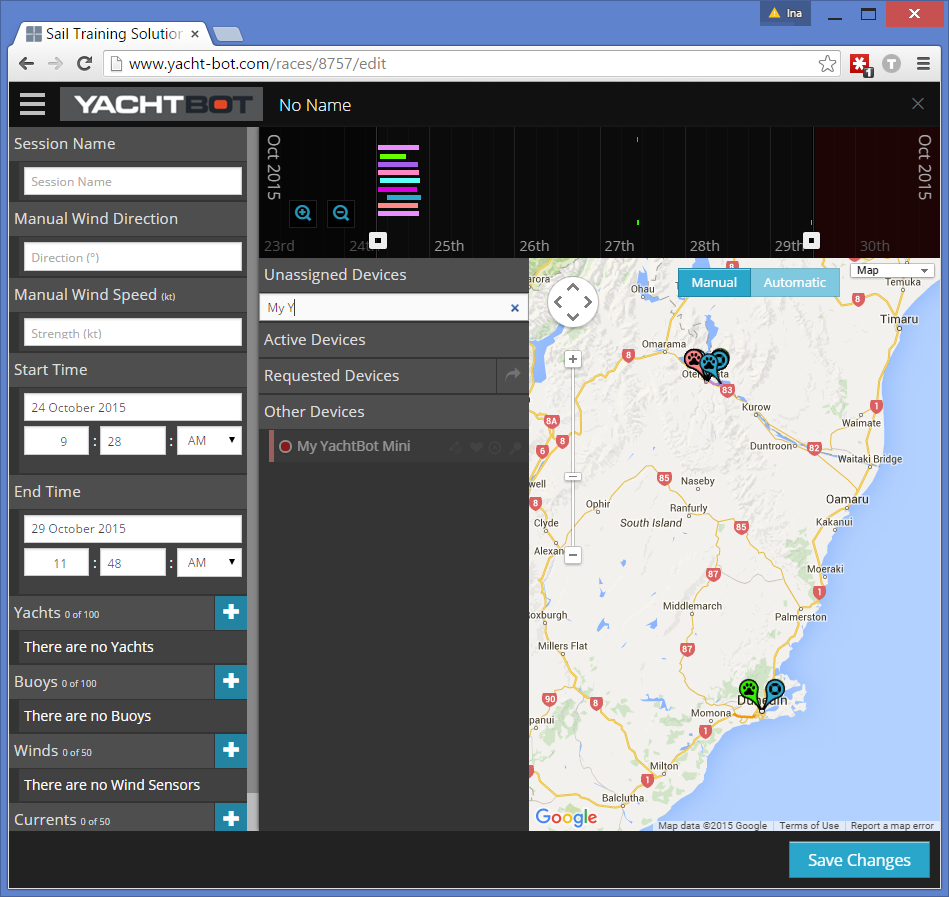
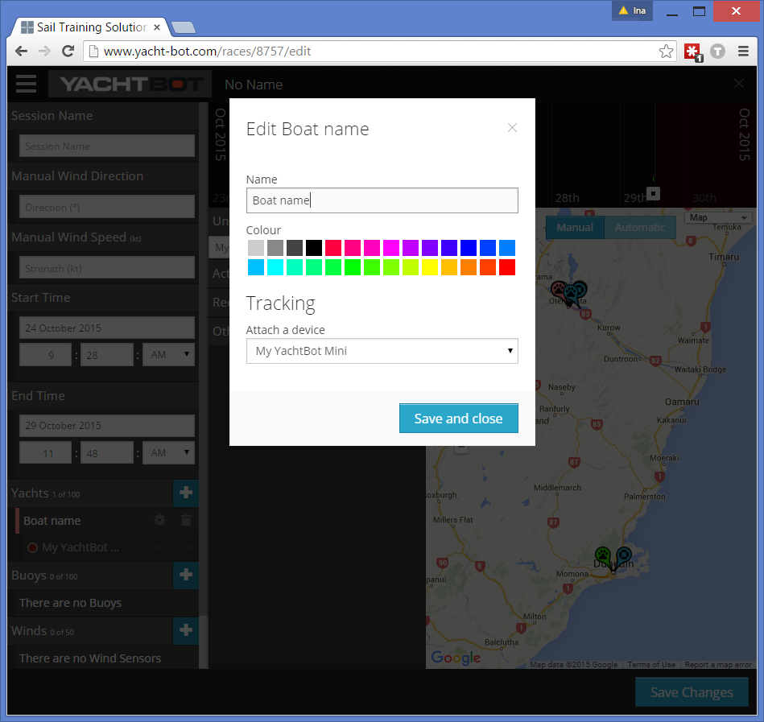

# Serial numbers, tags, and device names

Each device in YachtBot has an associated serial number and tag. Both are required when first registering a device to your account, with the exception of the YachtBot Mobile App, which is registered automatically.

In the Dashboard, all your devices are listed with a name and their serial number. The name, by default, is the device's tag.

It's sometimes convenient to rename the device if it is, for example, always associated with the same boat or person. To rename, select the device in the list and click on Rename. Only use alphanumeric characters, and avoid special characters.

The new name is available in the race editor when searching in the Unassigned Devices list.

Importantly, the device's name does not have to be the displayed name in the race. You can rename the yacht object regardless.

