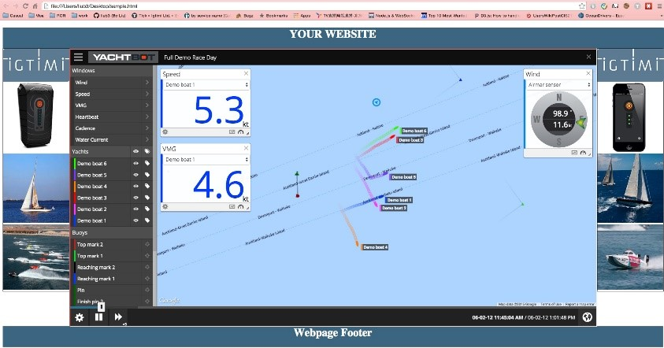

# Embedding a race into your website

YachtBot races are easy to view online, and the unique link to a specific race is easily generated and shared. This document outlines how to create a publicly viewable race and embed the viewer into your own website using html iframe.

  

Public races only
-----------------

Before sharing a YachtBot race via email or social media, make sure it’s set to be [publicly viewable](../../YachtBot%20Web/YachtBot%20accounts:%20the%20basics/Sharing%20races:%20Public%20vs.%20private.md).

  

Getting the link
----------------

Every YachtBot race has its own unique race number and this number makes up the unique link of the form http://www.yacht-bot.com/races/_nnnn_

  

You can get the number and link from:

*   Select the ’Get race link’ icon on the Share options page and copy the link to share
*   View the race and copy it from your browser’s address bar  
    

  

Embedding a public race
-----------------------

As soon as a race is publicly available, and whether you are the owner of it or not, you can embed this link into your webpage. This is particularly useful if you want to display sponsorship information or logos alongside to create a branded effect.

  



  

The code snippet used in the example above is this. The width and height (and other iframe parameters if applicable) need to be adjusted to suit your needs.  

  

```
<html>
	<head>
		<title>Embedded Race Viewer</title>
	</head>
	<body>
		<iframe src="http://www.yacht-bot.com/races/396" width="1200" height="600"></iframe>
	</body>
</html>

```

Note that all navigational features in the embedded page still work, so it can be used to browse the YachtBot website.