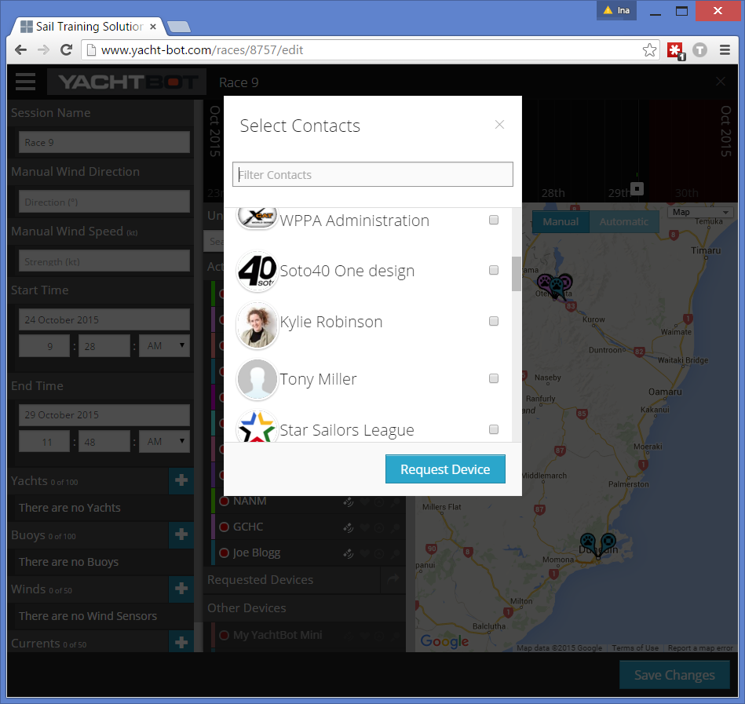
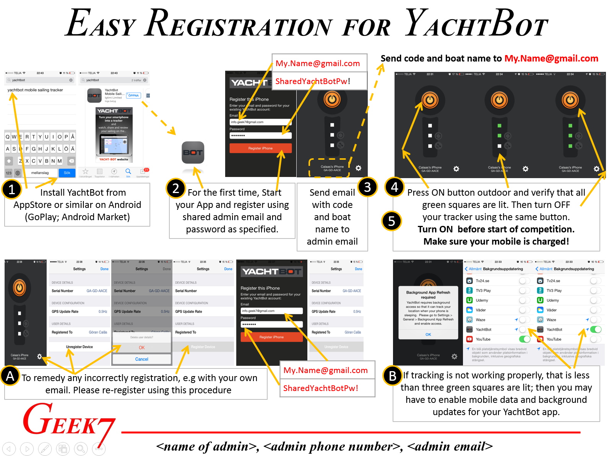

# Getting your race participants' data

The following instructions are intended for race organisers, who are assumed to have a YachtBot account with the appropriate plan, allowing them to create races with multiple yachts. All of the outlined options require some initial setup and communication between you and your participants and we recommend to start the process at least a few days before the race.  

  

There are two options we are covering in this article:  

1.  Competitors have their own YachtBot account and device (either YachtBot Mini or YachtBot Mobile App)  
    
2.  Competitors don't have a YachtBot account, but have installed the YachtBot Mobile App  
    

  

A third option is that you have a pool of YachtBot Minis you hand out before the race and collect again after. This is the easiest way, as you can match devices with boat names well ahead of time, and create a race that shows the correct vessel names.

  

Option 1: Own YachtBot accounts
-------------------------------

First, make sure you connect with your race participants by making them a contact.

  

### They share

After they appear in your contact list, they can share access to their device with you - either their smart phone, or their YachtBot Mini. Once devices have been shared with you, they appear in the Devices list under "Shared to you". In the race editor, they appear in the "unassigned devices" list, so you can include them in a race.

Ask people to share their device with you for the entire season if they are regular participants.

  

### You request

Alternatively, you can request access to your contacts' devices right from within the race editor. This is useful for one-off events. For this to work smoothly, you must have your race's start and end times set correctly first. Then, select who you want to add and click Request Device. Once you save the race, the request email is sent.

Your contact receives an email to alert them, and needs to login to their YachtBot account to approve your request. You can continue with the race setup and attach the requested device to yachts or buoys already, but no data is shown until the device owner approves the request.

  

  

  

Option 2: No own YachtBot accounts
----------------------------------

If not all of your competitors are savvy enough to have their own YachtBot account, you can still include them in the race. Simply use one (e.g. the race owner's) YachtBot account details to login onto their phone with. You can either share your password with them (we recommend changing the password on your account after each race) or type the details in yourself at, for example, race registration.

  

One of our customers, the Jönköpings Segelsällskap in Sweden, has created a handy "How-To" guide for this:

  

  

  

If you're interested in replicating this approach, just contact us and we'll share the source file with you. 

  

Happy racing!