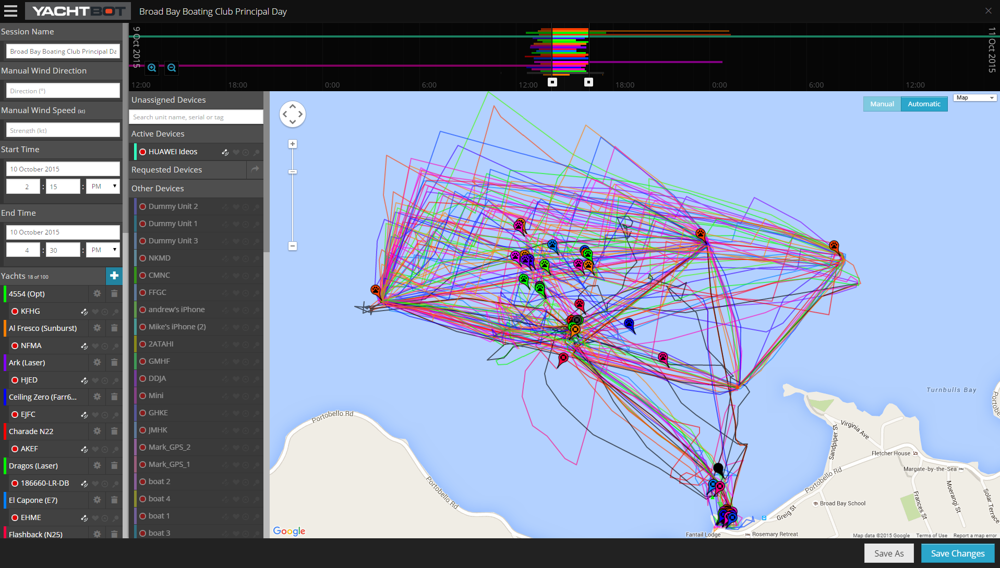
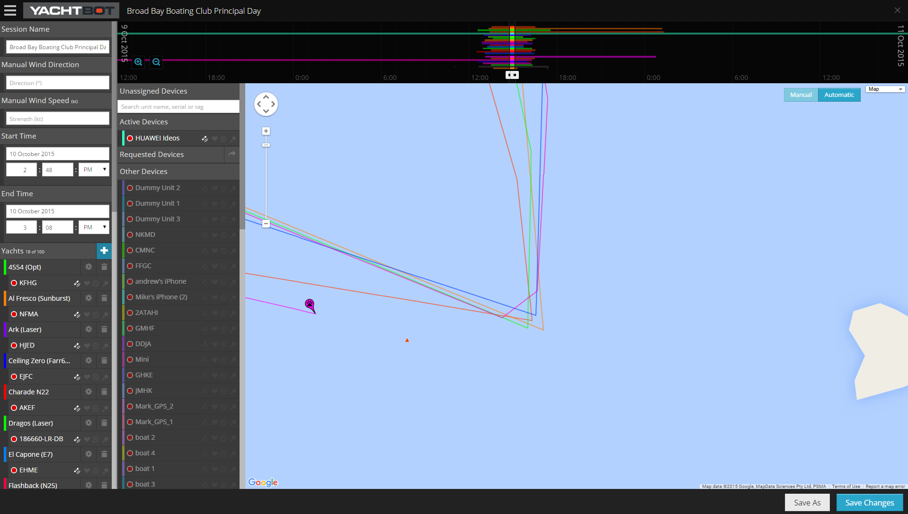

# Placing Buoys and markers

A race or a training session is more meaningful when you can see where buoys are. The gold standard is to track the buoys live, so that any course changes are reflected without you having to do anything. Without live tracking, you can still add geostationary buoys, and there are several ways to position them in your YachtBot race.

  

Adding Buoys on YachtBot web app
================================

Login to your YachtBot account and edit the race you want to add markers to. Add a buoy by clicking the "+" button beside the "Buoys" section. Name the buoy, select the appropriate type (more on this elsewhere), select a colour and save. Note that it can be very convenient to track mark set, pace and rescue boats as buoys as well. The YachtBot web app excludes them from automatic zooming.  

Position
========

Based on live GPS coordinates
-----------------------------

Once created, you can attach a device to your buoy in the edit window for the buoy. Alternatively, you can find the correct device in your list of trackers and drag it onto the Buoys section. Conveniently, you can do this before or after the race.

\[On a practical note: YachtBot Mini are very suitable for tracking buoys. Always double bag when using on a mark and detach before moving marks: never drag the electronics through water.\]

  

Based on fixed GPS coordinates
------------------------------

If you know the latitudinal and longitudinal position of the buoy from, for example, the mark set boat taking a reading when setting it, you can enter the values (in decimal degrees) for each buoy. Click the wheel icon beside the newly created buoy and fill in the "Longitude" and "Latitude" fields. Save and close the window.

  

Based on mark rounding
----------------------

For a completed race, it can be convenient to add buoys after the sailing has finished and all mark rounding data is available on YachtBot. The editor now shows you all tracks of all trackers that were in your race.   

  

  

Use the map to zoom into approximate location of the buoy and use the time slider to select only a very narrow time window (changing the session start and finish times temporarily)

  

  

This allows you to see the paths of the boats only around the buoy you want to place. 

You can position the buoy where you want it to be by **dragging** the created buoy from the buoy list onto the map.

  

Happy buoy setting!