# Race Timing - Lap line

In this example, we will work through setting up a race session containing 5 boats, a handful of race marks, and one single lap line for timing competitors.

**Define the race session**
---------------------------

This can be done ahead of time, and you can share the live racing link with others / competitors.

1.  Define a race session.  
    From the YachtBot dashboard, click 'Define a race'.  
      
    
2.  Fill in session details.  
    Once the race editor loads, work down the left hand column providing a race name and the session start and end times.  
    Note: The _session start_ and _session end_ times are not the same as the _race start_ and _race end_ times. The _session start_ and _session_ _end_ times are used to define the window of time that the viewer will show data for. The _race start_ time will be set in the 'Race Management' console in the Viewer. See below.  
    It is best practice to set the _session start_ time earlier than your expected _race start_ time and for the _session end_ time to be greater than the expected race finish time. This generates a buffer that allows for changes in race schedule to not interfere with your race session.  
      
    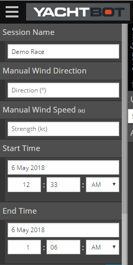  
    
3.  Add competitor boats to your race session.  
    You can drag YachtBot devices from the column on the right, into the column on the left, and place them under the heading 'Yachts'. Alternatively, you can click the '+' icon beside the 'Yachts' heading and manually enter a boat name, and assign a YachtBot device.  
      
    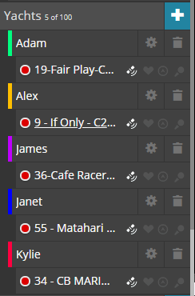  
    
4.  Add race marks to your race session.  
    Click the '+' icon beside the 'Race Marks' heading. Give the mark a friendly name and choose an appropriate colour.  
    If the mark is tracked (i.e Has a YachtBot device attached), then select the device under 'Attach a device'. If you know the Latitude and Longitude of the mark, enter this manually. Alternatively, you can drag and drop the race mark on to the map once you have setup the race mark name, colour and type.  
    If your race mark has a specific type, you can select this under 'Choose Race Mark type'.  
      
    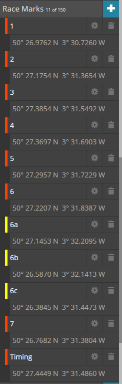  
    
5.  Setup your lap line  
    To create a lap line, we need to connect two race marks together to form a line. You can use any of the marks created in step 4, or you can create two new marks.  
    With the two marks created and placed on the map, click on the gear icon beside the mark object in the left column. Under 'Choose connected race mark', select the other lap line mark. Click 'Save and close'.  
      
    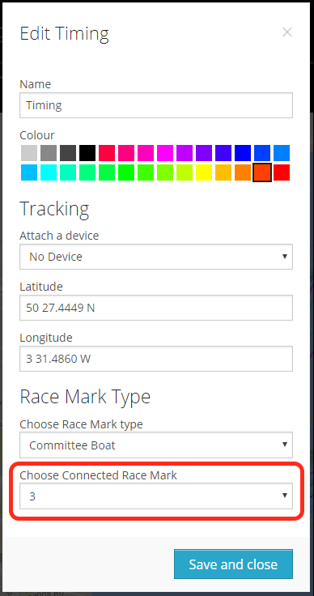  
    
6.  Save and close the Race Editor.  
    Click the 'Save and close' button in the bottom right corner of the editor.

  

At this stage, until the day of racing, setup is complete. You can share the live racing link on social media to competitors and spectators. The remaining work will be done live during the event.

  

  

**Operating race timing in YachtBot Viewer**
--------------------------------------------

### **Pre-race setup**

The following need to be completed prior to race commencing.

1.  Set the race start time.  
    This is the time that the race timing engine will begin to start calculating lap line crossings. You can set this time up ahead of time if you know when your racing will start, or you can click on the 'Now' button when the racing begins.  
      
    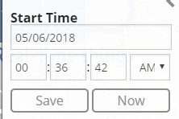  
      
    
2.  Determine your race start type.  
    Before we carry on, we need to determine what type of race start you have, either a rolling start, or a lap line crossing.  
    A rolling start is where the race timing begins when the flag is dropped. The alternative start is a lap line crossing start, where the boats cross over the lap line to start the timing.  
      
    
3.  Set the race start column.  
    **Lap line crossing start**  
    In the 'Start' column, under 'Attach to', use the drop down menu to select your lap line marks. These can be identified by the two mark names having an arrow denoting their connection. i.e. '3 -> Timing'.  
    This will make the start time, the time at which each boat crossed over the lap line.  
      
    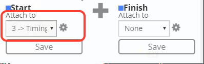  
    **Rolling start**  
    Leave the 'Start' column 'Attach to' set to 'None'. We will manually have the operator set the start time when the race flag drops.  
      
      
    
4.  Set the number of race laps.  
    As YachtBot is a sailing tool, the column headings are sailing specific - We are working towards making a more generic version for non-sailing events, but for now, think of each 'Leg' as a 'Lap line crossing'.  
    For each lap that you want to calculate, click on the '+' icon in the top right of the Race Management Console window.  
      
    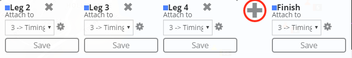  
    
5.  Attach the lap line to each of the 'lap' / 'leg' columns.  
    This will allow the timing system to populate the table with the line crossing times as competitors cross the line.  
    For each of the lap columns, use the drop down list under 'Attach to' to select your lap line marks. Again, the connected marks will be denoted by an arrow. i.e. '3 -> Timing'. The same line crossing will be used for each lap column.  
      
    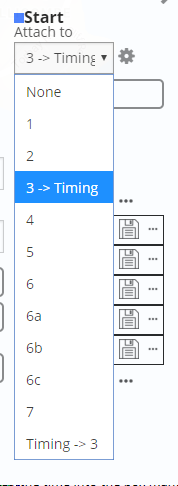  
      
    
6.  Save the 'lap' / 'leg' columns.  
    For each of the columns you have defined, click the 'Save' icon under each column heading. The small square will go blue to indicate the column settings have been saved.  
      
    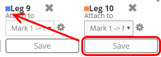  
      
    

### **While racing is happening**

The following need to occur while racing is happening.

1.  Race start time.  
    Ensure that the race start time is correct. Changes to the race schedule need to be updated on YachtBot too.  
    The race timing engine cannot calculate lap line crossings before the race start time. This is a feature which keeps false line crossing times out of the timing table.  
      
      
    
2.  Start the race.  
    If you are using a rolling start, then you must set the start time for the start column.  
    To set the race start time, press the 'double clocks' icon at the top of the start column. This will set all rows in the start column to have the current time. i.e. now. If you miss the start, then you can manually enter the start times into the start column rows.  
      
    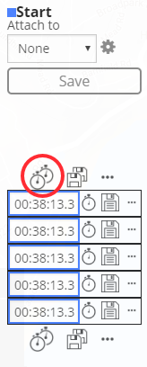  
    
3.  Save confirmed entries.  
    Each time the page is loaded (for you, or your viewers) the system begins recalculating all entries in the table. It is best practice to save entries once they are confirmed. This will exclude them from needing to be recalculated.  
    Once the race start time has been confirmed, then you should save the entries.  
    You can do this for the entire column by pressing the 'Double Disk' icon at the top of the column, or for single entries by clicking the 'Single Disk' on the appropriate row.  
      
    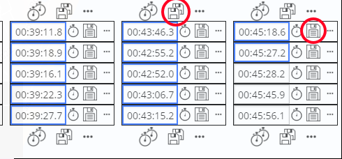  
    
4.   Track lap line crossings.  
    As competitors cross the lap line in real time, confirm their crossing time is correct in YachtBot. If the time is correct, click the 'Single Disk' icon to confirm the result. The cell will outline blue to indicate confirmed results.  
    If the lap crossing time is incorrect, you can manually enter in the correct time, and then click the 'Single Disk' icon to confirm the result.  
    There a number of functions under the '...' icon. These allow you to mark the lap as 'Skipped', where the timing system will continue to calculate subsequent laps, ignoring the missed crossing. The 'recalculate' button will attempt to recalculate the crossing time, however if there is bad data from a device, this will cause no change. In this case, manually enter the correct time.  
      
    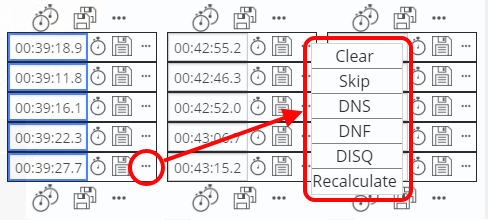  
    
5.  Race finish  
    When the race finishes, verify that all results are present and correct. All entries should be 'confirmed' and have blue highlighting around them.

  

  

### **Post race adjustments**

YachtBot viewer can replay post racing, even after the racing has finished.

If there are entries in your table that need clarification, then you can scrub through the racing and identify any discrepancies. This is particularly useful when a boat may have missed a line crossing. 

  
Pause the viewer with the affected boat on top of the lap line, and press the 'single clock' icon to set the affected cell time to the current viewer time.  
  

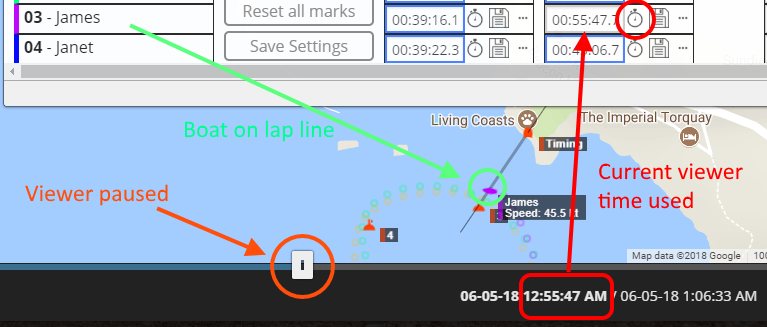  

  

**Exporting Race results**
--------------------------

With all of your racing results confirmed, in the Race Management Console, navigate back to the first column, the 'Global settings' column, using the 'arrow' buttons at the top of the screen. Press the 'Export timing info' button.

A CSV file will be generated for your race session. You can then analyse the data in a program of your choice.  
  

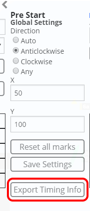